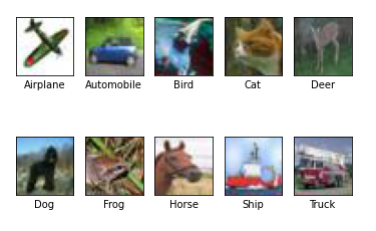
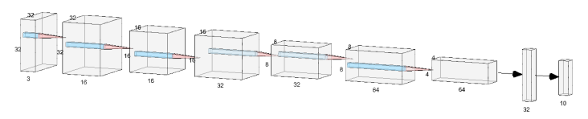

---
# User change
title: Build an image classification NN model trained with the CIFAR-10 dataset

weight: 3 # 1 is first, 2 is second, etc.

# Do not modify these elements
layout: "learningpathall"
---
Follow all these steps within the `Jupyter notebook` opened in the previous page. Click `Run` to execute each step.

For each step, you will see
* `In[ ]` when the step has not yet been run
* `In[*]` when the step is running, and
* `In[N]`, where `N` is the step number, when complete.

## Data preprocessing

To create the NN model, there are certain data pre-processing steps that need to be performed.

First, open the Jupyter Notebook through an Anaconda Prompt.

```console
jupyter notebook
```
Open `lab.ipynb` from the extracted project files folder on the notebook.

Execute (click `Run`) the first code block to import the required packages:
```python
import tensorflow as tf

from tensorflow.keras.models import Sequential
from tensorflow.keras.layers import Dense, Conv2D, Dropout, Flatten, MaxPooling2D, 
BatchNormalization, Activation

import matplotlib.pyplot as plt
import matplotlib.image as mpimg

import numpy as np
import random

from PIL import Image

import os
```

Next, load the `CIFAR-10` dataset. TensorFlow provides an API for downloading well-known datasets, such as CIFAR-10 and MNIST. Execute the next code block to get the dataset.

```python
# Load data from TF Keras
(x_train, y_train), (x_test, y_test) = tf.keras.datasets.cifar10.load_data()

# CIFAR10 class names
class_names = ['Airplane', 'Automobile', 'Bird', 'Cat', 'Deer', 'Dog', 'Frog', 
'Horse', 'Ship', 'Truck']
num_classes = len(class_names)
```

Then, you will save one image per class from the test set for testing with the board later. Execute the following code block to save the images.

```python
path_images = "./Data/images/"

# Create directory
if not os.path.exists(path_images):
 os.mkdir(path_images)

# Save one image per class 
ext=".jpg"
for image_index in range(0,100):
 im = Image.fromarray(x_test[image_index])
 im.save("./images/"+str(class_names[int(y_test[image_index])])+ext)
```

This code block below will visualize the saved images.

```python
# Show saved images
files = os.listdir(path_images) 
for img in files:
 if os.path.splitext(img)[1] == ext and os.path.splitext(img)[0] in class_names:
 #print(os.path.splitext(img)[0])
 plt.subplot(2,5,class_names.index(os.path.splitext(img)[0])+1)
 plt.xticks([])
 plt.yticks([])
 plt.grid(False)
 plt.imshow(mpimg.imread(path_images+img),)
 plt.xlabel(os.path.splitext(img)[0])
plt.show()
```

The expected output is shown below



Next, normalize all the training and testing data to have values between 0 and 1. This normalization facilitates machine learning. Each RGB value ranges from 0 to 255, so divide the training and testing data by 255.

```python
# Normalize pixel values to be between 0 and 1
x_train = x_train.astype(np.float32)/255
x_test = x_test.astype(np.float32)/255
# Convert class vectors to binary class matrices.
y_train = tf.keras.utils.to_categorical(y_train, num_classes)
y_test = tf.keras.utils.to_categorical(y_test, num_classes)
# Print arrays shape
print('x_train shape:', x_train.shape)
print('y_train shape:', y_train.shape)
print('x_test shape:', x_test.shape)
print('y_test shape:', y_test.shape)
```

The expected output is shown below:

```output
x_train shape: (50000, 32, 32, 3)
y_train shape: (50000, 10)
x_test shape: (10000, 32, 32, 3)
y_test shape: (10000, 10)
```

## Create the Model

You are going to create a small convolutional neural network for image classification. The image size of CIFAR10 is 32 by 32, and the number of colour channels is 3. So, the input shape of the first convolution layer is (32, 32, 3). Since the number of classes is 10, so the last dense layer should have 10 units.

Here is an image illustrating the network architecture. Note that only convolution and dense layers are illustrated in this image.



Execute the code blocks below to create a sequential model and add the layers

```python
# Hyperparameters
batch_size = 32
num_classes = len(class_names)
epochs = 1
img_rows, img_cols = x_train.shape[1], x_train.shape[2]
input_shape = (x_train.shape[1], x_train.shape[2], 1)
```

```python
# Creating a Sequential Model and adding the layers
model = Sequential()
model.add(Conv2D(16, (3, 3), padding='same', input_shape=(32,32,3)))
model.add(BatchNormalization())
model.add(Activation('relu'))
model.add(Conv2D(16, (3, 3),padding='same'))
model.add(Activation('relu'))
model.add(MaxPooling2D(pool_size=(2, 2),strides=(2, 2)))
model.add(Dropout(0.2))
model.add(Conv2D(32, (3, 3), padding='same'))
model.add(BatchNormalization())
model.add(Activation('relu'))
model.add(Conv2D(32, (3, 3),padding='same'))
model.add(Activation('relu'))
model.add(MaxPooling2D(pool_size=(2, 2),strides=(2, 2)))
model.add(Dropout(0.3))
model.add(Conv2D(64, (3, 3), padding='same'))
model.add(BatchNormalization())
model.add(Activation('relu'))
model.add(Conv2D(64, (3, 3),padding='same'))
model.add(Activation('relu'))
model.add(MaxPooling2D(pool_size=(2, 2),strides=(2, 2)))
model.add(Dropout(0.4))
model.add(Flatten())
model.add(Dense(32))
model.add(Activation('relu'))
model.add(Dropout(0.5))
model.add(Dense(10)) #The number of classes
model.add(Activation('softmax'))
```

Execute the code blocks below to compile and train the model. If tens of epochs are used, the training might take more than 10 hours because the dataset has 50,000 training images. Therefore, the model trained for 50 epochs is provided for testing (File: ‘Data/models/cifar10_model.h5’). You can use the model if you don't have enough time to train your own model. 

```python
# Check model structure and the number of parameters
model.summary()
# Let's train the model using Adam optimizer
model.compile(loss='categorical_crossentropy', optimizer='adam', 
metrics=['accuracy'])
# Train model
history = model.fit(x=x_train,
 y=y_train,
 batch_size=batch_size,
 epochs=epochs, 
 validation_data=(x_test, y_test))
```

Save the model and evaluate the model. Note that since the model was trained for 1 epoch only, the accuracy would not be that good. Please try a larger number of epochs later to obtain better performance.

```python
# Save keras model
path_models = "./Data/models/"
path_keras_model = path_models + "own_cifar10_model.h5"
# Create directory
if not os.path.exists(path_models):
 os.mkdir(path_models)
model.save(path_keras_model)
# Score trained model.
scores = model.evaluate(x_test, y_test, verbose=1)
print('Test loss:', scores[0])
print('Test accuracy:', scores[1])
```

## Save Data for Testing

Finally, save the validation data and the labels for testing. This code block will sample 50 images from the dataset and save them in CSV format. Execute the code block to save the test data.

```python
path_csv = "./Data/"
path_csv_file = path_csv+"own_cifar10_validation_20image.csv"
# Create directory
if not os.path.exists(path_csv):
 os.mkdir(path_csv)
# Remove old csv file
if os.path.exists(path_csv_file):
 os.remove(path_csv_file)
# Load data from TF Keras
(x_train, y_train), (x_test, y_test) = tf.keras.datasets.cifar10.load_data()
# CIFAR10 class names
class_names = ['Airplane', 'Automobile', 'Bird', 'Cat', 'Deer', 'Dog', 'Frog', 
'Horse', 'Ship', 'Truck']
# Normalize pixel values to be between 0 and 1
x_train = x_train.astype(np.float32)/255
x_test = x_test.astype(np.float32)/255
# Print arrays shape
print('x_train shape:', x_train.shape)
print('y_train shape:', y_train.shape)
print('x_test shape:', x_test.shape)
print('y_test shape:', y_test.shape)
 
# Save csv file that contain pixel's value
num_sample = 50
rx = random.sample(range(0,len(x_test)),num_sample)
for i in range(0,num_sample):
 data = x_test[rx[i]]
 #print(data.shape)
data = data.flatten()
 output = y_test[rx[i]]
 data=np.append(data,output)
 data = np.reshape(data, (1,data.shape[0]))
 #print(data.shape)
 with open(path_csv_file, 'ab') as f:
 np.savetxt(f, data, delimiter=",")
```

This code block will save the list of image classes. Execute the code block to save the label file.

```python
path_labels = "./Data/labels/”
path_labels_file = path_labels+"own_cifar10_labels.txt"
# Create directory
if not os.path.exists(path_labels):
 os.mkdir(path_labels)
 
# Remove old label file
if os.path.exists(path_labels_file):
 os.remove(path_labels_file)
# Create label file
for i in range(0,len(class_names)):
 with open(path_labels_file, 'a') as f:
 f.write(str(i)+","+class_names[i]+"\n")
```
You have now completed the steps to create the model and are ready to deploy it on the ST board.
