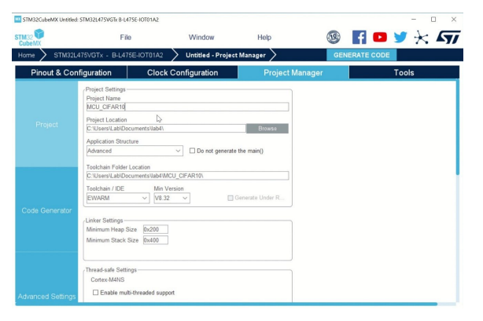
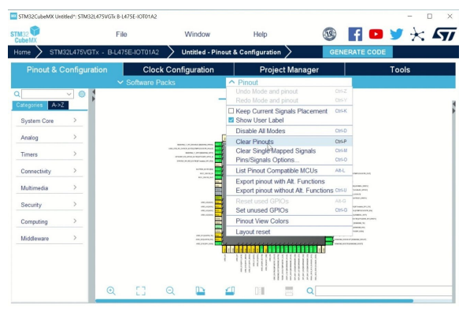
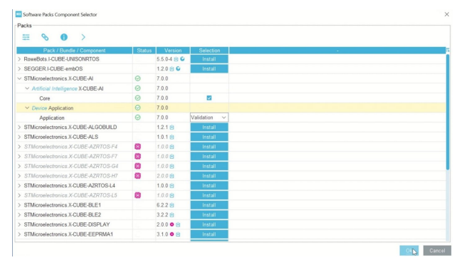
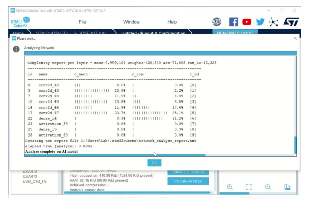
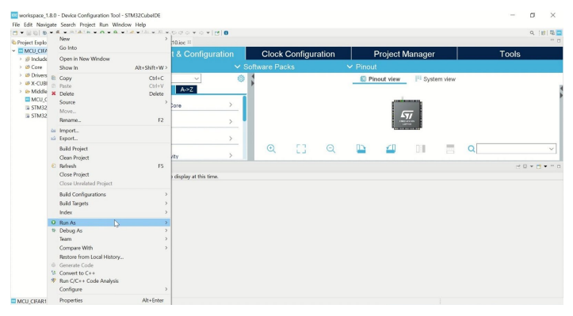
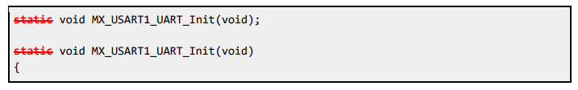

---
# User change
title: Deploy the image classification NN model on STM32

weight: 4 # 1 is first, 2 is second, etc.

# Do not modify these elements
layout: "learningpathall"
---
In this section, you will deploy the model directly on the STM32 board.

## Setup STM32CubeMX project

[STM32CubeMX](https://www.st.com/en/development-tools/stm32cubemx.html) is a graphical tool for configuring STM32 microcontrollers.\
[STM32Cube.AI](https://www.st.com/content/st_com/en/campaigns/stm32cube-ai.html) is an extension of STM32CubeMX to import ML models.

{}
- The testing tool (see later) has been written with `X-CUBE-AI 7.0.0`. Please select this version when installing. Later versions may not connect successfully.
{}

1. Download the Windows installer for STM32CubeMX from the [STM32CubeMX product page](https://www.st.com/en/development-tools/stm32cubemx.html).

2. Run the Windows installer and install in desired location of your Windows Machine.

3. Open STM32CubeMX IDE.

4. Click `Access to Board Selector`. Find your `B-L475E-IOT01A` board and click `Start Project`.

5. Go to `Project Manager`. Enter a project name and select the project location where the project will be saved.

6. Under `Pinout & Configuration`, expand `Pinout` menu, and click `Clear pinouts`.

7. Now install Cube AI and enable it for your project.

8. Expand `Software Packs` menu, and click `Select Components`.

9. Locate `X-CUBE-AI`, and click its `Install` button.

10. Expand the menu and enable `X-CUBE-AI` > `Core`. For device application, choose `Validation`. If the status shows a yellow warning, click `Resolve` to install any necessary dependencies.

11. Click `OK` when done.

## Deploy the model with STM32CubeMX

1. Open STM32CubeMX.

2. Click `Access to Board Selector`.

3. Find the `B-L475E-IOT01A2` board and click `Start Project`. Accept any defaults.

4. Go to `Project Manager`. Set the project name and save location.

5. Set `Toolchain/IDE` as `STM32CubeIDE`

6. Go to `Pinout & Configuration` and clear pinouts from the `Pinout` menu.

7. In `Software Packs` menu, click `Select Components`. Enable `X-CUBE-AI`. For device application, choose `Validation`. Click `OK` to save.

8. Navigate to `X-CUBE-AI` configuration.

9. Click `Add network`. Browse to the model provided (`Data/models/cifar10_model.h5`) or the model you trained by yourself (`Data/models/own_cifar10_model.h5`).

10. Click `Analyze` to check the model.

11. Generate the validation code for the model by clicking `Generate Code`.

12. Open STM32CubeIDE.

13. Navigate to `File` > `New` > `Project` > `ST` > `STM32 Project from an Existing STM32CubeMX Configuration File`.

14. Go to the project folder and open the `.ioc` file.

15. Ensure that the board is connected to your computer. If it is correctly connected, build and flash the code by clicking `Run As`.

16. If you get an ‘undefined reference’ error, go to `Core/Src/main.c`. Remove `static` from the declaration of the `MX_USART1_UART_Init()` function and also from its definition. Try `Run As` again.

With the model now deployed on the STM32 board, you are ready to test it.
