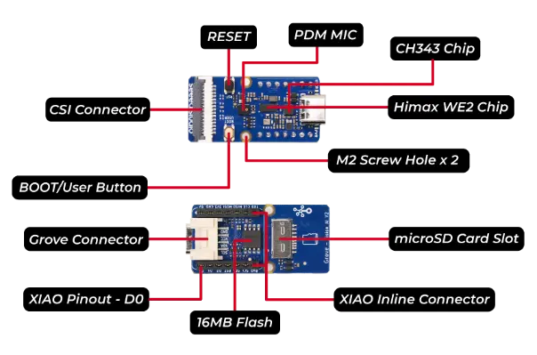
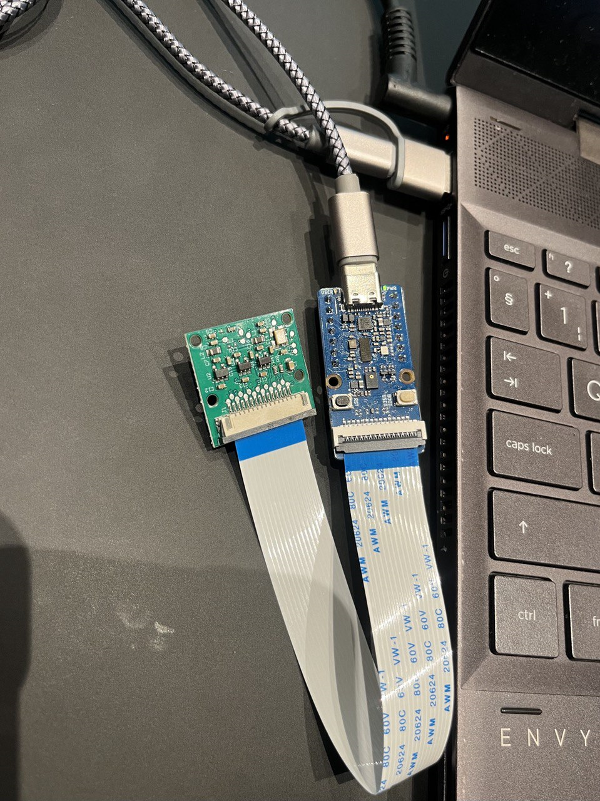

---
# User change
title: "Environment Setup"

weight: 6 # 1 is first, 2 is second, etc.

# Do not modify these elements
layout: "learningpathall"
---
## Before you begin 

These instructions have been tested on:
- A GCP Arm-based Tau T2A Virtual Machine instance Running Ubuntu 22.04 LTS.
- Host machine with Ubuntu 24.04 on x86_64 architecture.
- Windows Subsystem for Linux (WSL): Windows x86_64

The host machine is where you will perform most of your development work, especially cross-compiling code for the target Arm devices.

You can use your own Linux host machine or use [Arm Virtual Hardware (AVH)](https://www.arm.com/products/development-tools/simulation/virtual-hardware) for this Learning Path.

The Ubuntu version should be `20.04 or higher`. The `x86_64` architecture must be used because the Corstone-300 FVP is not currently available for the Arm architecture. You will need a Linux desktop to run the FVP because it opens graphical windows for input and output from the software applications. Also, though Executorch supports Windows via WSL, it is limited in resource.

If you want to use Arm Virtual Hardware the [Arm Virtual Hardware install guide](/install-guides/avh#corstone) provides setup instructions.

## Setup on Host Machine
1. Setup if you don't have access to the physical board: We would use the Corstone-300 FVP, it is pre-configured.
2. Setup if you have access to the board: Skip to **"Compilers"** Section


### Corstone-300 FVP Setup for ExecuTorch
For Arm Virtual Hardware users, the Corstone-300 FVP is pre-installed. 

To install and set up the Corstone-300 FVP and ExecuTorch on your machine, refer to [Building and Running ExecuTorch with ARM Ethos-U Backend](https://pytorch.org/executorch/stable/executorch-arm-delegate-tutorial.html). Follow this tutorial till the **"Install the TOSA reference model"** Section. It should be the last thing you do from this tutorial.

Since you already have the compiler installed from the above tutorial, skip to **"Install PyTorch"**.

### Compilers 

The examples can be built with [Arm Compiler for Embedded](https://developer.arm.com/Tools%20and%20Software/Arm%20Compiler%20for%20Embedded) or [Arm GNU Toolchain](https://developer.arm.com/Tools%20and%20Software/GNU%20Toolchain). 

Both compilers are pre-installed in Arm Virtual Hardware.

Alternatively, if you use Arch Linux or its derivatives, you can use Pacman to install GCC. 

Use the install guides to install the compilers on your computer:
- [Arm Compiler for Embedded](/install-guides/armclang/)
- [Arm GNU Toolchain](/install-guides/gcc/arm-gnu)
- Using Pacman:
 
```console
pacman -S aarch64-linux-gnu-gcc
```

## Install PyTorch
The latest version needs Python 3.8 or later

```console
pip3 install torch torchvision torchaudio --index-url https://download.pytorch.org/whl/cu118

```

## Install Executorch

1. Follow the [Setting Up ExecuTorch guide](https://pytorch.org/executorch/stable/getting-started-setup.html ) to install it.

2. Activate the `executorch` virtual environment from the installation guide to ensure it is ready for use:

```console
conda activate executorch
```

## Install Edge Impulse CLI
1. Create an [Edge Impulse Account](https://studio.edgeimpulse.com/signup) if you do not have one 

2. Install the CLI tools in your terminal

Ensure you have Nodejs installed

```console
node -v 
```
Install the Edge Impulse CLI
```console
npm install -g edge-impulse-cli
```
3. Install Edge Impulse Screen
```console
sudo apt install screen
```

4. Download and extract the latest Edge Impulse firmware
Grove Vision V2 [Edge impulse Firmware](https://cdn.edgeimpulse.com/firmware/seeed-grove-vision-ai-module-v2.zip). 


## Setup on Grove - Vision AI Module V2 
**Kindly Note:** Only follow this part of the tutorial if you have the board.

Due to its constrained environment, we'll focus on lightweight, optimized tools and models (which will be introduced in the next learning path).



Hardware overview : [Image credits](https://wiki.seeedstudio.com/grove_vision_ai_v2/). 

1. Connect the Grove - Vision AI Module V2 to your computer using the USB-C cable. 




2. In the extracted Edge Impulse firmware, locate and run the installation scripts to flash your device. 

```console
./flash_linux.sh
```

3. Configure Edge Impulse for the board
in your terminal, run:

```console
edge-impulse-daemon
```
Follow the prompts to log in.

4. Verify your board is connected

If successful, you should see your Grove - Vision AI Module V2 under 'Devices' in Edge Impulse.


## Build a Simple PyTorch Model 
With our Environment ready, we will create a simple program to test our setup. This example will define a simple feedforward neural network for a classification task. The model consists of 2 linear layers with ReLU activation in between. Create a file called simple_nn.py with the following code:

```python
import torch
from torch.export import export
from executorch.exir import to_edge

# Define a simple Feedforward Neural Network
class SimpleNN(torch.nn.Module):
    def __init__(self, input_size, hidden_size, output_size):
        super(SimpleNN, self).__init__()
        self.fc1 = torch.nn.Linear(input_size, hidden_size)
        self.relu = torch.nn.ReLU()
        self.fc2 = torch.nn.Linear(hidden_size, output_size)
        
    def forward(self, x):
        out = self.fc1(x)
        out = self.relu(out)
        out = self.fc2(out)
        return out

# Create the model instance
input_size = 10   # example input features size
hidden_size = 5   # hidden layer size
output_size = 2   # number of output classes

model = SimpleNN(input_size, hidden_size, output_size)

# Example input tensor (batch size 1, input size 10)
x = torch.randn(1, input_size)

# torch.export: Defines the program with the ATen operator set for SimpleNN.
aten_dialect = export(model, (x,))

# to_edge: Make optimizations for edge devices. This ensures the model runs efficiently on constrained hardware.
edge_program = to_edge(aten_dialect)

# to_executorch: Convert the graph to an ExecuTorch program
executorch_program = edge_program.to_executorch()

# Save the compiled .pte program
with open("simple_nn.pte", "wb") as file:
    file.write(executorch_program.buffer)

print("Model successfully exported to simple_nn.pte")
```

Run it from your terminal:

```console
python3 simple_nn.py
```

If everything runs successfully, the output will be:
```bash { output_lines = "1" }
Model successfully exported to simple_nn.pte
```
Finally, the model is saved as a .pte file, which is the format used by ExecuTorch for deploying models to the edge.

Now, we will run the ExecuTorch version, first run: 

```console
# Clean and configure the build system
rm -rf cmake-out && mkdir cmake-out && cd cmake-out && cmake ..

# Build the executor_runner target
cmake --build cmake-out --target executor_runner -j9
```

You should see an output similar to:
```bash { output_lines = "1" }
[100%] Built target executor_runner
```

Now, run the executor_runner with the Model:
```console
./cmake-out/executor_runner --model_path simple_nn.pte
```

Expected Output: Since the model is a simple feedforward model, you can expect a tensor of shape [1, 2]

```bash { output_lines = "1-3" }
Input tensor shape: [1, 10]
Output tensor shape: [1, 2]
Inference output: tensor([[0.5432, -0.3145]]) #will vary due to random initialization
```

If the model execution completes successfully, you’ll see confirmation messages similar to those above, indicating successful loading, inference, and output tensor shapes.

