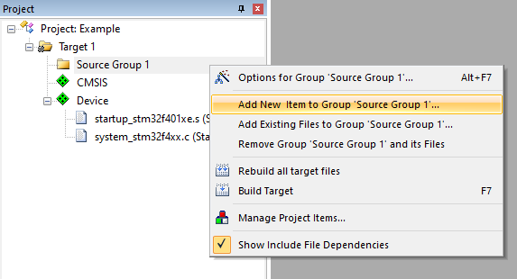
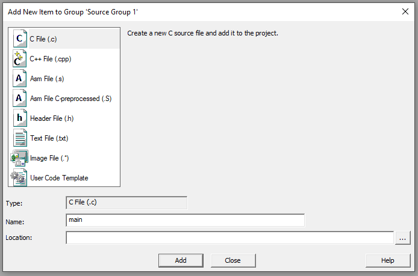

---
# User change
title: "Write C and assembler level functions" 

weight: 4 # 1 is first, 2 is second, etc.

# Do not modify these elements
layout: "learningpathall"
---

## Source code

You need to add a `main.c` file to the source folder. To do this, right-click `Source Group 1` > `Add New Item`.



Select 'C file (.c)' and then name it 'main'. Choose an appropriate location to save it - such as the project folder.



Next you will populate it with some code.

## The main() function

First create the `main()` C function. This function defines two variables (`a` and `b`) with character arrays. We will also define the function prototypes of the assembler functions (see later).

```C
void my_strcpy(const char *, char *);
void my_capitalize(char *);

int main(void)
{
    const char a[] = "Hello world!";
    char b[20];

    my_strcpy(a, b);
    my_capitalize(b);

    while(1);
}
```

## Place the stack and heap

CMSIS6 requires that the location of the stack and heap are defined.

Open the `Options` pane, and navigate to the `Linker` tab.

Deselect `Use Memory Layout from Target Debug`, and a scatter file should be defined. Click the `Edit` button, and then `OK` to close the `Options` pane.

Edit the scatter file appropriately to place stack (`ARM_LIB_STACK`) and heap (`ARM_LIB_HEAP`) in SRAM areas of the target.

For example, if using the `Cortex-M3 VHT`, edit as follows.
``` text
LR_IROM1 0x00000000 0x00400000  {    ; load region size_region
  ER_IROM1 0x00000000 0x00400000  {  ; load address = execution address
   *.o (RESET, +First)
   *(InRoot$$Sections)
   .ANY (+RO)
   .ANY (+XO)
  }
  RW_IRAM1 0x20000000 0x00300000  {  ; RW data
   .ANY (+RW +ZI)
  }
  ARM_LIB_STACK	0x20300000 EMPTY 0x00001000 {}
  ARM_LIB_HEAP	0x20301000 EMPTY 0x00001000 {}
}
```


## Mixing Assembly Language and C Code

You will program the board in C, but add assembly language subroutines to perform the string copy and capitalization operations. Most embedded systems are coded purely in C and resort to assembly language only for time-critical processing. This is because the code development process is much faster (and hence much less expensive) when writing in C when compared to assembly language. Writing an assembly language function which can be called as a C function results in a modular program which gives us the best of both worlds: the fast, modular development of C and the fast performance of assembly language. It is also possible to add inline assembly code to C code..

The keyword used to allow assembly code within a wider section of C code is `__asm`.

## Register use conventions

There are certain register use conventions to enable the assembly code to co-exist with C code.

### Calling functions and passing arguments

When a function calls a subroutine, it places the return address in the link register `lr`. The arguments (if any)are passed in registers `r0` through `r3`, starting with `r0`. If there are more than four arguments, or they are too large to fit in 32-bit registers, they are passed on the stack.

### Temporary storage

Registers `r0` through `r3` can be used for temporary storage if they were not used for arguments, or if the argument value is no longer needed.

### Preserved registers

Registers `r4` through `r11` must be preserved by a subroutine. If any must be used, they must be saved first and restored before returning. This is typically done by pushing them to and popping them from the stack.

### Returning from functions

Because the return address has been stored in the link register, the `BX lr` instruction will reload the `pc` with the return address value from the `lr`. If the function returns a value, it will be passed through register `r0`.


## String copy

The function `my_strcpy` has two arguments (`src` and `dst`). Each is a 32-bit long pointer to a character. In this case, a pointer fits into a register, so argument `src` is passed through register `r0` and `dst` is passed through `r1`.

Our function will load a character from memory, save it into the destination pointer and increment both pointers until the end of the string.

```c
__attribute__((naked)) void my_strcpy(const char *src, char *dst)
{
    __asm(
        "loop:              \n\t\
            LDRB  r2, [r0]  \n\t\
            ADDS  r0, #1    \n\t\
            STRB  r2, [r1]  \n\t\
            ADDS  r1, #1    \n\t\
            CMP   r2, #0    \n\t\
            BNE   loop      \n\t\
            BX    lr        \n\t\
    "    
    );
}
```

## String capitalization

The function `my_capitalize` will capitalize all the lower-case letters in the string. The code loads each character, checks to see if it is a letter, and if so, capitalizes it. 

Each character in the string is represented with its ASCII code. For example, `A` is represented with a `65` (`0x41`), `B` with `66` (`0x42`), and so on, up to `Z` which uses `90` (`0x5a`).

The lower case letters start at `a` (`97`, or `0x61`) and end with `z` (`122`, or `0x7a`).

To convert a lower case letter to an upper case letter, subtract 32 from its ASCII value.

```C
__attribute__((naked)) void my_capitalize(char *str)
{
    __asm(
        "cap_loop:            \n\t\
            LDRB  r1, [r0]    \n\t\
            CMP   r1, #'a'-1  \n\t\
            BLS   cap_skip    \n\t\
            CMP   r1, #'z'    \n\t\
            BHI   cap_skip    \n\t\
            SUBS  r1,#32      \n\t\
            STRB  r1, [r0]    \n\t\
        cap_skip:             \n\t\
            ADDS  r0, r0, #1  \n\t\
            CMP   r1, #0      \n\t\
            BNE   cap_loop    \n\t\
            BX    lr          \n\t\
        "    
    );
}
```

The code is shown above. It loads the byte into `r1`. If the byte is less than `a` then the code skips the rest of the tests and proceeds to finish up the loop iteration. 

This code has a quirk – the first compare instruction compares `r1` against the character immediately before `a` in the table. Why? The code is to compare `r1` against `a` and then branch if it is lower. However, there is no branch lower instruction, just branch lower or same (`BLS`). To use that instruction, reduce by one the value to compare `r1` against.
