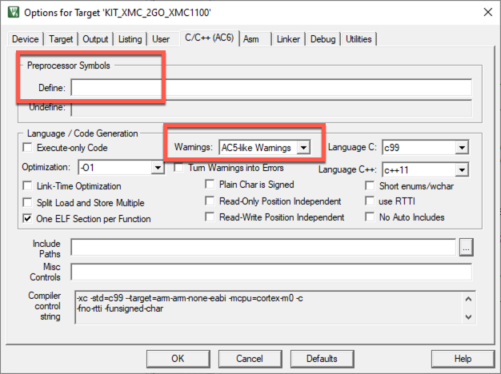

## Migration of example projects

The following assumes that your example is still using Arm Compiler 5. Thus, the project first needs to be migrated to Arm Compiler 6 before it can be automatically converted to the new CMSIS-Toolbox project standard (csolution/cproject).

1. Install the newly created device family pack in µVision.
1. Go to **Options for Target - Target** and set the `ARM Compiler` to *Use default compiler version 6*:
   
1. Go to the **C/C++ [AC6]** tab and set the appropriate defines. It is also good practice to set the compiler warnings to *AC5-like Warnings* as the new compiler is much more strict and may overwhelm with warning messages:
   
1. Copy the new scatter file from the device family pack into the project. Check if the project needs specific settings (you can compare against the original scatter file). Once done, go to the **Linker** tab and remove the checkmark at *Use Memory Layout from Target Dialog* and set the path to the new scatter file:  
   
1. Once done, build the project to verify the correct operation. Afterwards, do not forget to add the updated example project to the CMSIS-Pack to make it available to your customers.

{}
The [Arm Compiler for Embedded Migration and Compatibility Guide](https://developer.arm.com/documentation/100068/latest/Migrating-from-Arm-Compiler-5-to-Arm-Compiler-for-Embedded-6) helps you in case you encounter any problems when migrating to Arm Compiler 6.
{}
