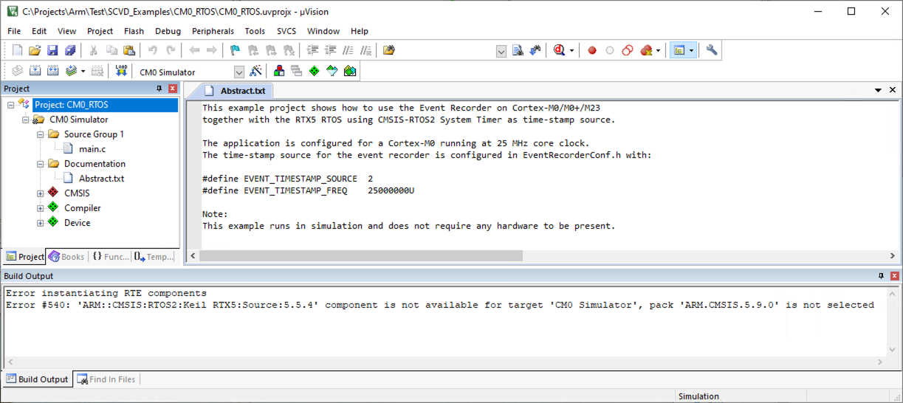
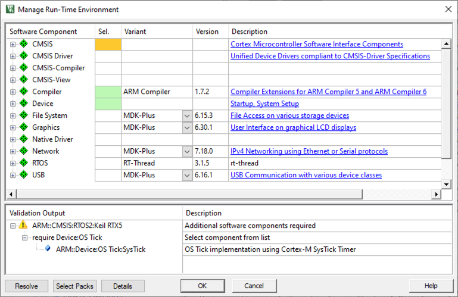

## Troubleshooting

This section shows the most common errors and shows possible resolutions.

### Missing device

The following error occurs when you try to migrate a project to CMSIS v6, but you have not installed the CMSIS_DFP pack:

{}
Install [ARM.CMSIS_DFP.1.0.0.pack](https://www.keil.com/pack/ARM.CMSIS_DFP_.1.0.0.pack) or above.
{}

### Error instantiating RTE components

The following error occurs when you try to migrate a Keil RTX-based project, but you have not installed the CMSIS-RTX pack:

{}
Install [ARM.CMSIS-RTX.1.0.0.pack](https://www.keil.com/pack/ARM.CMSIS-RTX.1.0.0.pack) or above.
{}

### Missing software components

The following warning is shown in the Validation Output window when you try to migrate a Keil RTX-based project:

{}
Use the **Resolve** button to select the missing component automatically.
{}

### Manual migration from Keil.ARM_Compiler pack

As the components from the Keil.ARM_Compiler pack do not have 1:1 replacements, you need to deselect the old components and select the replacements from the two new packs (ARM.Compiler and ARM.CMSIS-View).

1. Compiler:EventRecorder migration

   Deselect the `Compiler:Event Recorder` component and select the `CMSIS-View:Event Recorder` component:

   
1. Compiler:I/O migration

   Deselect any component of `Compiler:I/O` and select the corresponding `CMSIS-View:I/O` component:

   
