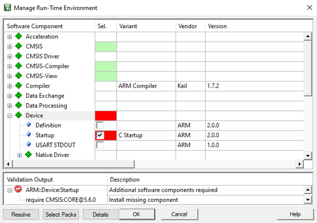
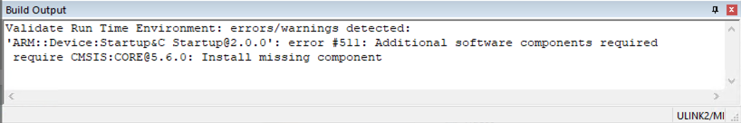
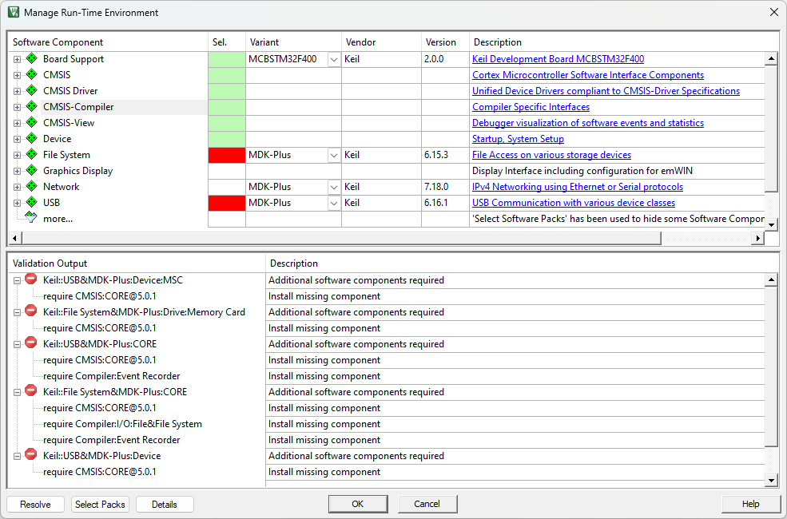
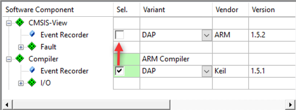
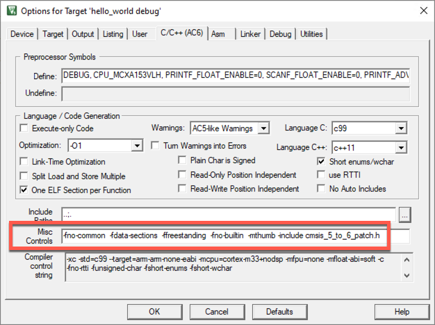

## Troubleshooting

This section provides an overview of the most common errors you might encounter along with possible resolutions. The following problems are explained:

- [Missing device](#missing-device)
- [Error instantiating RTE components](#error-instantiating-rte-components)
- [Missing software components](#missing-software-components)
- [Updating configuration files](#updating-configuration-files)
- [Manual migration from Keil.ARM_Compiler pack](#manual-migration-from-keilarm_compiler-pack)
- [Linker warning L6314W](#linker-warning-l6314w)
- [Linker errors using the RTX5 library](#linker-errors-using-the-rtx5-library)
- [Run-time exceptions due to wrong processor mode in RTX5](#run-time-exceptions-due-to-wrong-processor-mode-in-rtx5)
- [Use of undeclared identifier CoreDebug error](#use-of-undeclared-identifier-coredebug-error)

### Missing device

The following error occurs when you try to migrate a project to CMSIS v6 but you have not installed the Cortex_DFP pack:


{}
Install [ARM.Cortex_DFP.1.0.0.pack](https://www.keil.arm.com/packs/cortex_dfp-arm) or above.
{}

### Error instantiating RTE components

The following error occurs when you try to migrate a Keil RTX-based project but you have not installed the CMSIS-RTX pack:


{}
Install [ARM.CMSIS-RTX.5.8.0.pack](https://www.keil.arm.com/packs/cmsis-rtx-arm) or above.
{}

### Missing software components

#### Migrating Keil RTX5-based projects

The following warning is shown in the Validation Output window when you try to migrate a Keil RTX-based project:


{}
Use the **Resolve** button to select the missing component automatically.
{}

#### Migrating projects

The following error comes up if the `Device:Startup` component requires a CMSIS-CORE component with a specific v5.x.x version.



In the Build Output window you might see:



Despite this warning, the build operation should work normally and the resulting binary will work fine on hardware. If you want to get rid of the error, check one of the following options.

A similar error can come up for any software component. Here is an example using MDK-Middleware:



{}
1. Contact the CMSIS-Pack vendor for your device/software component and ask for an updated version without the CMSIS-CORE version requirement. Alternatively, do the following:
2. Edit the device's PDSC file and change for example:
```xml
<require Cclass="CMSIS" Cgroup="CORE" Cversion="5.6.0"/>
```
to
```xml
<require Cclass="CMSIS" Cgroup="CORE"/>
```
{}

### Updating configuration files

Moving a component from one pack to another has an additional implication. The Event Recorder component, for example, comes with a configuration file (`EventRecorderConf.h`). This configuration file is stored in the project under the RTE/*Cclass* folder. When you switch from one pack to the other, the Cclass name changes and a fresh copy of the original configuration file is copied to your project.


{}
Copy any edits that you made in the old configuration file into the new one.
{}

### Manual migration from Keil.ARM_Compiler pack

As the components from the Keil.ARM_Compiler pack do not have 1:1 replacements, you need to deselect the old components and select the replacements from the two new packs (ARM.CMSIS-Compiler and ARM.CMSIS-View):

1. Compiler:EventRecorder migration

   Deselect the `Compiler:Event Recorder` component and select the `CMSIS-View:Event Recorder` component:

   
2. Compiler:I/O migration

   Deselect any component of `Compiler:I/O` and select the corresponding `CMSIS-Compiler` component:

   

   This table helps you to identify the correct components:

   | Compiler:I/O:     | CMSIS-Compiler:            |
   |-------------------|----------------------------|
   | STDERR@Breakpoint | STDERR (API):Breakpoint    |
   | STDERR@ITM        | STDERR (API):ITM           |
   | STDERR@User       | STDERR (API):Custom        |
   | STDIN@Breakpoint  | STDIN (API):Breakpoint     |
   | STDIN@ITM         | STDIN (API):ITM            |
   | STDIN@User        | STDIN (API):Custom         |
   | STDOUT@Breakpoint | STDOUT (API):Breakpoint    |
   | STDOUT@EVR        | STDOUT (API):EventRecorder |
   | STDOUT@ITM        | STDOUT (API):ITM           |
   | STDOUT@User       | STDOUT (API):Custom        |
   | TTY@Breakpoint    | TTY (API):Breakpoint       |
   | TTY@ITM           | TTY (API):ITM              |
   | TTY@User          | TTY (API):Custom           |

{}
All CMSIS-Compiler components require CMSIS-Compiler:Core to be present.
{}

### Linker warning L6314W

With CMSIS v6, a linker warning as shown below may get reported:

```txt
L6314W: No section matches pattern *(.bss.noinit)
```

 This is due to the following entry in the Arm Compiler for Embedded scatter files:

```txt
RW_NOINIT __RW_BASE UNINIT __RW_SIZE {
  *(.bss.noinit)
}
```

This section is created for usage with [CMSIS-View's Event Recorder](https://arm-software.github.io/CMSIS-View/latest/evr.html), placing the event buffer in uninitialized memory so that it is persistent after a software reset.

{}
You can suppress the warning using the linker switch `--diag_suppress=L6314`.
{}
 
### Linker errors using the RTX5 library

In CMSIS v5, the RTX5 libraries were built using the compiler options `-fshort-enums` and `-fshort-wchar`. In CMSIS v6, the default compiler options are different. If you are using the new libraries with old build settings, you will encounter the linker error `L6242W`:

```
.\Blinky.axf: Error: L6242E: Cannot link object Itx timer.o as its attributes are incompatible with the image attributes.
   ... wchart-16 clashes with wchart-32.
   ... packed-enum clashes with enum_is_int
```

{}
In µVision, go to **Project - Options for Target** and click on the **C/C++ (AC6)** tab. Unselect **Short enums/wchar** and rebuild the project:


{}

{}
If you are using libraries in your project that have been built with short enums/wchars (for example the MDK-Middleware), you need to use the RTX5 source code variant in your project as otherwise the linker will fail, even when unselecting the "Short enums/wchar" option.
{}

### Run-time exceptions due to wrong processor mode in RTX5

With the new Keil RTX5 v5.8.0, the default processor mode for thread execution has changed. Previously, it was:

```c
define OS_PRIVILEGE_MODE 1
```

This enabled the privileged mode for threads by default.

The new default is:

```c
define OS_PRIVILEGE_MODE 0
```

This results in exceptions at run-time when threads use privileged operations.

{}
If an exception occurs at run-time, check the "Default Processor Mode for Thread execution" setting and adapt to "Privileged" if necessary.
{}

{}
Please note that you can also set the processor mode for threads individually, by setting the [osThreadPrivileged](https://arm-software.github.io/CMSIS_6/v6.0.0/RTOS2/group__CMSIS__RTOS__ThreadMgmt.html#ga7c2b7db42d23e4f56132e0ed739d02e5) define in [osThread_Attr_t](https://arm-software.github.io/CMSIS_6/v6.0.0/RTOS2/group__CMSIS__RTOS__ThreadMgmt.html).
{}

### Use of undeclared identifier CoreDebug error

Some symbol names were changed in CMSIS v6 which might lead to the following error:

```txt
/fsl_common_arm.c:126:9: error: use of undeclared identifier 'CoreDebug'
  126 |         CoreDebug->DEMCR |= CoreDebug_DEMCR_TRCENA_Msk;
      |         ^
```

This results in failing builds.

{}
In general, you should ask the provider of the software component that fails because of using legacy symbols to provide an updated version that is compliant to CMSIS v6.
{}

If an update is not possible or pushed out, we have created a header file that patches the changes and allows you to run older software with CMSIS v6.

{}
1. Please download this [header file](https://armkeil.blob.core.windows.net/developer/Files/downloads/cmsis/cmsis_5_to_6_patch.h) to a `<known_location>`.

1. In the `*.cproject.yml` file of your project, under the `add_path:` keyword, add `<known_location>`. Example:

```yml
project:
  add-path:
    -  <known_location>       #directory of any files you would like to include. 
```

3. In the `*.cproject.yml` file of your project, under the `misc:` keyword, add the pre-include command for the compiler you are using. Example:

```yml
project:
  misc: 
    - for-compiler: AC6
      C:
        - --include cmsis_5_to_6_patch.h
      CPP:
        - --include cmsis_5_to_6_patch.h
```

For more information on how to configure your *.cproject.yml file, please refer to [YML-Input-Format.md](https://github.com/Open-CMSIS-Pack/cmsis-toolbox/blob/main/docs/YML-Input-Format.md#project). It has a comprehensive explanation of how to write your own *.cproject.yml along with some examples.
{}

{}
1. Please download this [header file](https://armkeil.blob.core.windows.net/developer/Files/downloads/cmsis/cmsis_5_to_6_patch.h) to a `<known_location>`. A good place would be the project directory.

1. Go to **Project - Options for Target** and switch to the **C/C++ (AC6)** tab. Add `-include <known_location>\cmsis_5_to_6_patch.h` to the **Misc Controls**:

   

1. Rebuild the project.
{}
