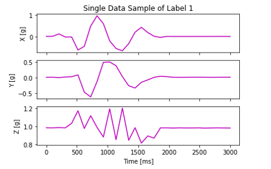

---
# User change
title: Collect training data

weight: 3 # 1 is first, 2 is second, etc.

# Do not modify these elements
layout: "learningpathall"
---
Follow all these steps within the `Jupyter notebook` opened in the previous page. Click `Run` to execute each step.

For each step, you will see
* `In[ ]` when the step has not yet been run
* `In[*]` when the step is running, and
* `In[N]`, where `N` is the step number, when complete.

## Train the neural network model

Import necessary packages by executing the first code block.
```python
import serial.tools.list_ports
import sklearn
import tensorflow as tf
import numpy as np
import pandas as pd
import matplotlib.pyplot as plt
import os, random

base_dir = os.getcwd()
samples_dir = os.path.join(base_dir, 'Samples')
```
## Connect to the board

Connect the board for data collection. 
```python
print('Com ports list:')
comPorts = list(serial.tools.list_ports.comports())
for comPort in comPorts:
    print(comPort)
chooseComPort = input('Please insert port number: ')
ser = serial.Serial('COM{}'.format(chooseComPort), 115200)
```
Execute this code block and enter which port the board is connected to (`11` in this example):
```output
Com ports list:
COM11 - STMicroelectronics STLink Virtual COM Port (COM11)
```
## Helper functions

This code block contains several helper functions for computation. Execute the code block to have these functions.

```python
def convert_to_list(value):
    value = value.replace("b' ", "")
    vals = value.split(", ")
    del vals[-1]
    results = list(map(int, vals))
    return results

def convert_list_to_df(lst):
    x = lst[0::3]
    y = lst[1::3]
    z = lst[2::3]
    df = pd.DataFrame({'X': x, 'Y': y, 'Z': z})
    return df
```

Now you are ready to acquire the dataset.

## Acquire the dataset

Execute the code block shown below. This code block will acquire accelerometer data from the board, and save training samples for machine learning. 

```python
letter = input('Please insert letter to collect data: ')
stride = 30
f = os.path.join(samples_dir, 'letter_{}_stride_{}.csv'.format(letter, stride))
if os.path.exists(f):
    print('File exists and data will be appended...')
    xyz_df = pd.read_csv(f)
else:
    print('New sample, starting blank...')
    xyz_df = pd.DataFrame(columns=['X', 'Y', 'Z'])

while input('1 - acquire sample, 2 - exit: ') == '1':
    line = ser.readline()
    lineList = convert_to_list(str(line))
    new_df = convert_list_to_df(lineList)
    print('New data acquired:\n', new_df.describe())
    xyz_df = pd.concat([xyz_df, new_df], ignore_index=True)
    print('Total Data count:', int(xyz_df.shape[0]/stride))

print('Saving data to:', f)
print('Total data of sample {}:\n'.format(letter), xyz_df.describe())
xyz_df.to_csv(f, index=False)
```

1. When prompted, enter a lower case letter (`a`) which you want to collect samples for.
2. Pick up the board, press the blue button (Green LED turns on), and "write" the letter in the air with the board. The green LED turns off when sampling ends.
3. In the notebook, enter `1` to save the accelerometer data.
4. Repeat this process until you get enough samples. The more data samples you collect, the better model you will probably get. Suggest 30+ samples.
5. Enter `2` when you want to finish the acquisition.

6. Re-execute this step in the notebook with a different letter (`z`).

## Load the dataset

Check the dataset you collected. Execute this code block to load the dataset.

```python
data_files = [file for file in os.listdir(samples_dir) if '.csv' in file]

stride = 30
data = []
labels = []
for idx, file in enumerate(data_files):
    df = pd.read_csv(os.path.join(samples_dir, file))
    x = df['X'].to_numpy()
    y = df['Y'].to_numpy()
    z = df['Z'].to_numpy()
    
    for i in range(int(df.shape[0]/stride)):
        base_idx = i * stride
        batch = np.array([x[base_idx:base_idx+stride], y[base_idx:base_idx+stride], z[base_idx:base_idx+stride]])
        batch = batch.reshape((3, stride))
        data.append(batch)
        labels.append(idx)
        
    print('Added {} data to the data list with label: {}'.format(file, idx))
```
If in your dataset you used the letters `a` and `z`, where the label for `a` is `0` and the label for `z` is `1`, this step should output:
```output
Added letter_a_stride_30.csv data to the data list with label: 0
Added letter_z_stride_30.csv data to the data list with label: 1
```
## Plot data sample

This code block plots the accelerometer data of one training sample.

```python
def plot_single_sample(data_sample, label='Not Specified'):
    plt.clf()
    scaling = 2**10 # The STM ADC is 10bit so scale to get [g]
    fig, axs = plt.subplots(3)
    t = np.linspace(0, data_sample.shape[1] * 100, data_sample.shape[1])
    # Accelerometer sampled with 100 ms
    axs[0].set_title(label='Single Data Sample of Label {}'.format(label))
    axs[0].plot(t, data_sample[0]/scaling, c='m')
    axs[0].set_ylabel('X [g]')
    plt.setp(axs[0].get_xticklabels(), visible=False)
    axs[1].plot(t, data_sample[1]/scaling, c='m')
    axs[1].set_ylabel('Y [g]')
    plt.setp(axs[1].get_xticklabels(), visible=False)
    axs[2].plot(t, data_sample[2]/scaling, c='m')
    axs[2].set_ylabel('Z [g]')
    plt.xlabel('Time [ms]')
    plt.show()
    
idx = random.randint(0, len(data)-1)
plot_single_sample(data_sample=data[idx], label=labels[idx])
```

Example output is shown below:


