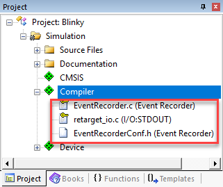

---
# User change
title: "Debug using Event Recorder"

weight: 3 # 1 is first, 2 is second, etc.

# Do not modify these elements
layout: "learningpathall"
---

## Debug using Event Recorder

[**Event Recorder (EVR)**](https://developer.arm.com/documentation/101407/latest/Debugging/Debug-Windows-and-Dialogs/Event-Recorder) provides an API (function calls) for event annotations in the application code or software component libraries. It uses CoreSight DAP to output data from the target (memory reads/writes). This means any debug adapter can be used. [MDK-Middleware](https://developer.arm.com/Tools%20and%20Software/Keil%20MDK/MDK-Middleware), [Keil RTX5](https://developer.arm.com/Tools%20and%20Software/Keil%20MDK/RTX5%20RTOS), and [CMSIS-FreeRTOS](https://github.com/ARM-software/CMSIS-FreeRTOS) are already annotated. EVR requires a certain amount of system RAM.

### printf without a UART

μVision provides a simple `printf` utility using the **Event Recorder**. It does not require a UART and it is much faster. Text is displayed in the [**Debug (printf) Viewer**](https://developer.arm.com/documentation/101407/latest/Debugging/Debug-Windows-and-Dialogs/Debug--printf--Viewer) window.

#### Configure Event Recorder

1. If it is running,  **stop** the application and  **exit** debug mode (Ctrl+F5).
2.  Go to **Project - Manage - Run-Time Environment**.
3. Expand **Compiler** and enable **Event Recorder:DAP** and **I/O:STDOUT:EVR** as shown:

5. The **Validation Output** window should be empty. If not, click on the **Resolve** button to enable other missing software components.
7. Click **OK** to close this window.
8. `retarget_io.c`, `EventRecorder.c`, and `EventRecorderConf.h` will be added to your project under the **Compiler** group in the **Project** window:  

9. Right click near the top of `Blinky.c` (at line 7), choose **Insert '#include file'**, and select:
   ```c
   #include "EventRecorder.h"
   ```
10. In the `main()` function (near line 39), just after `SystemCoreClockUpdate();`, add these lines:
    ```c
    EventRecorderInitialize(EventRecordAll,1);
    EventRecorderStart();
    ```

#### Use Event Recorder

Now, create a global variable named `counter` whose value will be printed on **Debug (printf) Viewer** window.

1. In Blinky.c, near line 14, declare the global variable counter:
   ```c
   uint32_t counter = 0;
   ```
2. Add these two lines just after the `Delay(1000)` statement at line 46:  
   ```c
   counter++;
   if (counter > 0x0F) counter = 0;
   ```
1. Near the top of the file (around line 80), add:
   ```c
   #include "stdio.h"
   ```
2. Near line 48, just after the statement `if (counter > 0x0F…`), add:
   ```c
   printf("Hello %d\n", counter);
   ```
3. Go to  **File - Save All**.
3. Go to  **Project - Build Target (F7)**.
1.  **Start a Debug Session (Ctrl+F5)** to enter the µVision debugger.
1.  **Run (F5)** the application.
3.  Go to **View - Serial Windows** and select **Debug (printf) Viewer**.
4. The values of counter are displayed as seen here:  
   
5. Go to **View - Analysis Windows** and select **Event Recorder** to see information about the printf statements:  
   
8.  **Stop** the program and  **exit** debug mode (Ctrl+F5).

{}
- When using real hardware, select the **::Compiler:Event Recorder:DAP** variant.
- The FVP model supports semihosting. It requires the following entry in the configuration file (already done in the example project):  
  `cpu0.semihosting-enable=1`  
{}

### Run EVR in Non-initialized Memory

In the [**Command**](https://developer.arm.com/documentation/101407/latest/Debugging/Debug-Windows-and-Dialogs/Command-Window) window, you will see `Warning: Event Recorder not located in uninitialized memory!`. This can be safely ignored for the purpose of this tutorial.

In general, it can be important to preserve the EVR data located in the target's RAM in the event of a crash and/or reset. Creating and using non-initialized memory is implemented by modifying the scatter file. [Knowledge base article KA003868](https://developer.arm.com/documentation/ka003868/latest) explains how to modify your project to do so.

### Code Annotation with Event Recorder

With Event Recorder, you can also annotate your source code which can be displayed in various information windows.

#### Configure Event Recorder

1. Confirm that the configuration steps in the previous section were completed.
1. To add an event, insert this function call at the top of the `while(1)` loop (around line 47):
   ```c
   EventRecord2(3, 44, counter);
   ```
3. Go to  **File - Save All**.
3. Go to  **Project - Build Target (F7)**.
1.  **Start a Debug Session (Ctrl+F5)** to enter the µVision debugger.
5. Go to **View - Analysis Windows** and select  **Event Recorder** to see the event coming in.
1.  **Run (F5)** the application.
5. Events will start to display in the **Event Recorder** window as shown below:  
   
6. You can see the results of the `EventRecord2(3, 44, counter);` event.
7. `printf` frames (stdout) are also displayed with the printf data in hexadecimal form.

{}
- Hover your mouse over **Event Property** entries to gain more information.
- Stop the recording by unselecting **Enable** in the upper left corner.
- When you re-enable it, events that were collected in the background as the program ran will be displayed.
{}

### Determine Relative Timing Values

1. Unselect **Enable** in the Event Recorder window to stop the collection of data.
2. Right-click on the first in a sequence of stdout frames and select **Set Time Reference**. The selected frame will turn from blue to green.
4. Position your mouse pointer on the **Time (sec)** column on the next event frame.
5. A box will open displaying the elapsed time. It took about one second from the start of this printf to the next one:  
   
6. Enable the Event Recorder so the frames continue to be captured and displayed.
7. You can use this feature to time many different events in your code.

{}
- Using event annotations provides a useful time link to your source code.
- Using `printf` with a 9600 baud/8 characters UART requires about 80,000 CPU cycles or about 8 msec. Using Event Recorder, it takes only ~500 CPU cycles. Event Recorder is 10 times faster than a UART running at highest speeds. Using an Event such as `StartB(1)` with 8 bytes is even faster: only ~250 CPU cycles.
{}

### Filter the Event Recorder Window

It is possible to filter the window contents. Modify the information displayed in the Event Recorder window using the funnel icon which will open the **Show Event Levels** window. You can specify what elements are collected and displayed in the Event Recorder window.

1. If running,  **stop** the program if necessary but stay in debug mode.
2. In the Event Recorder window, select  **Configure Target Event Recording**. The **Show Event Levels** window opens up:  
   
3. Unselect all boxes opposite STDIO as shown above.
4. Click **OK** to close this window.
5. Click  **Clear** to make it easier to see what is happening.
1.  **Run (F5)** the application.
7. The Event Recorder window no longer contains printf frames as shown below:  
     
In this case, you only need to unselect the Op column. The other frames do not exist in this simple example.

#### Save Filter Settings

You can [save and recall](https://developer.arm.com/documentation/101407/latest/Debug-Commands/EventRecorder) the filter settings. In the [**Command**](https://developer.arm.com/documentation/101407/latest/Debugging/Debug-Windows-and-Dialogs/Command-Window) window, execute:
```
ER SAVE path\filename
ER LOAD path\filename
```

### Event Statistics

You can add start and stop events to your source code to collect information about execution counts and times. If you are using a ULINKplus debug adapter, information can also include voltage, current, and total charge (Q) consumed. Individual and aggregate times are provided in the [**Event Statistics**](https://developer.arm.com/documentation/101407/latest/Debugging/Debug-Windows-and-Dialogs/Event-Recorder/Event-Statistics-Window) window. This information will be collected between the start and stop event tags including the execution of any exception handlers or program branches.

- **Start:** The basic function calls are `EventStartX(slot)` and `EventStartX(slot, v1, v2).`
- **Stop:** The basic function calla are `EventStopX(slot)` and `EventStopX(slot, v1, v2)`.
- These calls are arranged in four groups (X = A, B, C, D). v is for data value.
- Each group has 15 slots (0 to 15). Stop events for slot = 15 creates a global stop for all slots of a group.
- Examples:  
  ```c
  EventStartA(2);
  EventStopA(2);
  EventStartB(4,34, counter);
  ```

#### Set Core Clock for Timing Measurements

For correct timing information when working with real hardware, the core clock needs to be set up correctly.

1. Go to  **Project - Options for Target... (Alt+F7)** and select the **Debug** tab.
2. Select the **Settings** icon to the right of this window.
3. Select the **Trace** tab.
4. Enter the correct **Core Clock:** value. μVision uses this setting to calculate timing values displayed in some windows.
5. Click **OK** twice to return to the main μVision menu.

{}
The above is not required in simulation!
{}

#### Add the EventStart and EventStop Events

1. If running,  **stop** the program and  **exit** debug mode (Ctrl+F5).
2. Add this code near line 47:  
   ```
   EventStartA(11);
   ```
3. Add this code near line 51:  
   ```
   EventStopA(11);
   ```
3. Go to  **File - Save All**.
3. Go to  **Project - Build Target (F7)**.
1.  **Start a Debug Session (Ctrl+F5)** to enter the µVision debugger.
5. Go to **View - Analysis Windows** and select  **Event Statistics** to see the event coming in.
1.  **Run (F5)** the application.
4. The **Event Statistics** window displays timing data between the start and stop function calls:  
   
5. Event Group A is displayed, showing slot 11 as indicated.
6. The execution time statistics are displayed for minimum, maximum, and average execution times (do not differ in simulation). This makes it easy for you to determine these statistical values for locations in your sources.

This provides a good method to determine timings relative to your source code. Event Statistics is easy to configure and interpret. You can create up to 64 start/stop events.

{}
- Refer to [Event Statistics Window](https://developer.arm.com/documentation/101407/latest/Debugging/Debug-Windows-and-Dialogs/Event-Recorder/Event-Statistics-Window) for an in-depth explanation of this window.
- Refer to [Event Recorder](https://developer.arm.com/documentation/101407/latest/Debugging/Debug-Windows-and-Dialogs/Event-Recorder) to learn how to save Event Statistics information.
{}
