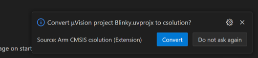

## Project conversion with a GUI 

1. In VS Code, go to **File - Open Folder** and select the folder containing the uvprojx file (here `Blinky.uvprojx`).

1. Once the folder is open in VS Code, a pop up appears in the bottom left corner asking if the uvprojx file should be converted:

   

1. Click the **Convert** button.

1. The following files (and more) are generated:
   - `Blinky.csolution.yaml`
   - `Blinky.cproject.yaml`
   - `vcpkg-configuration.json`

1. The vcpkg configuration file is automatically activated. You notice an active configuration in the **Status Bar** at the bottom:

   

1. Click on the **CMSIS** icon in the **Activity Bar**. The **Primary Side Bar** changes and shows the **CONTEXT**, **SOLUTION**, and **ACTIONS** for the project.

1. In the **ACTIONS** section, click on **Build**:

   

1. The `cbuild` task starts. A successful project build will end with:

   ```output
   Program size: Code=... RO-data=... RW-data=... ZI-data=...
   info cbuild: build finished successfully!
   Build complete
   ```
