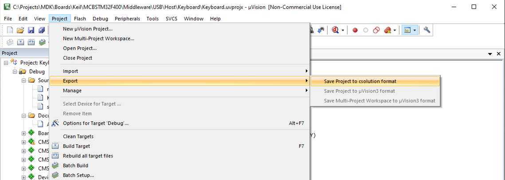
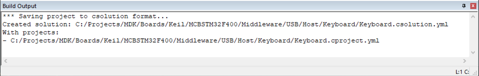

## Project conversion with µVision

1. In &micro;Vision, go to **Project - Export - Save Project to csolution format**:

   

1. The **Build Output** window will show a successful conversion:

   

1. You can now use the project with the CMSIS-Toolbox or Keil Studio.
