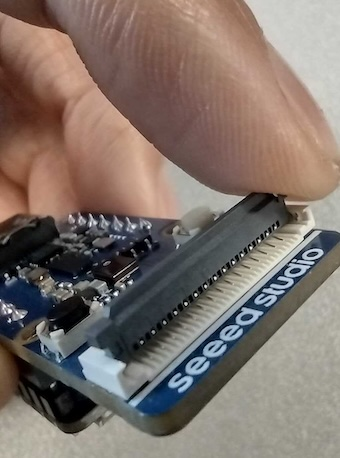
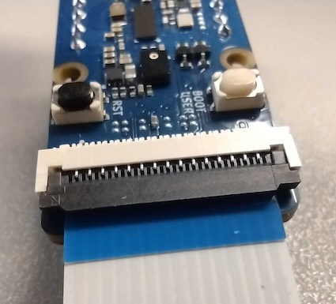
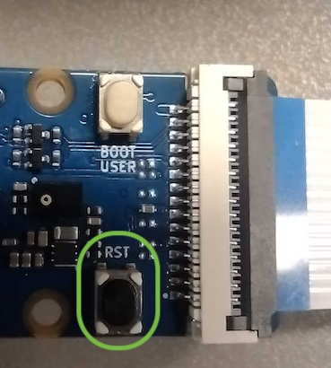

## Flash the Firmware

Now that we have generated a firmware file on our local machine, we need to flash the microcontroller with this firmware. 

### Step 3.1. Install xmodem.

`Xmodem` is a basic file transfer protocol. Run the following command to install the dependencies for xmodem. 

```bash
cd $HOME/Seeed_Grove_Vision_AI_Module_V2 # If you cloned the repo to a different location replace $HOME with the path. 
pip install -r xmodem/requirements.txt
```

### Step 3.2. Connect the module to PC by USB cable.

You will need to insert the FPC cable cable into the Grove Vision AI V2 module. Lift the dark grey latch on the connector as per the image below.



Then, slide the FPC connector in with the metal pins facing down and close the dark grey latch to fasten the connector. 



Then connect the Groove Vision AI V2 Module to your computer via the USB-C cable.

### Step 3.4. Flash the firmware onto the moule.

Run the python script below to flash the firmware. 

```python
python xmodem\xmodem_send.py --port=[your COM number] --baudrate=921600 --protocol=xmodem --file=we2_image_gen_local\output_case1_sec_wlcsp\output.img 
```

    Note: If running one of the other example models demonstrated in '(Optional) Try Different Models', the command might be slightly different.

After the firmware image burning is completed, the message "Do you want to end file transmission and reboot system? (y)" is displayed. Press the reset button on the module as per the image below.


