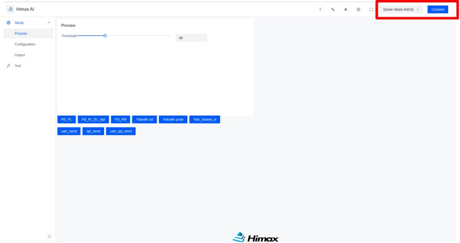

### Step 4.1. Connect module to PC with USB cable.

Exit the terminal session and connect the module to the PC via your USB-C cable. 

### Step 4.2. Download the Himax AI web toolkit.  

The Himax AI web toolkit enables a browser-based graphical user interface (GUI) for the live camera feed. 

Download the Himax AI Web toolkit by clicking on this [link](https://github.com/HimaxWiseEyePlus/Seeed_Grove_Vision_AI_Module_V2/releases/download/v1.1/Himax_AI_web_toolkit.zip)

Unzip the archived file and double click `index.html`. This will open the GUI within your default browser.

### Step 4.3. Connect to the Grove Vision AI

Select 'Grove Vision AI(V2)' in the top-right hand corner and press connect button. 

