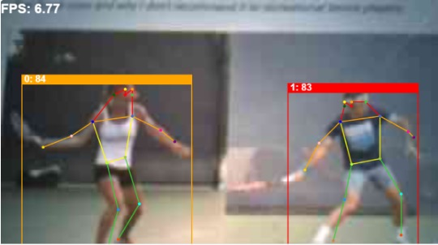

### Modify the makefile

Change the directory to the where the makefile is located.

```bash
cd $HOME/Seeed_Grove_Vision_AI_Module_V2/EPII_CM55M_APP_S/ # replace $HOME with the location of the project
```

Using a text editor, for example visual studio code or nano, modify the `APP_TYPE` field in the makefile from the default value of `allon_sensor_tflm` to one of the values in the table below 


|APP_TYPE =|Description|
|---|---|
|tflm_folov8_od|Object detection|
|tflm_folov8_pose|Pose detection|
|tflm_fd_fm|Face detection|

### Regenerate the Firmware Image

Go back to the 'Build The Firmware' section and start from Step 3.2. to regenerate the firmware image. 

The images below are examples images from the model. 

#### Objection Detection


#### Pose Estimation


#### Face Detection


