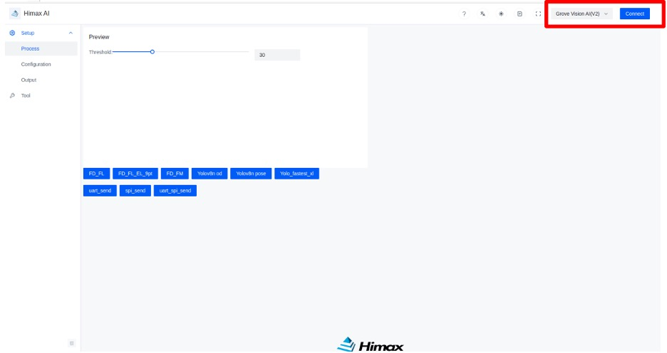
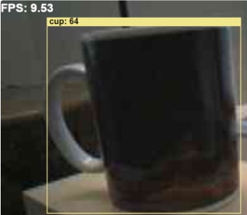
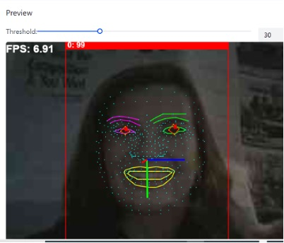

In this section, you will view a live camera feed with a computer vision application running.

## Modify the makefile

Change to the directory where the `makefile` is located. 

```bash
cd $HOME/Seeed_Grove_Vision_AI_Module_V2/EPII_CM55M_APP_S/
```

The table shows the different options available to use with the web toolkit. 

Use a text editor to open `makefile` and modify the `APP_TYPE` field to one of the values in the table. 

You will use the model argument value with the `--model` option to the `xmodem` command.

|APP_TYPE           |Description        | Model argument |
|---                |---                |---
|tflm_yolov8_od     |Object detection   | model_zoo\tflm_yolov8_od\yolov8n_od_192_delete_transpose_0xB7B000.tflite 0xB7B000 0x00000 |
|tflm_fd_fm         |Face detection     | model_zoo\tflm_fd_fm\0_fd_0x200000.tflite 0x200000 0x00000 model_zoo\tflm_fd_fm\1_fm_0x280000.tflite 0x280000 0x00000 model_zoo\tflm_fd_fm\2_il_0x32A000.tflite 0x32A000 0x00000 |

{}
For `tflm_fd_fm`, you need to pass all three models as separate `--model` arguments.
{}


## Regenerate the firmware image

Use Make to regenerate the `.elf` file.

```bash
make clean
make
```

Use the same commands from previous section to regenerate the firmware image:

```bash
cd ../we2_image_gen_local/
cp ../EPII_CM55M_APP_S/obj_epii_evb_icv30_bdv10/gnu_epii_evb_WLCSP65/EPII_CM55M_gnu_epii_evb_WLCSP65_s.elf input_case1_secboot/
```

Run the script corresponding to the OS of your host machine.


  
./we2_local_image_gen project_case1_blp_wlcsp.json
  
  
./we2_local_image_gen_macOS_arm64 project_case1_blp_wlcsp.json
  



Finally, use `xmodem` to flash the image.

```bash
python xmodem\xmodem_send.py --port=<COM port> \
--baudrate=921600 --protocol=xmodem \
--file=we2_image_gen_local\output_case1_sec_wlcsp\output.img \
--model=<model argument>
```

Press the reset button when prompted before moving on.

## Download the Himax AI web toolkit

The Himax AI web toolkit enables a browser-based graphical user interface (GUI) for the live camera feed.

```bash
wget https://github.com/HimaxWiseEyePlus/Seeed_Grove_Vision_AI_Module_V2/releases/download/v1.1/Himax_AI_web_toolkit.zip
unzip Himax_AI_web_toolkit.zip
```

{}
If needed, install the unzip command:

```bash
sudo apt install unzip -y
```
{}

Open the file `index.html` in a browser. You can double click the file in a file browser or use the `File -> Open File...` command from the browser menu.

## Connect to the Grove Vision AI

Select `Grove Vision AI(V2)` in the top-right hand corner and press `Connect` button. Follow the instructions to set up the connection. You should see a video feed with a bounding box showing identified objects, poses or face detection.



The images below are captured images from the models run in the toolkit.

### Objection detection


The Frames Per Second (FPS) index represents the number of ML inferences the hardware can complete per second. A higher number indicates better performance. The colored bounding boxes represent the objects identified by YOLO. The name of the object is labeled in the top left-hand corner of the box, and the number in parentheses is the confidence level as a percentage. This example shows that it can identify 9.53 frames per second with a confidence level of 64% for the 'CPU' object.

### Face detection


Similar to the previous example, the bounding boxes identify the areas in the image that contain faces and recognize the positions of different facial features. This image shows that YOLO has identified a face with 99% confidence. It has marked the mouth with a yellow line segment and used different colors to mark the eyebrows, eyes, and nose. Within the bounding box for the eyes, it has further identified the gaze direction vector.
