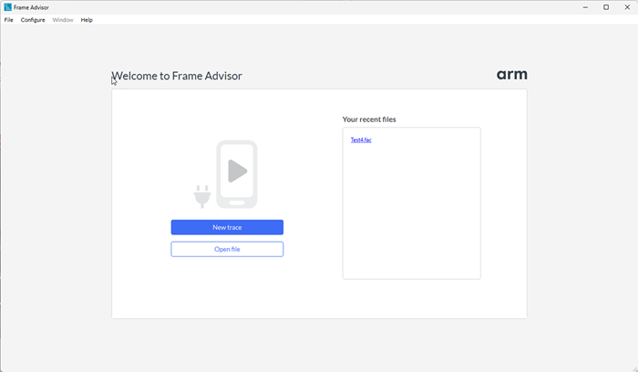
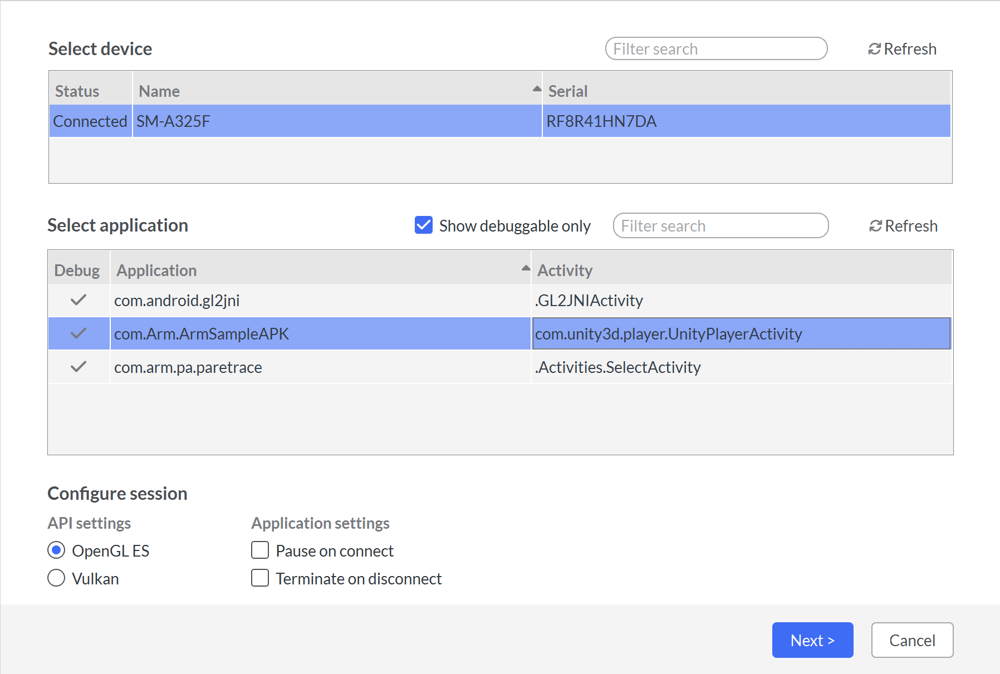

1. Open Frame Advisor and select `New Trace`.

    

1. Frame Advisor lists the connected devices and the applications installed. Select your device and the application containing the frames that you want to capture.

    

1. If your application is Vulkan, change the selection in the API settings.

1. Click `Next` to start the capture session. The application will start automatically on the device.

    

1. Play the application until you find your problem area. Just before you reach the part of the application where you have a frame rate drop or where the device overheats, click `Pause`, or hit the space bar. You can use the step button to move forward frame by frame.

1. You can currently capture a frame burst of up to 3 consecutive frames. Here, we will capture one frame. Click the capture button and Frame Advisor will capture the next frame.

    By default, we capture only the color attachment. Change the `Capture mode` to `All attachments` to also include any depth and stencil attachments as well as any attachments from multiple render targets, or you can capture the overdraw in the scene.

    When the capture completes, the frame is shown in the `Captured frames` list.

1. Click `Analyze` to see the results. This might take a few minutes, depending on your content and how many frames you captured.
