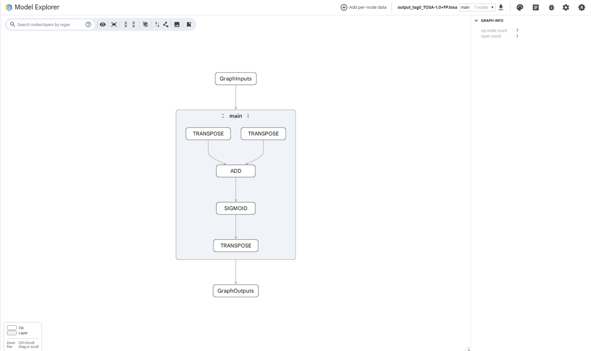

## Installing the explorer
you will need to download the model explorer and some extensions so use this command: 
    pip install ai-edge-model-explorer 
    pip install torch ai-edge-model-explorer
    pip install pte-adapter-model-explorer
    pip install tosa-adapter-model-explorer
    pip install vgf-adapter-model-explorer

## Loading the explorer with the correct extensions

we will now view our models in the model explorer with the below command 

    model-explorer --extensions=pte_adapter_model_explorer

we do this in order to have proper visibility into our models operations

now once the webpage has loaded please select the relevant .tosa file 

you may have noticed various possible file extensions in the homepage for the model explorer. we will use one of them later but it is good to know what file extensions of your own personal models you can view. 

## Exploring the explorer 

Inside the model explorer we can view a variety of operations. in this case we have loaded the 
.tosa buffer so we can see all the operations inside of our model. 

Given that our model is of simple scale we can see a limited number of operations however as the models you use expand and grow this section will become much larger 
