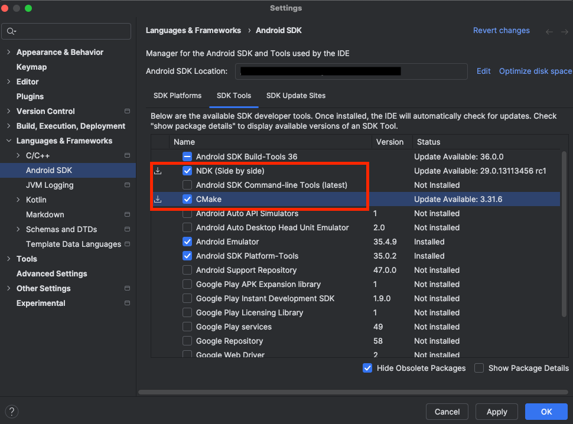

In this section, you will set up a development environment by installing dependencies and preparing the Qwen vision model.

## Install required software

Install the Android NDK (Native Development Kit) and git-lfs. This learning path was tested with NDK version `28.0.12916984` and CMake version `4.0.0-rc1`.

For Ubuntu or Debian systems, you can install CMake and git-lfs with the following command:

```bash
sudo apt update
sudo apt install cmake git-lfs -y
```

You can use Android Studio to obtain the NDK. Click **Tools > SDK Manager**, and navigate to the the SDK Tools tab. Select the NDK (Side by side) and CMake checkboxes, as shown below:



Refer to [Install NDK and CMake](https://developer.android.com/studio/projects/install-ndk) for other installation methods.

Make sure Python and pip is installed by verifying a version is printed on running this command:

```bash
python --version
pip --version
```

{}
The above commands may fail when Python is installed if Python 3.x is not the default version. You can try running `python3 --version` and `pip3 --version` to be sure.
{}

## Set up phone connection

You will need to set up an authorized connection with your phone. The Android SDK Platform Tools package, included in Android Studio, comes with Android Debug Bridge (ADB). You will use this tool to transfer files later on.

Connect your phone to the computer using a USB cable. You will need to activate USB debugging on your phone. Find the **Build Number** in your **Settings** app and tap it 7 times. Then, enable **USB debugging** in **Developer Options**.

You should now see your device listed upon running `adb devices`:

```output
List of devices attached
<DEVICE ID>     device
```

## Download and convert the model

The following commands download the model from Hugging Face, and clones a tool for exporting LLM model to the MNN framework.

```bash
cd $HOME
pip install -U huggingface_hub
huggingface-cli download Qwen/Qwen2-VL-2B-Instruct --local-dir ./Qwen2-VL-2B-Instruct/
git clone https://github.com/wangzhaode/llm-export
cd llm-export && pip install .
```

You can use the `llm-export` repository to convert the model with the following options:

```bash
llmexport --path ../Qwen2-VL-2B-Instruct/ --export mnn --quant_bit 4 \
    --quant_block 0 --dst_path Qwen2-VL-2B-Instruct-convert-4bit-per_channel --sym
```

| Parameter        | Description | Explanation |
|------------------|-------------|--------------|
| `--quant_bit`    | mnn quant bit, 4 or 8, default is 4 | `4` represents q4 quantization. |
| `--quant_block`  | mnn quant block, default is 0 | `0` represents per-channel quantization, `128` represents 128 per-block quantization. |
| `--sym`          | symmetric quantization (without zeropoint), defualt is False.| The quantization parameter that enables symmetrical quantization. |

To learn more about the parameters, refer to the [transformers README.md](https://github.com/alibaba/MNN/tree/master/transformers).

Verify the build was correct by checking the size of the resulting model. The `Qwen2-VL-2B-Instruct-convert-4bit-per_channel` directory should total to at lest 1 GB.

Push the model onto the device.

```shell
adb shell mkdir /data/local/tmp/models/
adb push Qwen2-VL-2B-Instruct-convert-4bit-per_channel /data/local/tmp/models
```

With the model set up, it's time to use Android Studio to build and run an example application.