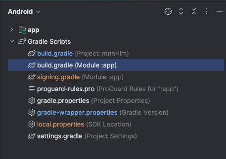
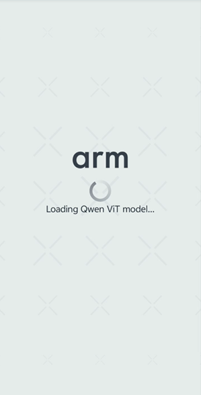
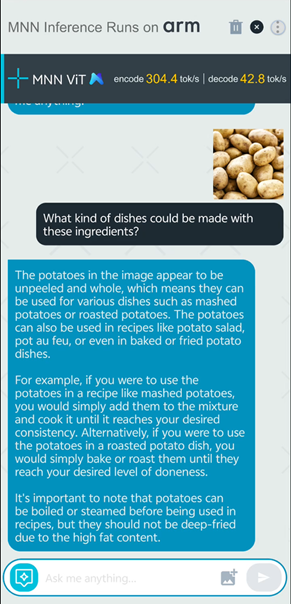

## Set up development environment

In this section, you will build and deploy a ViT chat app to an Android device using MNN-LLM. You will learn how to build the MNN-LLM and how to run the Qwen model for the Android application.

The first step is to prepare a development environment with the required software.

Install the Android NDK (Native Development Kit), CMake and git-lfs. This learning path was tested with NDK version `28.0.12916984` and CMake version `4.0.0-rc1`.

For Ubuntu or Debian systems, you can install the Android NDK on an x86_64 using:

```bash
sudo apt update
sudo apt install cmake git-lfs google-android-ndk-installer -y
```
For other operating systems, refer to [Install NDK and CMake](https://developer.android.com/studio/projects/install-ndk).

Make sure Python and pip is installed by verifying a version is printed on running this command:

```bash
python --version
pip --version
```

{}
The above commands may fail when Python is installed if Python 3.x is not the default version. You can try running `python3 --version` and `pip3 --version` to be sure.
{}

You will use pip to install a package at a later point.

## Clone MNN repo

To run the example mobile application, a fork of the MNN repository is set up as an Android Studio project. Run the following to clone the repository and checkout the source tree:

```bash
cd $HOME
git clone https://github.com/HenryDen/MNN.git
cd MNN
git checkout origin/MNN_commit
```

{}
The app code is currently not merged into the MNN repo. The repo above is a fork from the MNN upstream repository.
{}

## Build the app using Android Studio

### Create sign file for release version

You will need a signing.gradle file for the your project to build correctly. If you need to compile a release version of the app, you can skip the following step of creating a sign file and write anything in the signing.gradle.
Create a  file at android/app with the following template:
```shell
ext{
    signingConfigs = [
        release: [
            storeFile: file('PATH_TO_jks_file'),
            storePassword: "****",
            keyAlias: "****",
            keyPassword: "****"
        ]
    ]
}
```


### Open project and build
Open Android Studio. Go to **File > Open**. Navigate to the MNN repository you just cloned. Choose the `transformers/llm/engine/android` directory and click `OK`.

This will trigger a build of your project, and you should see a similar output on completion:

```output
BUILD SUCCESSFUL in 1m 42s
```
### Add a namespace
For some Gradle versions, you are required to add a `namespace` to your `build.gradle` file.




From the Android menu, open the highlighted file in the above image and add the following to the `android` field.

```output
namespace "com.mnn.llm"
```
- Add namespace to build.gradle com.mnn.llm

### Generate the APK

Navigate to **Build > Generate Signed App Bundle or APK**. Select **APK** and click **next**.
- Press **Create new** and  fill in the information.
- Fill in the information of the newly generated JKS file in the template above.

Open the MNN/transformers/llm/engine/android directory with Android Studio and wait for the Gradle project sync to finish.

## Prepare the model
You can download the model from ModelScope : https://www.modelscope.cn/models/qwen/qwen2-vl-2b-instruct

If you need to test other vision transformer models, you can download models from  https://modelscope.cn/organization/qwen?tab=model and convert them to MNN format.


The following commands download the model from Hugging Face, and clones a tool for exporting LLM model to the MNN framework.

```bash
git clone https://huggingface.co/Qwen/Qwen2-VL-2B-Instruct
git clone https://github.com/wangzhaode/llm-export
cd llm-export && pip install .
```

Finally, convert the model with the following options:
```bash
llmexport --path ../Qwen2-VL-2B-Instruct/ --export mnn --quant_bit 4 --quant_block 0 --dst_path Qwen2-VL-2B-Instruct-convert-4bit-per_channel --sym
```

| Parameter        | Description | Explanation |
|------------------|-------------|--------------|
| `--quant_bit`    | mnn quant bit, 4 or 8, default is 4 | `4` represents q4 quantization. |
| `--quant_block`  | mnn quant block, default is 0 | `0` represents per-channel quantization, `128` represents 128 per-block quantization. |
| `--sym`          | symmetric quantization (without zeropoint), defualt is False.| The quantization parameter that enables symmetrical quantization. |

To learn more about the parameters, refer to the [transformers README.md](https://github.com/alibaba/MNN/tree/master/transformers).

## Build and run the app
Before launching the app, you need to push the model into the device manually:

```shell
$ adb shell mkdir /data/local/tmp/models/
$ adb push <path to the model folder> /data/local/tmp/models
```

When you select Run, the build will be executed, and then the app will be copied and installed on the Android device.

After opening the app, you will see:



After the Model is loaded, you can chat with the APP.


