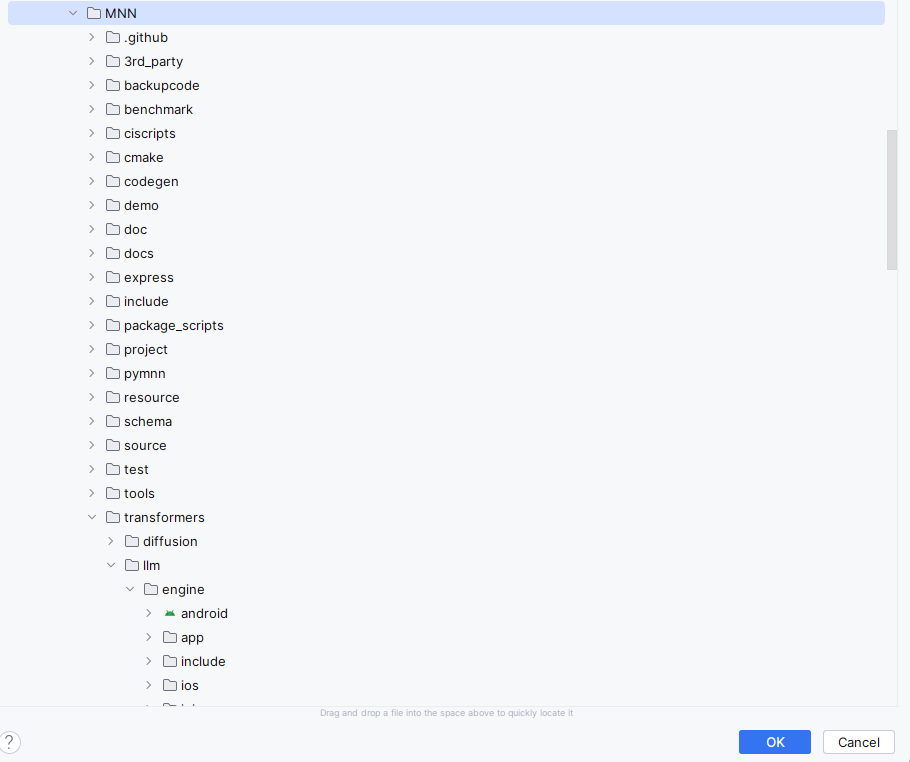

## Set up development environment
In this learning path, you will learn how to build and deploy a Vision Transformer(ViT) chat app to an Android device using MNN-LLM. You will learn how to build the MNN-LLM and how to run the Qwen model for the Android application.

The first step is to prepare a development environment with the required software:

- Android Studio (latest version recommended)
- Android NDK (tested with version 28.0.12916984)
- CMake (4.0.0-rc1)
- Python3 (Optional)
- Git

## Clone MNN repo
Open up a Windows PowerShell or Git Bash and checkout the source tree:

```shell
cd C:\Users\$env:USERNAME
git clone https://github.com/HenryDen/MNN.git
cd MNN
git checkout origin/llm_android_demo
```

{}
The app code is currently not merged into the MNN repo. The repo above is a fork from the MNN. 
{}

## Build the app using Android Studio

Open Android Studio

- Navigate to **Open**.
- Browse the folder to the MNN/transformers/llm/engine/android, it will be android icon as picture show,
- Press **OK** to load the android project
- Wait for a while till the Gradle sync finish




## Prepare the model
You can download the model from ModelScope : https://modelscope.cn/models/MNN/Qwen2-VL-2B-Instruct-MNN

Or Hugging Face : https://huggingface.co/taobao-mnn/Qwen2-VL-2B-Instruct-MNN

```shell
$ git lfs install
$ git clone https://www.modelscope.cn/MNN/Qwen2-VL-2B-Instruct-MNN.git
```

If you need to test other vision transformer models, you can download models from  https://modelscope.cn/organization/qwen?tab=model and convert them to MNN format.

```shell
// make sure install git lfs
$ git lfs install
$ git clone https://huggingface.co/Qwen/Qwen2-VL-2B-Instruct
// install llm-export
$ git clone https://github.com/wangzhaode/llm-export && cd llm-export/
$ pip install .
// CONVERT model
$ llmexport --path /path/to/mnn-llm/Qwen2-VL-2B-Instruct/ --export mnn --quant_bit 4 --quant_block 0 --dst_path Qwen2-VL-2B-Instruct-convert-4bit-per_channel --sym
```

- --quant_bit: the quantization parameter, for example 4 is the q4 quantization
- --quant_block: the quantization parameter, for example 0 is per channel quantization, 128 is 128 per block quantization
- --sym: the quantization parameter, means symmetrical quantization.

## Build and run the app
Before launching the app, you need to push the model into the device manually, connect the android device with the host PC with usb, and make sure the USB debugging is enable in the android device:

```shell
$ adb shell mkdir /data/local/tmp/models/
$ adb push <path to the model folder> /data/local/tmp/models
```

When you select Run, the build will be executed, and then the app will be copied and installed on the Android device. 

After opening the app, you will see:


After the Model is loaded, you can chat with the APP.


