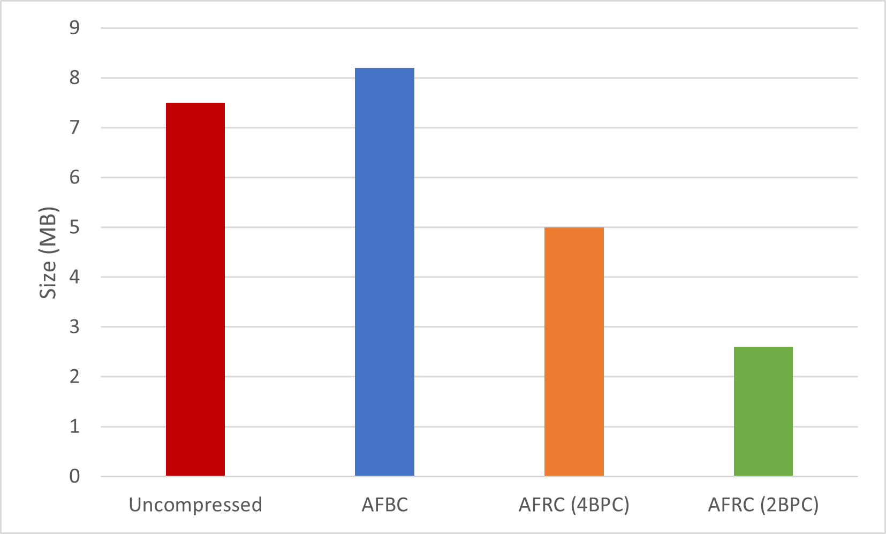
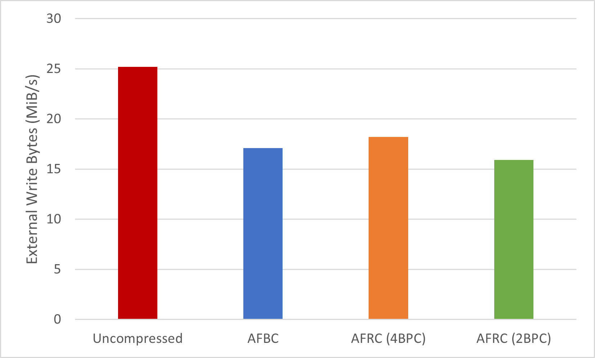

## What is fixed-rate compression?

Image compression is the process of encoding images so that they can be stored and transmitted using fewer bits than in their original representation.
This generally results in reduced memory footprint and bandwidth, which helps applications perform better.

Lossless compression schemes, such as [Arm Frame Buffer Compression (AFBC)](https://developer.arm.com/documentation/101897/latest/Buffers-and-textures/AFBC-textures-for-Vulkan?lang=en), achieve this without compromising quality as they are able to preserve all of the original data after decompression but at the expense of certain trade-offs, for example, reserving memory for compression metadata.

[Arm Fixed Rate Compression (AFRC)](https://developer.arm.com/documentation/101897/latest/Buffers-and-textures/AFRC?lang=en), however, uses the same bitrate for all compression blocks, so that the encoder and decoder can be better optimized.
It guarantees a reduced memory footprint and often reduced bandwidth.
For example, the Sponza scene shown below, on a Google Pixel 8 shows the difference between uncompressed and compressed images with both AFBC and AFRC:

&nbsp;
| Memory footprint (lower is better) | Memory bandwidth (lower is better) |
| ----------- | ----------- |
|  |  |

Fixed-rate compression is lossy but, despite this, AFRC achieves high quality results even with the highest compression ratios, preserving detail in edges and high-frequency areas.
So much so that, to the naked eye, the compressed and uncompressed images look the same side-by-side, so that it may be called 'visually lossless':

&nbsp;
| Uncompressed | AFRC 2BPC (bits per component) |
| ----------- | ----------- |
|  |  |

More information can be found in [this blog on Arm® Immortalis™](https://community.arm.com/arm-community-blogs/b/graphics-gaming-and-vr-blog/posts/arm-immortalis-g715-developer-overview) and in [this Vulkan sample](https://github.com/KhronosGroup/Vulkan-Samples/blob/main/samples/performance/image_compression_control/README.adoc).

Whereas default lossless compression can be transparently handled by the driver to improve performance, it is up to developers to explicitly enable fixed-rate compression for those images that will benefit the most from it.

For this, Vulkan provides the following extensions: [VK_EXT_image_compression_control](https://docs.vulkan.org/spec/latest/appendices/extensions.html#VK_EXT_image_compression_control) and [VK_EXT_image_compression_control_swapchain](https://docs.vulkan.org/spec/latest/appendices/extensions.html#VK_EXT_image_compression_control_swapchain).
