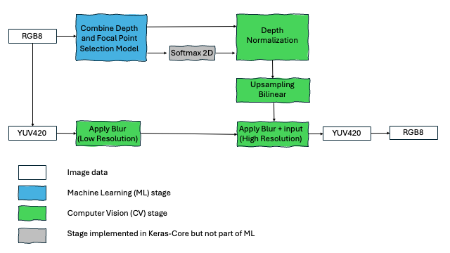
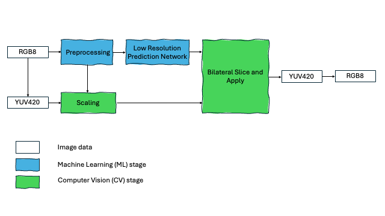
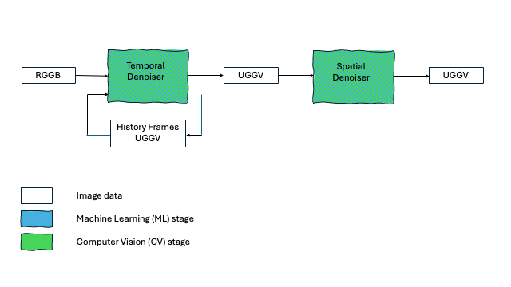

## KleidiAI

[KleidiAI](https://gitlab.arm.com/kleidi/kleidiai) is an open-source library of optimized, performance-critical routines (micro-kernels) for AI workloads on Arm CPUs. These routines are tuned for specific Arm microarchitectures to maximize performance and are designed for straightforward integration into C/C++ ML and AI frameworks.

Several popular AI frameworks already take advantage of KleidiAI to improve performance on Arm platforms.

## KleidiCV

[KleidiCV](https://gitlab.arm.com/kleidi/kleidicv) is an open-source library that provides high-performance image-processing functions for AArch64. It is lightweight and simple to integrate, and computer-vision frameworks such as OpenCV can leverage KleidiCV to accelerate image processing on Arm devices.

## AI camera pipelines

This Learning Path provides three example applications that combine AI and computer vision (CV) techniques:

- Background blur
- Low-light enhancement (LLE)
- Neural denoising

## Background blur and low-light enhancement

The applications:

- Use input and output images in **PNG** format with three **RGB** channels (8-bit per channel, often written as **RGB8**)
- Convert images to **YUV 4:2:0** for processing
- Apply the relevant effect (background blur or low-light enhancement)
- Convert the processed images back to **RGB8** and save as **.png**

## Background blur

The background blur pipeline is implemented as follows:

## Low-light enhancement

The low-light enhancement pipeline is adapted from the LiveHDR+ method proposed by Google Research (2017):

The low-resolution coefficient-prediction network (implemented with LiteRT) performs operations such as:

- Strided convolutions
- Local feature extraction using convolutional layers
- Global feature extraction using convolutional and fully connected layers
- Add, convolve, and reshape ops

## Neural denoising

Every smartphone photographer has experienced it: images that look sharp in daylight but degrade in dim lighting. This is because **signal-to-noise ratio (SNR)** drops sharply when sensors capture fewer photons. At 1000 lux, the signal dominates and images look clean; at 1 lux, readout noise becomes visible as grain, color speckling, and loss of fine detail.

That’s why **neural camera denoising** is a critical, computationally-demanding, stage in modern camera pipelines. Done well, it can transform noisy frames into sharp, vibrant captures; done poorly, it leaves smudges and artifacts.

As shown below, the neural-denoising pipeline uses two algorithms:

- **Temporal** denoising, `ultralite` in the repository (uses a history of previous frames)
- **Spatial** denoising, `collapsenet` in the repository
- Or a combination of both

The Neural Denoising application works on frames, as emitted by a camera sensor in Bayer format:
- The input frames are in RGGB 1080x1920x4 format
- The output frames in YGGV 4x1080x1920 format
