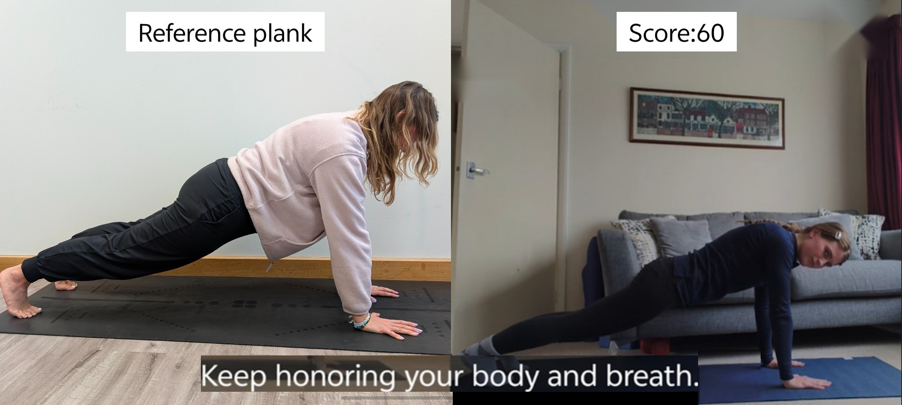

## What you will build

In this Learning Path, you will build a simple on-device AI fitness tutor for Android.

The app watches a learner hold a plank, compares their body position with a stored instructor reference, asks a local LLM for one short correction, and speaks the correction using Android text-to-speech.

This project is based on the [AI Yoga Tutor](https://developer.arm.com/community/arm-community-blogs/b/ai-blog/posts/ai-yoga-tutor) demo. The Learning Path keeps the same core pipeline, but narrows the app to one static pose so you can focus on how a pipeline that includes Android camera, pose detector, local LLM, and speech output fits together.



The finished app has two main visual areas:

- An instructor plank image on the left.
- A live front-camera preview on the right.

The app overlays a pose score and a short caption that matches the spoken coaching feedback.

This Learning Path starts with a "shell" project with MediaPipe and camera integration mostly setup. If you wish to learn about that setup from an empty project, you could try another Learning Path - [Build a Hands-Free Selfie Android Application with MediaPipe](https://learn.arm.com/learning-paths/mobile-graphics-and-gaming/build-android-selfie-app-using-mediapipe-multimodality/) is a good example.

## App pipeline

The app uses a small pipeline of on-device components:

```text
reference image and camera view
        -> CameraX live frames
        -> Pose landmarks
        -> joint-angle scoring
        -> compact text prompt
        -> Arm AI Chat + LLM
        -> Text-To-Speech
```

Each stage passes structured data to a subsequent stage. The LLM does not receive camera frames or images. It receives a short text prompt describing the largest joint-angle differences between the learner and the reference plank pose.

This keeps the LLM prompt small, reduces latency, and makes the behavior easier to tune.

## Clone the starter project

Clone the Learning Path code examples repository:

```console
git clone https://gitlab.arm.com/learning-code-examples/code-examples.git
```

The starter app for this Learning Path is in:

```text
code-examples/learning-paths/mobile-graphics-and-gaming/ai-plank-tutor/android
```

{}
The starter project contains the app structure, layout, image asset, MediaPipe pose model, and several Kotlin shell files. You will fill in the missing code over the next pages.
{}

## Open the project in Android Studio

1. Start Android Studio.
2. Select **Open**.
3. Open `code-examples/learning-paths/mobile-graphics-and-gaming/ai-plank-tutor/android`.
4. Wait for Gradle sync to finish.

If Android Studio prompts you to trust the project, accept the prompt.

The starter app is intentionally incomplete, but it should sync successfully before you add code.

## Inspect the provided files

Start by looking at the files that are already provided for you.

Open `app/build.gradle` and confirm that the Android, CameraX, lifecycle, and MediaPipe dependencies are already present.
Arm's AI Chat dependency is not included yet. You will add it later, when you implement local LLM inference.

Open `app/src/main/AndroidManifest.xml` and confirm that the app requests camera access:

```xml
<uses-permission android:name="android.permission.CAMERA" />
```

Open `app/src/main/res/layout/activity_main.xml` and review the main UI. The layout already contains:

- An `ImageView` for the instructor plank image.
- A `PreviewView` for the live camera.
- A score label.
- A caption label for spoken feedback.

Open `app/src/main/res/drawable/plank.jpg` and review the instructor reference image.

Code is under the long path `app/src/main/java/com/arm/demo/AIPlankTutor`. Under that, open `data/PlankPoseData.kt` and note the hard-coded plank reference data. This file contains the instructor's reference landmarks and angle weights used by the scoring step. This was generated from the reference plank image in an offline step so it doesn't need any runtime compute.

Android code starts from the `MainActivity.kt` file, and we will look at that in the next step.
