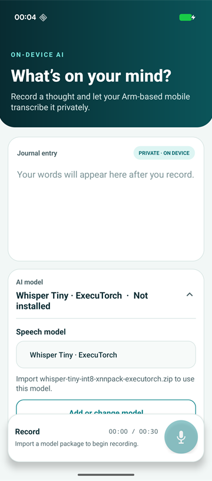

## Connect an Android phone

Enable **Developer options** and **USB debugging** on the phone. Connect the phone to your development computer with USB, unlock it, and accept the debugging authorization prompt.

Verify that the phone is listed in `adb`:

```console
adb devices -l
```

The output lists the authorized phone and its device serial. If the phone reports `unauthorized`, unlock it and accept the debugging prompt. If the phone doesn't appear, see [Run apps on a hardware device](https://developer.android.com/studio/run/device).

Confirm that the phone uses the Arm64 ABI and runs Android 9 (API 28) or later:

```console
adb shell getprop ro.product.cpu.abi
adb shell getprop ro.build.version.sdk
```

The first command should print `arm64-v8a`. The second command should print a version `28` or later.

{}
On Linux, a phone that doesn't appear in `adb` might need Android `udev` rules and membership in the `plugdev` group. On Windows, you might need the phone manufacturer's USB driver. You don't normally need an additional USB driver on macOS.
{}

## Clone the application repository

Clone the repository with Git, then enter the project directory:

```console
git clone https://github.com/arm-education/ai-portal-speech-to-text-app.git
cd ai-portal-speech-to-text-app
```

Run the remaining terminal commands from this project directory.

## Prepare the Arm AI Portal model downloader

The sample repository includes a downloader for its supported Arm AI Portal model packages. Create a Python virtual environment and install the Hugging Face Hub package used by the downloader:


  
python3 -m venv .hf-venv
.hf-venv/bin/python -m pip install --upgrade pip huggingface_hub
  
  
python -m venv .hf-venv
.\.hf-venv\Scripts\python.exe -m pip install --upgrade pip huggingface_hub
  


The later commands invoke the environment's Python executable directly, so the PowerShell script-execution policy doesn't need to be changed.

If Python reports that `venv` is unavailable on Debian or Ubuntu, install the `python3-venv` package and rerun the command.

## Build and run the Whisper Journal application

Use the Gradle wrapper to build and lint the debug Android package (APK):


  
chmod +x gradlew
./gradlew :app:assembleDebug :app:lintDebug
  
  
.\gradlew.bat :app:assembleDebug :app:lintDebug
  


You don't need to install Gradle separately because the repository includes the wrapper.

Install the APK and start Whisper Journal with the commands used on every operating system:

```console
adb install -r app/build/outputs/apk/debug/app-debug.apk
adb shell am start -n org.arm.learningpath.whisper/.MainActivity
```

On a first install, Whisper Journal opens with recording disabled because no model has been imported. Installing with `adb install -r` preserves any model imported previously.



## What you've accomplished and what's next

You've connected an Arm-based Android phone, prepared the model downloader, and confirmed that Whisper Journal builds and starts.

Next, you'll download an optimized speech transcription model from the Arm AI Portal and transcribe speech locally.
