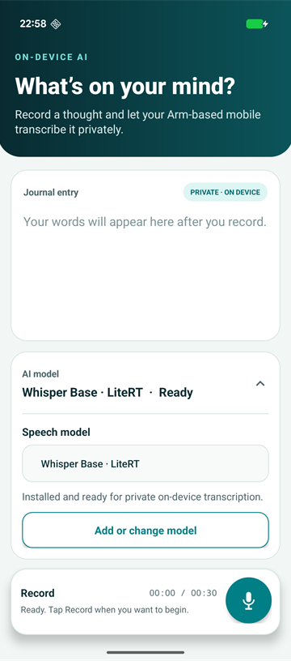
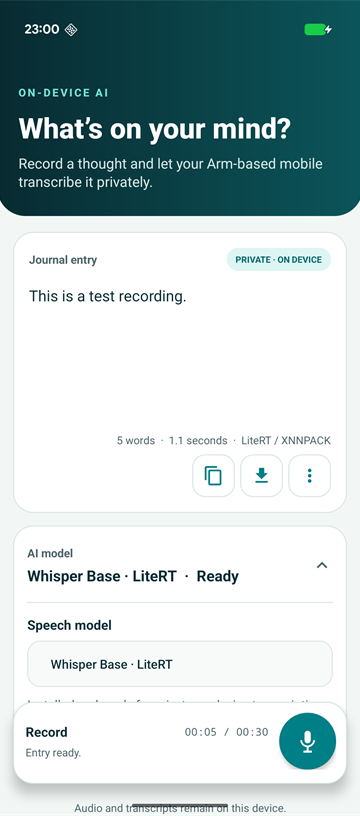

## Whisper Journal adapters

An adapter is application code that connects the shared Android interface to a model task and runtime. It validates a compatible model, prepares its inputs, invokes [LiteRT for Android](https://ai.google.dev/edge/litert/android) or [ExecuTorch for Android](https://docs.pytorch.org/executorch/stable/using-executorch-android.html), and converts the outputs into results the application can display.

Whisper Journal uses a separate adapter for each supported runtime. The adapter connects the shared recording interface to the runtime and handles each model’s preprocessing and decoding requirements. After you select a registered model, the application chooses the matching adapter automatically.

## Speech recognition with Whisper Journal

Whisper Journal records mono audio at 16 kHz and generates an English transcript locally on the Android CPU. It doesn't upload the recording to a server.

Start with Whisper Base INT8 and its LiteRT adapter. You can use another supported model after completing the default workflow. Run the commands from the project directory in the same terminal session that you used during setup.

{}
Arm AI Portal models are hosted on Hugging Face. The `download_model.py` script uses `huggingface_hub` and connects to `https://huggingface.co` by default.
{}

## Run Whisper Base with LiteRT

Set `MODEL_ID` to the complete Hugging Face repository ID for the Whisper Base model.


  
export MODEL_ID="Arm/whisper-base-int8-litert"
  
  
$MODEL_ID = "Arm/whisper-base-int8-litert"
  


Download the model and copy it to the phone:


  
export MODEL_PACKAGE="$(.hf-venv/bin/python download_model.py \
  --repo-id "$MODEL_ID" \
  --print-path)"

printf 'Model package: %s\n' "$MODEL_PACKAGE"
adb push "$MODEL_PACKAGE" /sdcard/Download/
  
  
$MODEL_PACKAGE = .\.hf-venv\Scripts\python.exe download_model.py `
  --repo-id "$MODEL_ID" `
  --print-path

Write-Output "Model package: $MODEL_PACKAGE"
adb push "$MODEL_PACKAGE" /sdcard/Download/
  


The downloader selects `whisper_base_vivo_litert_optimized.tflite` and packages it with the matching tokenizer and support files as `whisper-base-int8-litert.zip`.

The final command copies the package to the phone's **Downloads** directory.

### Import and transcribe with LiteRT

In Whisper Journal:

1. Expand **AI model**.
2. Select **Whisper Base · LiteRT**.
3. Select **Add or change model**.
4. Open **Downloads** in the Android document picker and select `whisper-base-int8-litert.zip`.
5. Wait until the model panel reports **Installed and ready for private on-device transcription**.



The importer copies the required model and tokenizer files into application-private storage. You can delete the package from Android's **Downloads** directory after the import completes.

Choose two short test sentences and use the same sentences for the comparison later. Record each sentence as a separate entry under similar microphone and background-noise conditions:

1. Select **Record** and grant microphone access if Android asks for it.
2. Speak one test sentence.
3. Select **Stop recording** when you finish. Otherwise, recording stops automatically after 30 seconds.

Repeat these steps for the second sentence.

Wait while the LiteRT adapter prepares the audio, runs the model, and decodes the transcript.

The completed journal entry shows the English transcript, word count, adapter transcription time, and LiteRT with XNNPACK as the runtime backend. The time includes preprocessing, model inference, and token decoding. It doesn't include recording, model import, or model loading.



Treat the displayed transcription time as an application measurement rather than a benchmark.

## Compare with Whisper Tiny and ExecuTorch

Next, run the Whisper Tiny INT8 package with the ExecuTorch adapter. This comparison changes both the model and the runtime. It demonstrates how Whisper Journal switches between registered adapters, but it isn't a controlled LiteRT-versus-ExecuTorch benchmark.

### Download and copy Whisper Tiny

Set `MODEL_ID` to the complete Hugging Face repository ID for the Whisper Tiny model:


  
export MODEL_ID="Arm/whisper-tiny-int8-xnnpack-executorch"
  
  
$MODEL_ID = "Arm/whisper-tiny-int8-xnnpack-executorch"
  


Download the package and copy it to the phone:


  
export MODEL_PACKAGE="$(.hf-venv/bin/python download_model.py \
  --repo-id "$MODEL_ID" \
  --print-path)"

printf 'Model package: %s\n' "$MODEL_PACKAGE"
adb push "$MODEL_PACKAGE" /sdcard/Download/
  
  
$MODEL_PACKAGE = .\.hf-venv\Scripts\python.exe download_model.py `
  --repo-id "$MODEL_ID" `
  --output-dir "$env:USERPROFILE\hf" `
  --print-path

Write-Output "Model package: $MODEL_PACKAGE"
adb push "$MODEL_PACKAGE" /sdcard/Download/
  


The downloader selects `pte_optimized/whisper_tiny_vivo_executorch_optimized.pte` and packages it with the audio preprocessor and matching `tokenizer.json` as `whisper-tiny-int8-xnnpack-executorch.zip`.

Start or return to Whisper Journal:

```console
adb shell am start -n org.arm.learningpath.whisper/.MainActivity
```

### Import and transcribe with ExecuTorch

Import and run the Whisper Tiny package:

1. Expand **AI model** and select **Whisper Tiny · ExecuTorch**. The registry selects the ExecuTorch adapter automatically.
2. Select **Add or change model**.
3. Open **Downloads** and select `whisper-tiny-int8-xnnpack-executorch.zip`.
4. Wait until the model panel reports **Installed and ready for private on-device transcription**.
5. Record both test sentences as separate entries under the same conditions used for Whisper Base.
6. Wait for the transcript to appear.

Each completed journal entry should show an English transcript, word count, adapter transcription time, and the runtime backend reported by the ExecuTorch package. The Tiny model repository describes the optimized package as using XNNPACK.

Compare the two pairs of transcripts and application-reported times on the same phone. Model size and runtime both changed, so use the result to explore the alternatives rather than to attribute a performance difference to either runtime.

Enable airplane mode and repeat one recording. A new transcript confirms that inference continues without a network connection after the model packages are imported.

## Use another supported model

Whisper Journal recognizes the following packages:

| Model | Runtime | Hugging Face repository ID | Import this package |
| --- | --- | --- | --- |
| [Whisper Base INT8](https://huggingface.co/Arm/whisper-base-int8-litert) | LiteRT | `Arm/whisper-base-int8-litert` | `whisper-base-int8-litert.zip` |
| [Whisper Tiny INT8](https://huggingface.co/Arm/whisper-tiny-int8-xnnpack-executorch) | ExecuTorch | `Arm/whisper-tiny-int8-xnnpack-executorch` | `whisper-tiny-int8-xnnpack-executorch.zip` |
| [Whisper Small INT8](https://huggingface.co/Arm/whisper-small-int8-xnnpack-executorch) | ExecuTorch | `Arm/whisper-small-int8-xnnpack-executorch` | `whisper-small-int8-xnnpack-executorch.zip` |
| [Whisper Medium INT8](https://huggingface.co/Arm/whisper-medium-int8-litert) | LiteRT | `Arm/whisper-medium-int8-litert` | `whisper-medium-int8-litert.zip` |
| [Whisper Large V3 INT8](https://huggingface.co/Arm/whisper-large-v3-int8-litert) | LiteRT | `Arm/whisper-large-v3-int8-litert` | `whisper-large-v3-int8-litert.zip` |

The first two rows are the models used in the guided workflows.

To try another registered model, set `MODEL_ID` to its repository ID and repeat the download, copy, and import workflow. Each imported model is stored separately in application-private storage.

## What you've accomplished and what's next

You've generated local English transcripts with Whisper Base using LiteRT and Whisper Tiny using ExecuTorch. You've also compared the two results while accounting for the model and runtime changes.

Next, you'll understand how the sample application selects adapters, imports model files, and performs transcription.
