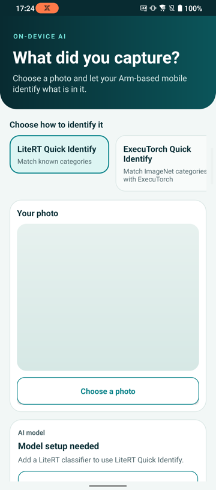

## Connect an Android phone

Enable **Developer options** and **USB debugging** on the phone. Connect the phone to your development computer with USB, unlock it, and accept the debugging authorization prompt.

Verify that your phone is listed in `adb`:

```console
adb devices -l
```

The output lists the authorized phone and its device serial. If the phone reports `unauthorized`, unlock it and accept the debugging prompt. If the phone doesn't appear, see [Run apps on a hardware device](https://developer.android.com/studio/run/device).

## Clone the application repository

Clone the repository with Git, then enter the project directory:

```console
git clone https://github.com/arm-education/ai-portal-android-app-image-to-text.git
cd ai-portal-android-app-image-to-text
```

Run the remaining terminal commands from this project directory.

## Prepare the Arm AI Portal model downloader

The sample repository includes a downloader for its supported Arm AI Portal model packages. The packages are published by Arm and hosted in Arm's Hugging Face repositories.

Create a Python virtual environment and install the package used by the downloader:


  
python3 -m venv .hf-venv
.hf-venv/bin/python -m pip install --upgrade pip huggingface_hub
  
  
python -m venv .hf-venv
.\.hf-venv\Scripts\python.exe -m pip install --upgrade pip huggingface_hub
  


The later commands invoke the environment's Python executable directly, so the PowerShell script-execution policy doesn't need to be changed.

If Python reports that `venv` is unavailable on Debian or Ubuntu, install the `python3-venv` package and rerun the command.

## Build and run the Photo Insight application

Use the Gradle wrapper to build and lint the debug APK:


  
chmod +x gradlew
./gradlew :app:assembleDebug :app:lintDebug
  
  
.\gradlew.bat :app:assembleDebug :app:lintDebug
  


You don't need to install Gradle separately because the repository includes the wrapper.

Install the APK and start Photo Insight:

```console
adb install -r app/build/outputs/apk/debug/app-debug.apk
adb shell am start -n org.arm.learningpath.imageclassification/.MainActivity
```

Photo Insight opens without a model. You can see its three workflows, but you can't run any of them until you import their matching `.tflite` or `.pte` files. 



## What you've accomplished and what's next

You've connected an Arm-based Android phone, prepared the model downloader, and confirmed that Photo Insight builds and starts.

Next, you'll download an optimized image-classification model from the Arm AI Portal and classify a photo.
