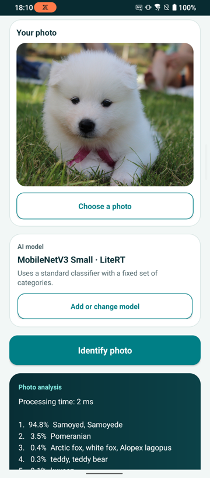
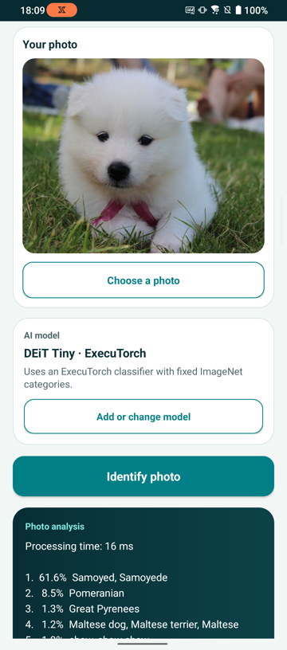
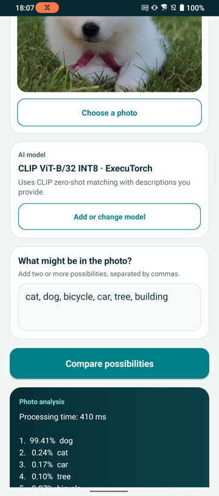

## Photo Insight adapters

An adapter is application code that connects the shared Android interface to a model task and runtime. It validates a compatible model and prepares the model's inputs. It invokes [LiteRT for Android](https://ai.google.dev/edge/litert/android) or [ExecuTorch for Android](https://docs.pytorch.org/executorch/stable/using-executorch-android.html), and converts the outputs into results the application can display.

Photo Insight includes three adapters to demonstrate two useful comparisons. LiteRT and ExecuTorch run the same fixed-label ImageNet task through different mobile runtimes. The ExecuTorch CLIP adapter demonstrates zero-shot classification, where you supply the candidate descriptions at run time.

Start with the LiteRT workflow. It provides the shortest path to a result. You can then run the two ExecuTorch workflows to compare runtimes and task designs. All inference runs locally on the Android CPU, and the application doesn't upload the selected image to a server.

Run the commands from the project directory in the same terminal session that you used during setup. Each command calls the Python virtual environment directly.

The following commands use three default models. To use a different supported AI Portal model, see [Use another supported model](#use-another-supported-model).

{}
Arm AI Portal models are hosted on Hugging Face. The `download_model.py` script uses `huggingface_hub` and connects to `https://huggingface.co` by default.

MobileNetV3 Small ExecuTorch and CLIP both publish a file named `optimized.pte`, so the script gives those two files unique names when it downloads them.
{}

## Run MobileNetV3 Small with LiteRT

Use MobileNetV3 Small as the default model for LiteRT Quick Identify. MobileNetV3 Small is an integer-quantized Arm AI Portal model that ranks 1,000 fixed ImageNet labels.

Set the model repository ID:


  
export MODEL_ID="Arm/mobilenet-v3-small-int8-litert"
  
  
$MODEL_ID = "Arm/mobilenet-v3-small-int8-litert"
  


Download the model and copy it to the phone:


  
export MODEL_FILE="$(.hf-venv/bin/python download_model.py \
  --repo-id "$MODEL_ID" \
  --print-path)"

printf 'Model file: %s\n' "$MODEL_FILE"
adb push "$MODEL_FILE" /sdcard/Download/
  
  
$MODEL_FILE = .\.hf-venv\Scripts\python.exe download_model.py `
  --repo-id "$MODEL_ID" `
  --print-path

Write-Output "Model file: $MODEL_FILE"
adb push "$MODEL_FILE" /sdcard/Download/
  


The Arm AI Portal package is hosted in Arm's Hugging Face repository. The downloader selects `mobilenet_v3_small_android_litert_optimized.tflite`, the filename recognized by Photo Insight.

The final command copies the model to the phone's **Downloads** directory.

To classify a photo:

1. In Photo Insight, select **LiteRT Quick Identify**.
2. Select **Add or change model**, open **Downloads**, and choose `mobilenet_v3_small_android_litert_optimized.tflite`.
3. Select **Choose photo** and choose a JPEG or PNG image from the phone.
4. Select **Identify photo**.

The application displays the five highest-scoring ImageNet labels and the processing time. The available labels are fixed when the model is trained, so a result can be more specific or less natural than the description you would use.

The timing shown was recorded on one Arm-based phone and is an example rather than a benchmark. Measure latency on your target phone before making deployment choices.

## Run DEiT Tiny to compare fixed-label classification with ExecuTorch

Use DEiT Tiny to run the same ImageNet classification task through ExecuTorch. This comparison shows how a different runtime and model format can implement the same user-facing workflow.

Set the model repository ID:


  
export MODEL_ID="Arm/deit-tiny-int8-xnnpack-executorch"
  
  
$MODEL_ID = "Arm/deit-tiny-int8-xnnpack-executorch"
  


Download the model and copy it to the phone:


  
export MODEL_FILE="$(.hf-venv/bin/python download_model.py \
  --repo-id "$MODEL_ID" \
  --print-path)"

printf 'Model file: %s\n' "$MODEL_FILE"
adb push "$MODEL_FILE" /sdcard/Download/
  
  
$MODEL_FILE = .\.hf-venv\Scripts\python.exe download_model.py `
  --repo-id "$MODEL_ID" `
  --print-path

Write-Output "Model file: $MODEL_FILE"
adb push "$MODEL_FILE" /sdcard/Download/
  


The final command copies `deit_raspberry_executorch_optimized.pte` to the phone. Keep the filename unchanged because the application uses it to select the correct preprocessing profile.

To run the model:

1. In Photo Insight, select **ExecuTorch Quick Identify**.
2. Select **Add or change model** and choose `deit_raspberry_executorch_optimized.pte` from **Downloads**.
3. Select **Choose photo** and choose the same image used for LiteRT.
4. Select **Identify photo**.

The adapter loads the model's `forward` method, applies its registered preprocessing profile, and displays the processing time and five highest-scoring ImageNet labels.

The timing is illustrative. Differences between these results include both the model and runtime, so they aren't a controlled LiteRT-versus-ExecuTorch benchmark.

## Run custom image matching with ExecuTorch CLIP

Use CLIP when your application needs categories chosen at run time instead of a fixed label set. CLIP converts the image and each candidate description into embeddings, then ranks the descriptions by image-text similarity. It doesn't generate a caption or discover a new label by itself.

Set the model repository ID:


  
export MODEL_ID="Arm/clip-vit-base-patch32-int8-xnnpack-executorch"
  
  
$MODEL_ID = "Arm/clip-vit-base-patch32-int8-xnnpack-executorch"
  


Download the model and copy it to the phone:


  
export MODEL_FILE="$(.hf-venv/bin/python download_model.py \
  --repo-id "$MODEL_ID" \
  --print-path)"

printf 'Model file: %s\n' "$MODEL_FILE"
adb push "$MODEL_FILE" /sdcard/Download/
  
  
$MODEL_FILE = .\.hf-venv\Scripts\python.exe download_model.py `
  --repo-id "$MODEL_ID" `
  --print-path

Write-Output "Model file: $MODEL_FILE"
adb push "$MODEL_FILE" /sdcard/Download/
  


The final command copies `clip-vit-base-patch32-int8-executorch.pte` to the phone's **Downloads** directory.

To compare custom descriptions:

1. In Photo Insight, select **ExecuTorch CLIP Custom Match**.
2. Select **Add or change model** and choose `clip-vit-base-patch32-int8-executorch.pte` from **Downloads**.
3. Select **Choose photo** and choose the same image used for the classifiers.
4. Enter two or more comma-separated descriptions, such as `a dog, a cat, a bicycle`.
5. Select **Compare possibilities**.

The application ranks only the descriptions that you enter. Change the descriptions and run the same image again to see how the candidate set affects the result.

## Use another supported model

The three default models keep the main workflow predictable. The application also supports the following Arm AI Portal model packages:

| Model | Runtime | Repository ID | Import this file | Behavior |
| --- | --- | --- | --- | --- |
| [MobileNetV3 Small LiteRT](https://huggingface.co/Arm/mobilenet-v3-small-int8-litert) (default) | LiteRT | `Arm/mobilenet-v3-small-int8-litert` | `mobilenet_v3_small_android_litert_optimized.tflite` | Ranks 1,000 ImageNet classes |
| [DEiT Tiny LiteRT](https://huggingface.co/Arm/deit-tiny-int8-litert) | LiteRT | `Arm/deit-tiny-int8-litert` | `facebook__deit-tiny-patch16-224_litert_optimized.tflite` | Ranks 1,000 ImageNet classes |
| [Swin Tiny LiteRT](https://huggingface.co/Arm/swin-tiny-int8-litert) | LiteRT | `Arm/swin-tiny-int8-litert` | `microsoft__swin-tiny-patch4-window7-224_android_litert_optimized.tflite` | Ranks 1,000 ImageNet classes |
| [timm ViT LiteRT](https://huggingface.co/Arm/vit-base-timm-int8-litert) | LiteRT | `Arm/vit-base-timm-int8-litert` | `timm__vit_base_patch16_224.augreg_in21k_ft_in1k_android_litert_optimized.tflite` | Ranks 1,000 ImageNet classes |
| [DEiT Tiny ExecuTorch](https://huggingface.co/Arm/deit-tiny-int8-xnnpack-executorch) (default) | ExecuTorch | `Arm/deit-tiny-int8-xnnpack-executorch` | `deit_raspberry_executorch_optimized.pte` | Ranks 1,000 ImageNet classes |
| [GoogLeNet ExecuTorch](https://huggingface.co/Arm/googlenet-int8-xnnpack-executorch-raspberrypi5) | ExecuTorch | `Arm/googlenet-int8-xnnpack-executorch-raspberrypi5` | `googlenet_raspberry_executorch_optimized.pte` | Ranks 1,000 ImageNet classes |
| [MobileNetV3 Small ExecuTorch](https://huggingface.co/Arm/mobilenet-v3-small-int8-xnnpack-executorch) | ExecuTorch | `Arm/mobilenet-v3-small-int8-xnnpack-executorch` | `mobilenet-v3-small-int8-executorch.pte` | Ranks 1,000 ImageNet classes |
| [ResNet-18 ExecuTorch](https://huggingface.co/Arm/resnet-18-int8-xnnpack-executorch) | ExecuTorch | `Arm/resnet-18-int8-xnnpack-executorch` | `resnet-18_raspberry_executorch_optimized.pte` | Ranks 1,000 ImageNet classes |
| [ResNet-50 ExecuTorch](https://huggingface.co/Arm/resnet-50-int8-xnnpack-executorch) | ExecuTorch | `Arm/resnet-50-int8-xnnpack-executorch` | `resnet-50_raspberry_executorch_optimized.pte` | Ranks 1,000 ImageNet classes |
| [ShuffleNet V2 x1.0 ExecuTorch](https://huggingface.co/Arm/shufflenet-v2-x1-0-int8-xnnpack-executorch) | ExecuTorch | `Arm/shufflenet-v2-x1-0-int8-xnnpack-executorch` | `shufflenet_v2_x1_0_raspberry_executorch_optimized.pte` | Ranks 1,000 ImageNet classes |
| [SqueezeNet 1.1 ExecuTorch](https://huggingface.co/Arm/squeezenet-1-1-int8-xnnpack-executorch) | ExecuTorch | `Arm/squeezenet-1-1-int8-xnnpack-executorch` | `squeezenet_1_1_raspberry_executorch_optimized.pte` | Ranks 1,000 ImageNet classes |
| [Swin Tiny ExecuTorch](https://huggingface.co/Arm/swin-tiny-int8-xnnpack-executorch) | ExecuTorch | `Arm/swin-tiny-int8-xnnpack-executorch` | `swin_tiny_dynamic_raspberry_executorch_optimized.pte` | Ranks 1,000 ImageNet classes |
| [ViT Base ExecuTorch](https://huggingface.co/Arm/vit-base-int8-xnnpack-executorch) | ExecuTorch | `Arm/vit-base-int8-xnnpack-executorch` | `google__vit-base-patch16-224_raspberry_executorch_optimized.pte` | Ranks 1,000 ImageNet classes |
| [CLIP ViT-B/32 ExecuTorch](https://huggingface.co/Arm/clip-vit-base-patch32-int8-xnnpack-executorch) (default) | ExecuTorch | `Arm/clip-vit-base-patch32-int8-xnnpack-executorch` | `clip-vit-base-patch32-int8-executorch.pte` | Ranks descriptions that you enter |

Set `MODEL_ID` to a repository ID from the table and repeat the matching download and import workflow.

## What you've accomplished and what's next

You've now run an Arm AI Portal model with LiteRT and compared it with ExecuTorch fixed-label classification and CLIP custom image matching.

Next, you'll learn how the Photo Insight application works.
