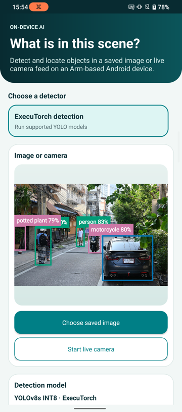

## Scene Detector adapters

An adapter is application code that connects the shared Android interface to a model task and runtime. Scene Detector uses one ExecuTorch adapter for supported YOLO object-detection models. The adapter selects the preprocessing and output decoder associated with the imported filename.

The model runs locally on the Android CPU. The application doesn't upload the selected image or camera frames to a server.

## Object detection in Scene Detector

Image classification assigns one or more labels to an entire image. Object detection also identifies where objects appear by returning a class, confidence score, and bounding box for each retained detection. A single street image can therefore contain separate detections for people, bicycles, motorcycles, and cars.

The confidence threshold controls which detections are displayed. Increasing the threshold removes lower-confidence boxes. Decreasing the threshold can retain more objects and more false positives.

Start with YOLOv8s because it provides the shortest path to a result. You can use another supported model after completing the default workflow. Run the commands from the project directory in the same terminal session that you used during setup.

{}
Arm AI Portal models are hosted on Hugging Face. The `download_model.py` script uses `huggingface_hub` and connects to `https://huggingface.co` by default.
{}

## Run YOLOv8s with ExecuTorch

Set `MODEL_ID` to the repository ID for the default YOLOv8s model:


  
export MODEL_ID="Arm/yolov8s-int8-xnnpack-executorch"
  
  
$MODEL_ID = "Arm/yolov8s-int8-xnnpack-executorch"
  


Download the model:


  
export MODEL_FILE="$(.hf-venv/bin/python download_model.py \
  --repo-id "$MODEL_ID" \
  --print-path)"

printf 'Model file: %s\n' "$MODEL_FILE"
  
  
$MODEL_FILE = .\.hf-venv\Scripts\python.exe download_model.py `
  --repo-id "$MODEL_ID" `
  --print-path

Write-Output "Model file: $MODEL_FILE"
  


The downloader selects `yolov8s_raspberry_executorch_optimized.pte`, the filename recognized by Scene Detector. Keep the filename unchanged because the application uses it to select the YOLOv8 preprocessing and decoder.

Copy the model to the phone's **Downloads** directory:

```console
adb push "$MODEL_FILE" /sdcard/Download/
```

## Copy the sample image to Android

Download the [street-scene image](https://commons.wikimedia.org/wiki/File:DSC_6799-_a_man_riding_a_motorcycle_down_a_street_next_to_a_parked_car.jpg) from Wikimedia Commons and save it as `street-scene.jpg`. The image contains pedestrians, bicycles, a motorcycle, and cars, which gives the detector several object classes to find.

The image is by Jonas Kimmich and is licensed under [CC BY-SA 4.0](https://creativecommons.org/licenses/by-sa/4.0/).

Download the sample image:


  
curl --fail --location --output street-scene.jpg "https://upload.wikimedia.org/wikipedia/commons/thumb/7/71/DSC_6799-_a_man_riding_a_motorcycle_down_a_street_next_to_a_parked_car.jpg/1280px-DSC_6799-_a_man_riding_a_motorcycle_down_a_street_next_to_a_parked_car.jpg"
  
  
curl.exe --fail --location --output street-scene.jpg "https://upload.wikimedia.org/wikipedia/commons/thumb/7/71/DSC_6799-_a_man_riding_a_motorcycle_down_a_street_next_to_a_parked_car.jpg/1280px-DSC_6799-_a_man_riding_a_motorcycle_down_a_street_next_to_a_parked_car.jpg"
  


Copy the image to the phone:

```console
adb push street-scene.jpg /sdcard/Download/
```

To use a different JPEG or PNG image, replace `street-scene.jpg` in the `adb push` command with its path. You can also skip the copy command and select an image already stored on the phone or emulator.

## Run object detection

In Scene Detector:

1. Select **Add or change model** and choose the `.pte` file from **Downloads**.
2. Select **Choose saved image** and choose `street-scene.jpg` from **Downloads**.
3. Keep the default `75%` confidence threshold for the first run.
4. Select **Detect objects**.

The application runs detection once and displays the annotated image, detected objects, confidence scores, and processing time.

The output is similar to:



Increase the confidence threshold to remove more lower-scoring boxes. Reduce it if the model doesn't display expected objects.

{}
Reducing the threshold can increase false positives and the amount of work passed to non-maximum suppression.
{}

## Use the live camera

On the phone, select **Start live camera** and allow camera access. The application uses the most recent camera frame and drops queued frames while inference is running. Dropping queued frames prevents a slow detector from building an increasingly delayed frame queue.

The live-camera view draws each retained label, confidence score, and bounding box over the preview.

Camera behavior on an emulator depends on its configured front and back camera sources. Use the saved-image workflow when the emulator doesn't expose a useful camera feed.

## Use another supported model

YOLOv8s keeps the main workflow predictable. Scene Detector also supports the following Arm AI Portal model packages:

| Model | Repository ID | Import this file | Detector strategy |
| --- | --- | --- | --- |
| [YOLOv5s INT8](https://huggingface.co/Arm/yolov5s-int8-xnnpack-executorch) | `Arm/yolov5s-int8-xnnpack-executorch` | `yolov5s_raspberry_executorch_optimized.pte` | YOLOv5 objectness and class scores |
| [YOLOv8s INT8](https://huggingface.co/Arm/yolov8s-int8-xnnpack-executorch) (default) | `Arm/yolov8s-int8-xnnpack-executorch` | `yolov8s_raspberry_executorch_optimized.pte` | YOLOv8 candidate decoding |
| [YOLOv9s INT8](https://huggingface.co/Arm/yolov9s-int8-xnnpack-executorch) | `Arm/yolov9s-int8-xnnpack-executorch` | `yolov9s_raspberry_executorch_optimized.pte` | Letterboxing and multi-label decoding |

To use one of these models, set `MODEL_ID` to a repository ID from the table and repeat the download and import workflow.

## What you've accomplished and what's next

You've imported an optimized ExecuTorch detector, analyzed a saved image locally on Android, and used the same detector with a live camera feed.

Next, you'll understand how Scene Detector works.
