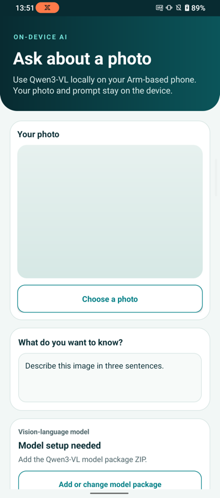

## Connect an Android phone

Enable **Developer options** and **USB debugging** on the phone. Connect the phone to your development computer with USB, unlock it, and accept the debugging authorization prompt.

Verify that your phone is listed in `adb`:

```console
adb devices -l
```

The output lists the authorized phone and its device serial. If the phone reports `unauthorized`, unlock it and accept the debugging prompt. If the phone doesn't appear, see [Run apps on a hardware device](https://developer.android.com/studio/run/device).

## Check the phone's CPU features

Vision Chat is built for Armv8.6-A with Dot Product and Int8 Matrix Multiplication instructions. Check that the phone reports the corresponding `asimddp` and `i8mm` features:

```console
adb shell cat /proc/cpuinfo
```

Find the `Features` line in the output and confirm that it contains both values:

```output
Features : ... asimddp ... i8mm ...
```

Use a different Arm-based Android phone if either feature is absent.

If the same line also contains `sme` and `sme2`, Vision Chat can select the
KleidiAI SME2 kernels included in the APK. SME2 isn't required. Other phones can use I8MM.

## Clone the application repository

Clone the repository with Git, then enter the project directory:

```console
git clone https://github.com/arm-education/ai-portal-android-app-image-text-to-text.git
cd ai-portal-android-app-image-text-to-text
```

Run the remaining terminal commands from this project directory.

## Prepare the Arm AI Portal model downloader

The sample repository includes a downloader for its supported Arm AI Portal model package. The package is published by Arm and hosted in Arm's Hugging Face repository.

Create a Python virtual environment and install the package used by the downloader:


  
python3 -m venv .hf-venv
.hf-venv/bin/python -m pip install --upgrade pip huggingface_hub
  
  
python -m venv .hf-venv
.\.hf-venv\Scripts\python.exe -m pip install --upgrade pip huggingface_hub
  


The later commands invoke the environment's Python executable directly, so the PowerShell script-execution policy doesn't need to be changed.

If Python reports that `venv` is unavailable on Debian or Ubuntu, install the `python3-venv` package and rerun the command.

## Fetch the llama.cpp source

Vision Chat pins a llama.cpp revision that includes Qwen3-VL support in `libmtmd`.

Fetch the pinned source and verify its checksum:


  
chmod +x scripts/fetch_llama_cpp.sh
./scripts/fetch_llama_cpp.sh
  
  
$llamaCommit = "56381e407c0ccfb3a6f71e668a27a901001d22ce"
$llamaSha256 = "7fd19c03e7d7bb02c07e64c47e0539aeabe54f366a59be822f550b5f012a8751"
$llamaArchive = Join-Path $env:TEMP "llama-cpp-$llamaCommit.tar.gz"
$llamaStaging = Join-Path $env:TEMP "llama-cpp-$([guid]::NewGuid())"

Invoke-WebRequest `
    -Uri "https://github.com/ggml-org/llama.cpp/archive/$llamaCommit.tar.gz" `
    -OutFile $llamaArchive

if ((Get-FileHash $llamaArchive -Algorithm SHA256).Hash -ne $llamaSha256) {
    throw "Checksum verification failed for the llama.cpp archive."
}

New-Item -ItemType Directory -Path $llamaStaging | Out-Null
tar -xzf $llamaArchive -C $llamaStaging
New-Item -ItemType Directory -Force -Path third_party | Out-Null
Move-Item `
    "$llamaStaging\llama.cpp-$llamaCommit" `
    "third_party\llama.cpp"
  


The commands place the source under `third_party/llama.cpp`. Keep this revision and the application's Java Native Interface (JNI) code together when updating the project.

## Build and run the Vision Chat application

Use the Gradle wrapper to build and lint the debug APK:


  
chmod +x gradlew
./gradlew :app:assembleDebug :app:lintDebug
  
  
.\gradlew.bat :app:assembleDebug :app:lintDebug
  


You don't need to install Gradle separately because the repository includes the wrapper.

Install the APK and start Vision Chat with the commands used on every operating system:

```console
adb install -r app/build/outputs/apk/debug/app-debug.apk
adb shell am start -n org.arm.learningpath.visionchat/.MainActivity
```

Vision Chat opens without a model. You can choose an image and edit the prompt, but you can't run inference until you import the Qwen3-VL model package ZIP.



## What you've accomplished and what's next

You've connected an Arm-based Android phone, prepared the model downloader, and confirmed that Vision Chat builds and starts.

Next, you'll download the optimized Qwen3-VL model package from the Arm AI Portal and ask about an image.
