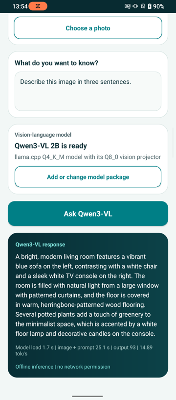

## Vision-language inference in Vision Chat

A vision-language model accepts an image and a text prompt, then generates text. It can describe a scene, read visible text, or answer a question about an image. Unlike an image classifier, it isn't limited to a fixed list of labels.

Vision Chat supports the following model package:

| Model | Runtime | Language model | Vision projector |
| --- | --- | --- | --- |
| [Qwen3-VL 2B Instruct](https://developer.arm.com/ai/models/hugging-face/Arm/qwen3-vl-2b-instruct-q4-k-m-ggml-llama-cpp-vivo-x300/qwen3-vl-2b-instruct-q4_k_m-gguf?targetName=vivo+X300) | llama.cpp | Q4_K_M GGUF | Q8_0 `mmproj` GGUF |

The ZIP contains the language-model and vision-projector GGUF files. Vision Chat
validates and extracts them together. It doesn't support other model packages.

All inference runs locally on the Android CPU. The application doesn't upload the selected image or prompt to a server.

Run the commands from the project directory in the same terminal session that you used during setup. Each command calls the Python virtual environment directly.

{}
Arm AI Portal models are hosted on Hugging Face. The `download_model.py` script uses `huggingface_hub` and connects to `https://huggingface.co` by default.
{}

## Download Qwen3-VL

Use the application downloader to fetch the supported model package:


  
.hf-venv/bin/python download_model.py
  
  
.\.hf-venv\Scripts\python.exe download_model.py
  


The downloader fetches both GGUF files, writes them to one uncompressed ZIP,
and removes the separate GGUF files. The `models/qwen3-vl-2b` directory then
contains:

```output
Qwen__Qwen3-VL-2B-Instruct_llamacpp_optimized.zip
sample_input.jpg
```

The ZIP contains the Q4_K_M language model, the Q8_0 vision encoder and
projector, and a manifest that records their filenames, sizes, and SHA-256
hashes. Keep the ZIP filename unchanged so Vision Chat can identify the
package.

## Copy the model and sample image to Android

Copy the model package and sample image to the phone's **Downloads** directory:

```console
adb push models/qwen3-vl-2b/Qwen__Qwen3-VL-2B-Instruct_llamacpp_optimized.zip /sdcard/Download/
adb push models/qwen3-vl-2b/sample_input.jpg /sdcard/Download/
```

The model package uses about 1.6 GB. Vision Chat extracts another copy into
application-private storage during import, so keep at least 4 GB free while the
ZIP also remains in **Downloads**.

## Run Qwen3-VL

In Vision Chat:

1. Select **Add or change model package**.
2. Open **Downloads** and select `Qwen__Qwen3-VL-2B-Instruct_llamacpp_optimized.zip`.
3. Select **Choose a photo**, then choose `sample_input.jpg`.
4. Enter `Describe this image in three sentences.` in the prompt field.
5. Select **Ask Qwen3-VL**.

The first run loads both GGUF files, encodes the image, evaluates the formatted prompt, and generates up to 128 tokens. Loading and generation can take substantially longer than image classification on the same phone.

The application displays the generated response, model-load time, image-and-prompt evaluation time, output token count, and decode speed.

The output is similar to:



The sample shown was recorded on an ASUS ROG Phone 6D. It evaluated the image
and prompt in 25.1 seconds, then generated 93 tokens at 14.89 tokens per second.
The timing is an example rather than a benchmark. Measure performance on your
target phone before making deployment choices.

## What you've accomplished and what's next

You've downloaded the supported Qwen3-VL package from the Arm AI Portal and generated a response from an image and prompt on an Android phone.

Next, you'll trace how Vision Chat validates and extracts the package and runs local multimodal inference.
