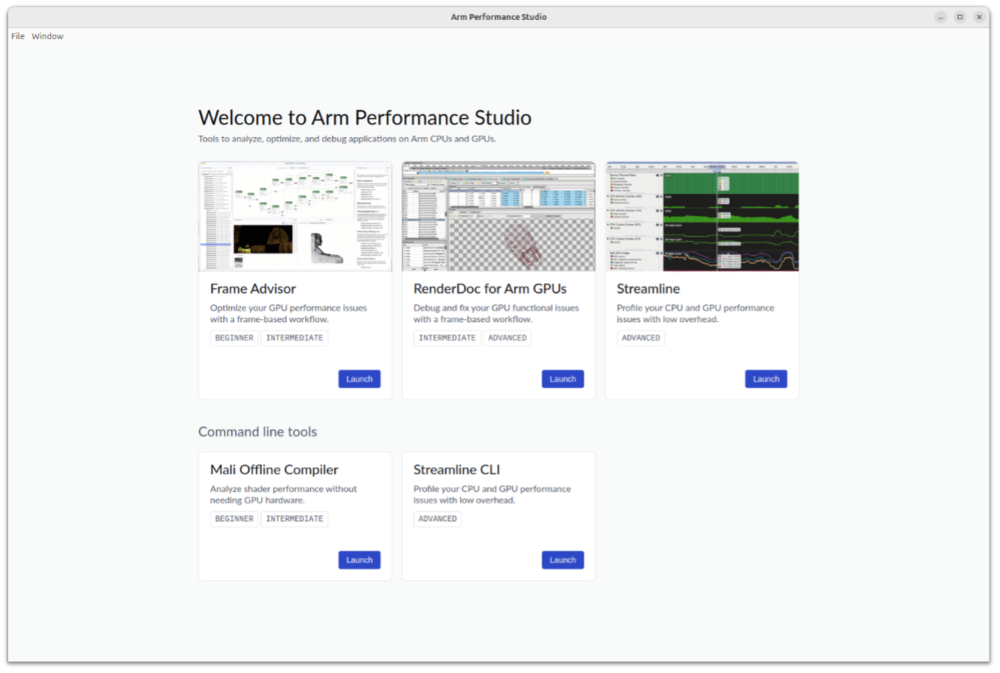

---
# User change
title: "What is Arm Performance Studio?"

weight: 2 # 1 is first, 2 is second, etc.

# Do not modify these elements
layout: "learningpathall"
---
[Arm Performance Studio](https://developer.arm.com/Tools%20and%20Software/Arm%20Performance%20Studio) is a performance analysis tool suite for developers to performance test their applications on devices with Mali-based GPUs. It consists of 4 easy-to-use tools that show you how well your application performs either on off-the-shelf Android devices, or Linux targets. The tools help you to identify problems that might slow down performance, overheat the device, or drain the battery.

| Component | Functionality |
|----------|-------------|
| [Streamline](https://developer.arm.com/Tools%20and%20Software/Streamline%20Performance%20Analyzer) with [Performance Advisor](https://developer.arm.com/Tools%20and%20Software/Performance%20Advisor) | Capture a performance profile that shows all the performance counter activity from the device. Generate an easy-to-read performance summary from an annotated Streamline capture, and get actionable advice about where you should optimize. |
| [Frame Advisor](https://developer.arm.com/Tools%20and%20Software/Frame%20Advisor) | Capture the API calls and rendering from a problem frame and get comprehensive geometry metrics to discover what might be slowing down your application. |
| [Mali Offline Compiler](https://developer.arm.com/Tools%20and%20Software/Mali%20Offline%20Compiler) | Analyze how efficiently your shader programs perform on a range of Mali GPUs. |
| [RenderDoc for Arm GPUs](https://developer.arm.com/Tools%20and%20Software/RenderDoc%20for%20Arm%20GPUs) | The industry-standard tool for debugging Vulkan graphics applications, including early support for Arm GPU extensions and Android features. |

## Download and Install Arm Performance Studio

Arm Performance Studio is supported on Windows, Linux, and macOS hosts. Get the [Arm Performance Studio installation package](https://developer.arm.com/Tools%20and%20Software/Arm%20Performance%20Studio#Downloads).

Refer to the [Arm Performance Studio install guide](/install-guides/ams/) for installation instructions.

## Launch the tools

To open the tools, launch the Performance Studio Hub:

- On Windows, search for Performance Studio.
- On macOS and Linux, open the Performance Studio application file from the install directory.

   
