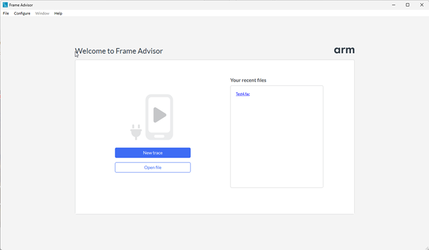
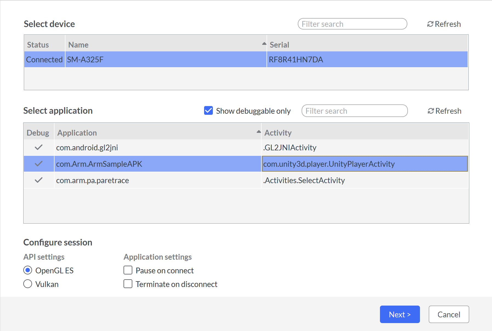
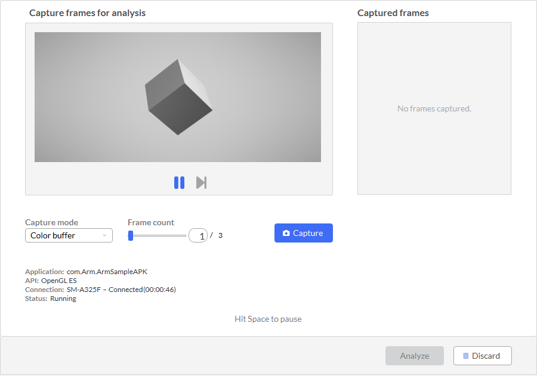
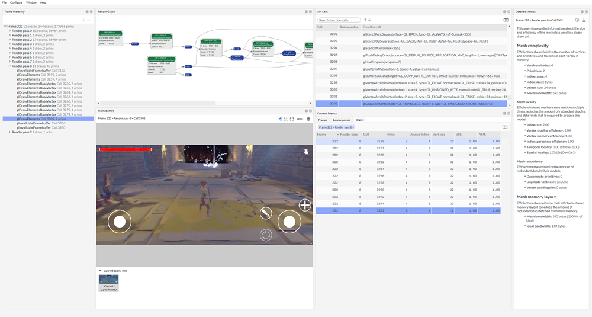
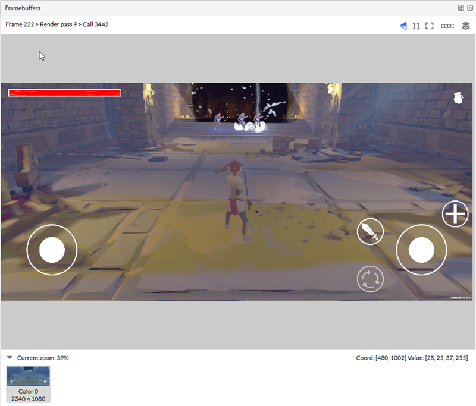
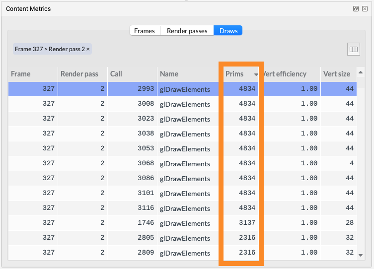
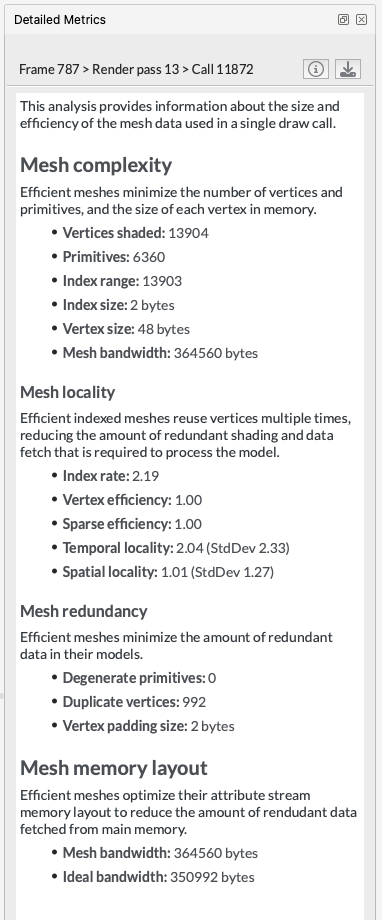

---
# User change
title: Analyze your application with Frame Advisor

description: Capture a frame burst with Frame Advisor and inspect render graph, framebuffer, content metrics, and detailed metrics views for bottlenecks.

weight: 8 # 1 is first, 2 is second, etc.

# Do not modify these elements
layout: "learningpathall"
---

## Connect to your Android device

[Frame Advisor](https://developer.arm.com/Tools%20and%20Software/Frame%20Advisor) offers in-depth frame-based analysis for mobile graphics in Android applications. 

By capturing the API calls and rendering processes of a specific frame, you can identify performance bottlenecks that might slow down your application.

Start by connecting to your device.

1. Launch the Performance Studio Hub and open Frame Advisor.
    - On Windows, search for Performance Studio.
    - On macOS and Linux, open the Performance Studio application file from the install directory.

    

2. Select **New trace** to start a new trace.

   

3. Select your device, and the application that you want to capture frames from.

   

4. If your application uses the Vulkan API, change the selection in the API settings to **Vulkan**.

5. Select **Next** to continue.

   Unless you chose the **Pause on connect** option in the **Device connection** screen, the application starts automatically on the device.

## Capture a frame burst

After connecting to your device, you can capture a frame burst.

1. The **Capture** screen provides options for your capture session.

   

   When you approach the part of your game where the problem occurs, select **Pause** and use the **Step** button to focus in just before it.

2. You can capture one frame burst of up to three consecutive frames. Adjust the **Frame count** as required.

3. Select the **Capture** button to start capturing the frame burst. Wait for the capture to complete. This might take several seconds.

4. Select **Analyze** to see the results. It might take a few minutes to analyze the data.

## Analyze the capture

Frame Advisor presents the captured data in the **Analysis** screen. See your captured frames in the **Frame Hierarchy** view.

Explore each frame to evaluate how efficiently they were rendered on the device.

1. Look at the Render Graph to see how the frame was constructed.

    

    Evaluate the render graph to look for render passes or input or output attachments that aren’t used in the final output and can be removed to save processing power and bandwidth.

2. Expand a frame in the **Frame Hierarchy** view, to see the render passes and draw calls within it. Step through the draw calls and watch the scene being built up in the **Framebuffers** view with each draw. Look for draw calls that can be eliminated, or identical draw calls that can be batched together.

    

3. In the **Content Metrics** view, sort draw calls by the number of primitives to find the most expensive objects. See whether these objects can be simplified.

    

4. For an expensive object, check the **Detailed Metrics** view to see how efficiently the object's mesh is being rendered to the screen. Look for objects with duplicated vertices, or those that don't efficiently reuse indices.

    

To see how to capture and analyze a problem frame with Frame Advisor, see the [Capture and analyze a problem frame with Frame Advisor video tutorial](https://developer.arm.com/Additional%20Resources/Video%20Tutorials/Capture%20and%20analyze%20a%20problem%20frame%20with%20Frame%20Advisor).

## What you've accomplished and what's next

You've now analyzed your application with Frame Advisor. 

Next, you'll use RenderDoc for Arm GPUs to capture frames and select application events for debugging.
