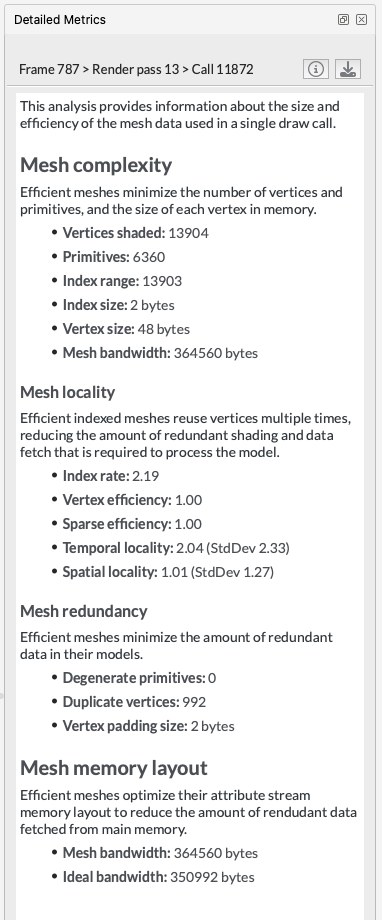

---
# User change
title: "Frame Advisor"

weight: 8 # 1 is first, 2 is second, etc.

# Do not modify these elements
layout: "learningpathall"
---
[Frame Advisor](https://developer.arm.com/Tools%20and%20Software/Frame%20Advisor) is a developer tool designed to offer in-depth frame-based analysis for mobile graphics in Android applications. By capturing the API calls and rendering processes of a specific frame, you can identify potential performance bottlenecks that may be causing slowdowns in your application.

## Prerequisites

Build your application, and setup the Android device as described in the [Streamline](/learning-paths/mobile-graphics-and-gaming/ams/streamline/) instructions.

## Connect to the device

1. When Frame Advisor opens, select `New trace` to start a new trace.

   

1. Select your device, and the application that you want to capture frames from.

   

1. If your application uses the Vulkan API, change the selection in the API settings to `Vulkan`.

1. Click `Next` to continue.

   Unless you chose the `Pause on connect` option in the `Device connection` screen, the application starts automatically on the device.

## Capture a frame burst

1. The `Capture` screen provides options for your capture session.

   

   When you approach the part of your game where the problem occurs, click `Pause` and use the `Step` button to focus in just before it.

1. You can capture one frame burst of up to 3 consecutive frames. Adjust the `Frame count` as required.

1. Click the `Capture` button to start capturing the frame burst. Wait for the capture to complete. This may take several seconds.

1. Click `Analyze` to see the results. It may take a few minutes to analyze the data.

## Analyze the capture

Frame Advisor presents the captured data in the `Analysis` screen. See your captured frames in the `Frame Hierarchy` view.

Explore each frame to evaluate how efficiently they were rendered on the device.

1. Look at the Render Graph to see how the frame was constructed.

    

    Evaluate the render graph to look for render passes or input or output attachments that aren’t used in the final output, and could be removed, saving processing power and bandwidth.

1. Expand a frame in the `Frame Hierarchy` view, to see the render passes and draw calls within it. Step through the draw calls and watch the scene being built up in the `Framebuffers` view with each draw. Look for draw calls that could be eliminated, such as those that do not contribute anything to the final output. Look for identical draw calls that could be batched together into one draw.

    

1. In the `Content Metrics` view, sort draw calls by the number of primitives to find the most expensive objects. See whether these objects could be simplified.

    

1. For an expensive object, check the `Detailed Metrics` view to see how efficiently the object's mesh is being rendered to the screen. Look for objects with duplicated vertices, or those that do not efficiently reuse indices.

    

Watch this [video tutorial](https://developer.arm.com/Additional%20Resources/Video%20Tutorials/Capture%20and%20analyze%20a%20problem%20frame%20with%20Frame%20Advisor) to see how to capture and analyze a problem frame with Frame Advisor.
