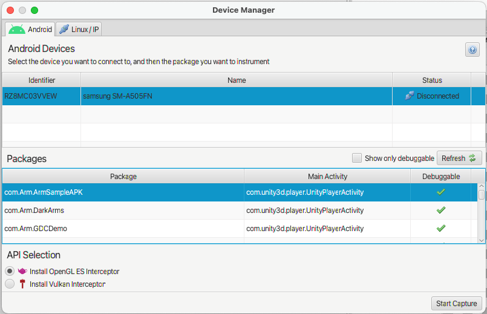

---
# User change
title: "Graphics Analyzer"

weight: 9 # 1 is first, 2 is second, etc.

# Do not modify these elements
layout: "learningpathall"
---
Graphics Analyzer is a tool to help `OpenGL ES` and `Vulkan` developers get the best out of their applications through analysis at the API level.

The tool allows you to observe API call arguments and return values, and interact with a running target application to investigate the effect of individual API calls. It highlights attempted misuse of the API, and gives recommendations for improvements.

**Note:** Graphics Analyzer is no longer in active development. You can still get Graphics Analyzer as part of [Arm Performance Studio 2024.2](https://artifacts.tools.arm.com/arm-performance-studio/2024.2/), but it is no longer available in later versions of the suite. For a more lightweight tool, try [Frame Advisor](https://developer.arm.com/Tools%20and%20Software/Frame%20Advisor), which enables you to capture and analyze rendering and geometry data for a single frame. For graphics debugging, we recommend RenderDoc for Arm GPUs. Both tools are available for free as part of [Arm Performance Studio](https://developer.arm.com/Tools%20and%20Software/Arm%20Performance%20Studio).

## Prerequisites

Build your application, and setup your Android device as described in [Setup tasks](/learning-paths/mobile-graphics-and-gaming/ams/setup_tasks/).

## Capture data from the device

1. In Graphics Analyzer, select `Debug` > `Device Manager`, then select your device from the list of detected devices.

1. Select the required APIs (OpenGL ES and/or Vulkan) for your application.

1. Click `Start capture` to connect to the device and install Graphics Analyzer daemon on the device.

1. Start the application on the device, and interact as desired. Graphics Analyzer will collect API calls from the device.

    * To collect `Frame Buffer` data, pause the application when you reach the frame of interest.

    * Click the `camera` icon to capture the frame buffer output.

    * You can also enable `Overdraw`, `Shader`, and/or `Fragment count` data to be captured. Click the `camera` icon to capture this data.

1. When you have captured enough data, click `Stop tracing`. Graphics Analyzer will stop collecting data, remove the daemon(s), and process the captured data.

## Analyze the capture

The captured data will be processed into a report that the user can manually examine. The frames are listed in the `Trace Outline` view. A full description of the capabilities is given in the [Graphics Analyzer User Guide](https://developer.arm.com/documentation/101545/latest/The-Graphics-Analyzer-interface).

Understanding the output of the report is key to the usefulness of Graphics Analyzer. This [video tutorial](https://developer.arm.com/Additional%20Resources/Video%20Tutorials/Arm%20Mali%20GPU%20Training%20-%20EP3-4) shows how to make use of the features of Graphics Analyzer.
