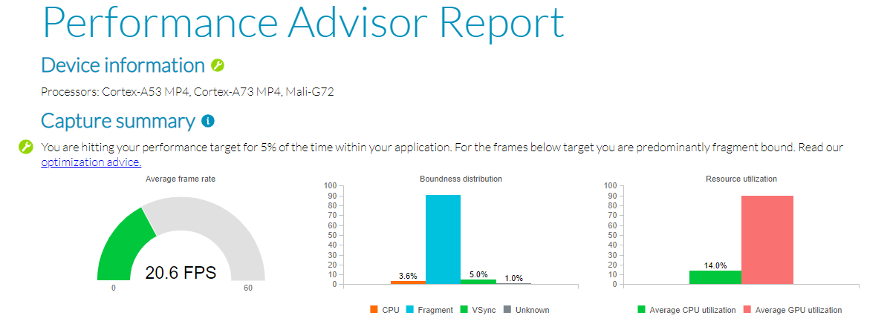

---
# User change
title: "Performance Advisor example report "

weight: 6 # 1 is first, 2 is second, etc.

# Do not modify these elements
layout: "learningpathall"
---
Performance Advisor creates an easy-to-read report from a Streamline capture. This helps you quickly understand how your Android application performed on a mobile device.

## Generate a performance report

The supplied [Arm Streamline example capture](/learning-paths/mobile-graphics-and-gaming/ams/streamline_example/) can be used to generate a `Performance Advisor` report.

1. Open a terminal, and navigate to the location of the imported capture.

1. Run the `streamline-cli` command with the `-pa` option on the Streamline capture file (.apc):
    ```command
    streamline-cli -pa "Android - GPU Bound Example.apc"
    ```
    The capture is processed, and a `html` report generated. Warnings shown can be ignored for now:
    ```output
    Importing capture...
    Fetching data...
    Preparing report type html...
    Processing data...
    Generating report type html...
    Report performance_advisor-<timestamp>.html" successfully generated
    ```
    Open the report in a browser and explore the report.
    

## Evaluate the report

Refer to the [Performance Advisor tutorial](https://developer.arm.com/documentation/102478/latest/Example-Performance-Advisor-report) for a detailed explanation about the charts in the report.
