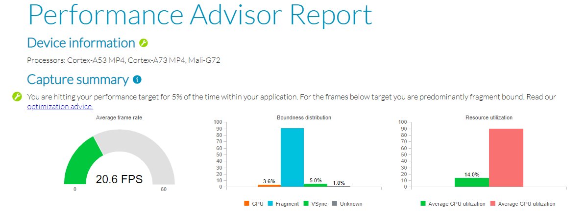

---
# User change
title: View an example Performance Advisor report

weight: 6 # 1 is first, 2 is second, etc.

# Do not modify these elements
layout: "learningpathall"
---

## Generate a performance report

Performance Advisor creates an easy-to-read report from a Streamline capture that you can use to understand how your Android application performs on a mobile device.

You can use the [Arm Streamline example capture](/learning-paths/mobile-graphics-and-gaming/ams/streamline_example/) that comes with Arm Performance Studio to generate an example `Performance Advisor` report.

1. Open a terminal, and navigate to the location of the imported capture.

1. Run the `streamline-cli` command with the `-pa` option on the Streamline capture file (.apc):
    ```command
    streamline-cli -pa "Android - GPU Bound Example.apc"
    ```
    The capture is processed, and a `html` report generated. Warnings shown can be ignored for now:
    ```output
    Importing capture...
    Fetching data...
    Preparing report type html...
    Processing data...
    Generating report type html...
    Report performance_advisor-<timestamp>.html" successfully generated
    ```
    Open the report in a browser and explore the report.
    

## Evaluate the report

For a detailed explanation on how to interpret the report, see the [Example Performance Advisor report tutorial](https://developer.arm.com/documentation/102478/latest/Example-Performance-Advisor-report) in Arm documentation.

## What you've accomplished and what's next

You've now created a performance report from the example Streamline capture that's packaged with Arm Performance Studio to understand the workflow for report creation. 

Next, you'll create a report for your application.
