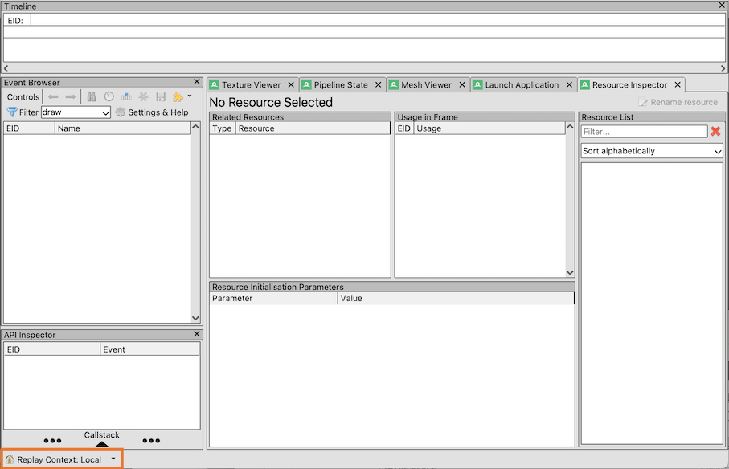
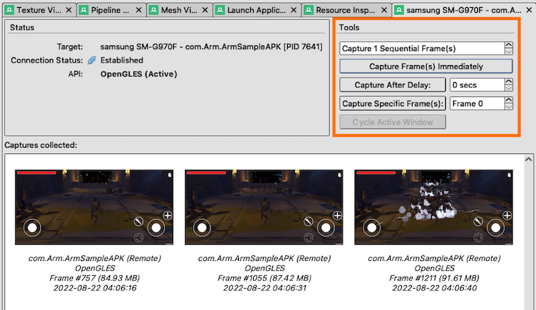
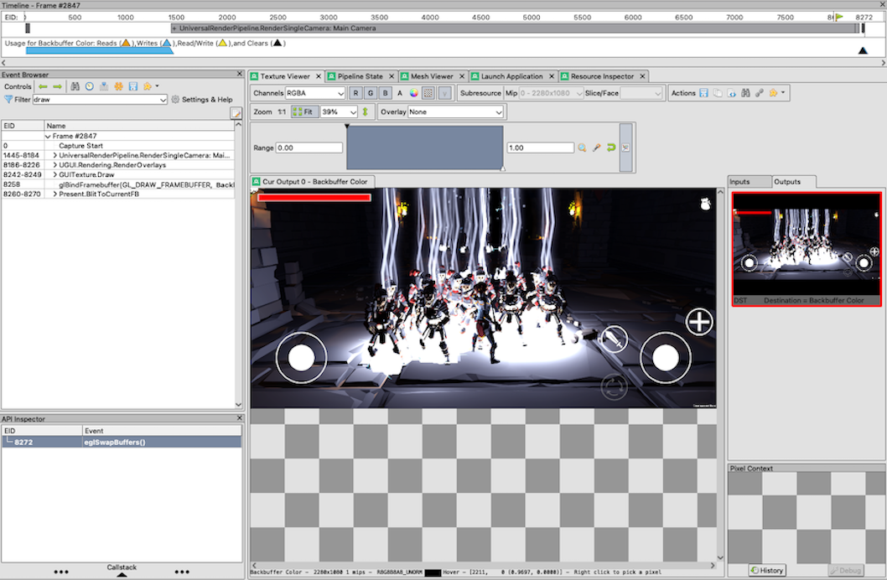
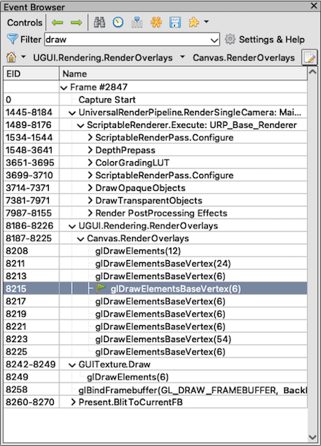

---
# User change
title: "RenderDoc for Arm GPUs"

weight: 9 # 1 is first, 2 is second, etc.

# Do not modify these elements
layout: "learningpathall"
---
[RenderDoc for Arm GPUs](https://developer.arm.com/Tools%20and%20Software/RenderDoc%20for%20Arm%20GPUs) is an Arm fork of the [RenderDoc](https://renderdoc.org/) open-source debugger. The Arm release includes support for API features and extensions that are available on the latest Arm GPUs, but not yet supported in upstream RenderDoc. Arm intends to contribute changes to the upstream project, but some Arm-specific or Android-specific features may only be available in the Arm fork.

## Prerequisites

Build your application, and setup the Android device as described in [Setup tasks](/learning-paths/mobile-graphics-and-gaming/ams/setup_tasks/).

## Connect to the device

1. Open RenderDoc for Arm GPUs and select your connected device from the **Replay Context** dropdown list at the bottom left of the RenderDoc UI.

   

   The RenderDoc APK starts running on your target.

   If you don't see your device, check that your device is setup correctly as described in [Setup tasks](/learning-paths/mobile-graphics-and-gaming/ams/setup_tasks/).

1. Navigate to the **Launch Application** tab, and set the Executable Path to the application that you want to debug. Click the **Browse** button to view all of the installed application packages on the target and find the `.exe` file.

1. Click **Launch**, to start the application running on your target. After a successful launch, a new target-specific tab opens in the UI where you can select the frames that you want to capture.

    

    As your application runs, you can choose to:

    * Capture one or more frames immediately
    * Capture one or more frames after a delay
    * Capture one or more frames after a specific frame

    Use these controls to take captures of your application as it runs on the target device. Captured frames are stored temporarily on the device.

1. When you have finished capturing the frames of interest, stop the application that you are debugging. Keep RenderDoc running though, as this is needed so that you can analyze and debug your captures.

1. Select a capture from the **Captures collected** window and click **Open**. When the frame has loaded, it is displayed on the target and in the **Texture Viewer** tab, and the **Event Browser** is populated.

    

    By default, the **Event Browser** shows all `action()` events, which include draws, copies, and clears. Enter a search term in the **Filter** dropdown to filter these events.

    

    Selected events are highlighted with a green flag. All the other windows in the UI update to display information that is specific to the selected event. You can use this to view the render state and data resources that are used by the current event, and view the GPU output that resulted from it.

See the [RenderDoc documentation](https://renderdoc.org/docs/index.html#) to explore the full list of features.