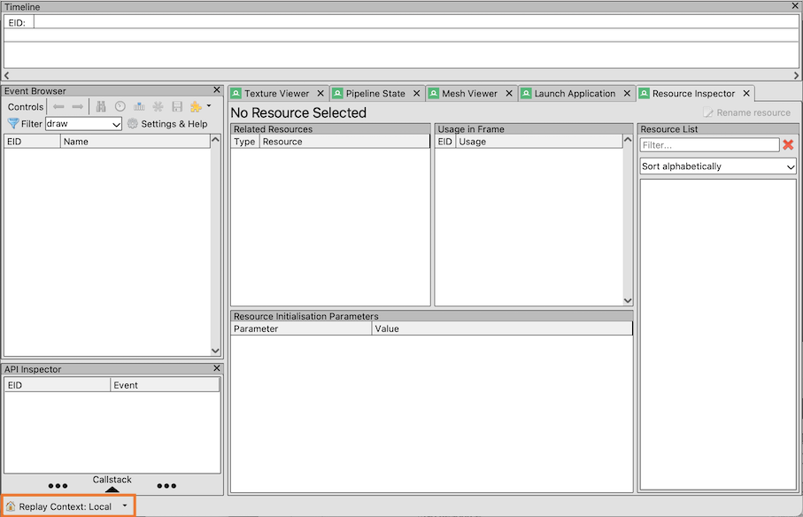
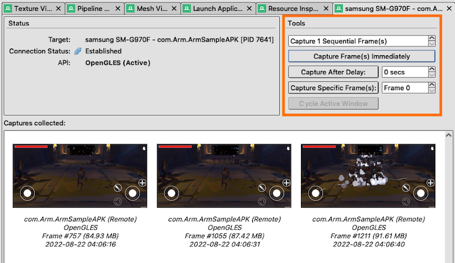
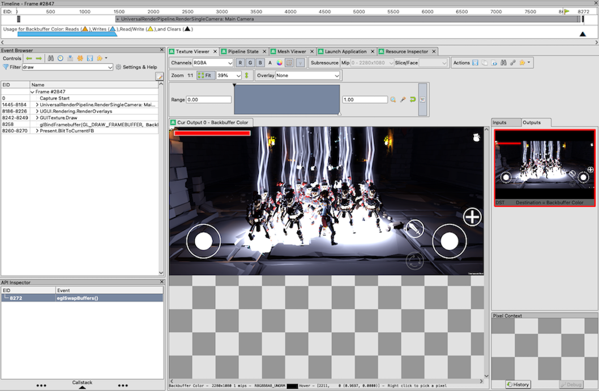
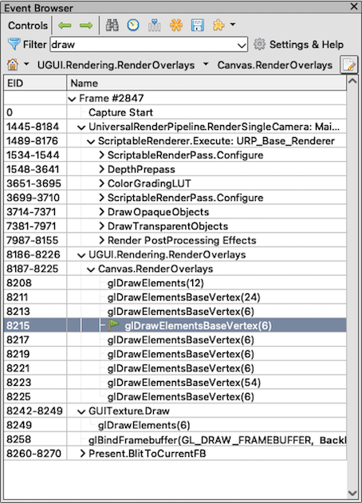

---
# User change
title: Debug your application with RenderDoc for Arm GPUs

description: Connect RenderDoc for Arm GPUs to an Android target, capture frames, and inspect events and GPU output for debugging.

weight: 9 # 1 is first, 2 is second, etc.

# Do not modify these elements
layout: "learningpathall"
---

## Run RenderDoc for Arm GPUs

[RenderDoc for Arm GPUs](https://developer.arm.com/Tools%20and%20Software/RenderDoc%20for%20Arm%20GPUs) is an Arm fork of the [RenderDoc](https://renderdoc.org/) open-source debugger. 

The Arm release includes support for API features and extensions that are available on the latest Arm GPUs, but not yet supported in upstream RenderDoc. Arm intends to contribute changes to the upstream project, but some Arm-specific or Android-specific features might be available only in the Arm fork.

To run RenderDoc for Arm GPUs:

1. Open RenderDoc for Arm GPUs and select your connected device from the **Replay Context** dropdown list at the bottom left of the RenderDoc UI.

   

   The RenderDoc APK starts running on your target.

   If you don't see your device, check that your device is setup correctly as described in [Setup tasks](/learning-paths/mobile-graphics-and-gaming/ams/setup_tasks/).

2. Navigate to the **Launch Application** tab, and set the **Executable Path** to the application that you want to debug. Select the **Browse** button to view all of the installed application packages on the target and find the `.exe` file.

3. Select **Launch**, to start the application running on your target. After a successful launch, a new target-specific tab opens in the UI where you can select the frames that you want to capture.

    

    As your application runs, you can choose to:

    - Capture one or more frames immediately
    - Capture one or more frames after a delay
    - Capture one or more frames after a specific frame

    Use these controls to take captures of your application as it runs on the target device. Captured frames are stored temporarily on the device.

4. When you have finished capturing the frames of interest, stop the application that you are debugging. Keep RenderDoc running so that you can analyze and debug your captures.

5. Select a capture from the **Captures collected** window and select **Open**. When the frame has loaded, it is displayed on the target and in the **Texture Viewer** tab, and the **Event Browser** is populated.

    

    By default, the **Event Browser** shows all `action()` events, which include draws, copies, and clears. Enter a search term in the **Filter** dropdown to filter these events.

    

    Selected events are highlighted with a green flag. The other windows in the UI update to display information for the selected event, including the render state, data resources, and GPU output.

See the [RenderDoc documentation](https://renderdoc.org/docs/index.html#) to explore the full list of features.

## What you've accomplished and what's next

You've now run RenderDoc for Arm GPUs on your application and learned how to capture frames and select events for debugging. 

Next, you'll run Mali Offline Compiler to compile shaders and generate performance reports.
