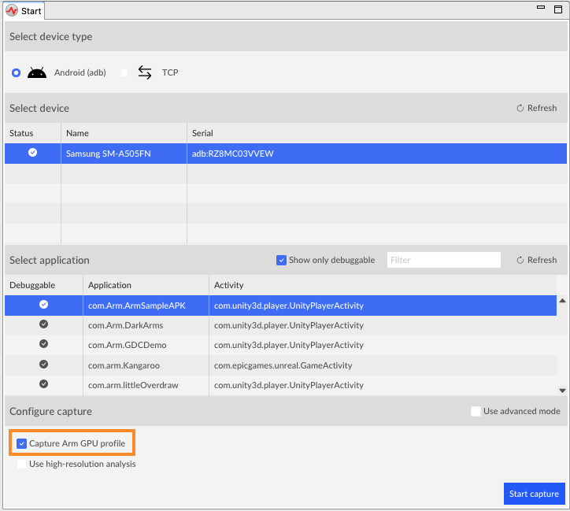
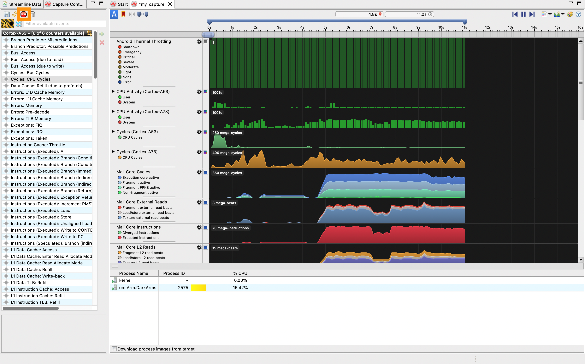

---
# User change
title: "Streamline with your application"

weight: 5 # 1 is first, 2 is second, etc.

# Do not modify these elements
layout: "learningpathall"
---
Now that you have seen an [Arm Streamline example capture](/learning-paths/mobile-graphics-and-gaming/ams/streamline_example/), you can use it to capture data from your own application.

## Select the device and application in Streamline

1. In the Streamline `Start` view, select `Android (adb)` as your device type, then select your device from the list of detected devices. This installs the `gatord` daemon and connects to the device.

1. Wait for the list of available packages to populate, then select the one you wish to profile.
1. With `Capture Arm GPU profile` selected, Streamline will detect the Arm GPU in the device, and select an appropriate counter template for it. Alternatively, to choose a different template or to build your own configuration, select `Use advanced mode` and click `Configure counters`.

    

{}
Optionally, you can set a preferred location to store your captures using `Window` > `Preferences` > `Data Locations`. New reports will be created in the topmost folder specified.
{}

## Capture data

1. Click `Start capture` to start capturing profile data from the device. Enter a name and location for the capture file.

1. The application starts automatically on the device. Interact with the application as desired for the profiling run you wish to do.

1. When you have collected enough data, click `Stop capture`.

Streamline will stop capturing data, remove the daemon, and process the captured data.

## Analyze the results

The charts in the `Timeline` view show the performance counter activity captured from the device. Hover over the charts to see the values at that point in time. Use the Calipers to focus on particular windows of activity. Refer to the [Streamline User Guide](https://developer.arm.com/documentation/101816/latest/Analyze-your-capture) for full instructions on how to use the features in the `Timeline` view.

Understanding the output of Streamline is key to the usefulness of Streamline. The documentation for [Android performance triage with Streamline](https://developer.arm.com/documentation/102540/latest/) on Arm Developer describes how to understand the capture from a number of points of view, depending on what information you are trying to extract from it.
