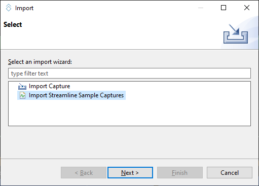
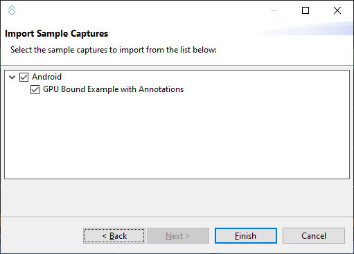
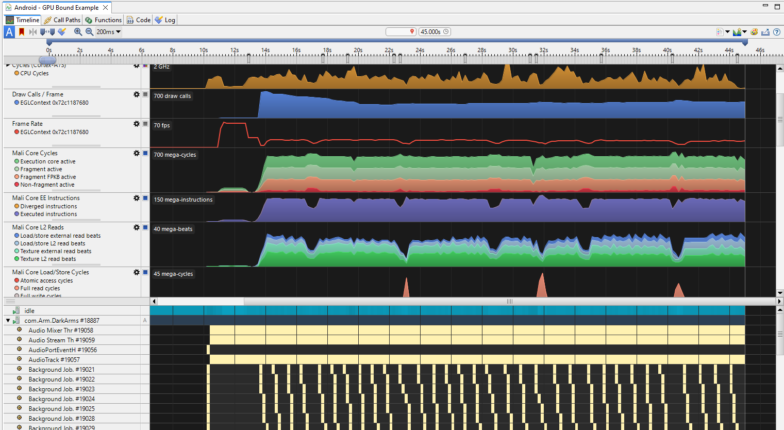

---
# User change
title: Interpret an example Arm Streamline report

description: Import and inspect the sample Streamline capture included with Arm Performance Studio so you can recognize key timeline views before profiling your app.

weight: 4 # 1 is first, 2 is second, etc.

# Do not modify these elements
layout: "learningpathall"
---

## View the example Arm Streamline report

To understand the capabilities of Streamline, use the example Streamline profile that comes with Arm Performance Studio.

1. To open the example profile, in Streamline, select **File** > **Import**.
2. Select **Import Streamline Sample Captures** and click **Next**.
    

3. Select the Android example and click **Finish**.
    

4. Select the report in **Streamline Data**, then select **Analyze** when prompted. After the report is processed, you'll see an interactive timeline.

## Analyze the results

The charts in the **Timeline** view show the performance counter activity captured from the device. Hover over the charts to see the values at that point in time. Use the Calipers to focus on particular windows of activity. 

For instructions to use the features in the **Timeline** view, see the [Streamline User Guide](https://developer.arm.com/documentation/101816/latest/Analyze-your-capture).

Understanding the output of Streamline is key to the tool's usefulness. To understand how to interpret the capture from different points of view, see [Android performance triage with Streamline](https://developer.arm.com/documentation/102540/latest/).

## What you've accomplished and what's next

You've now viewed an example Arm Streamline report and interpreted the results using Arm documentation. 

Next, you'll use Arm Streamline to capture data for your application. 
