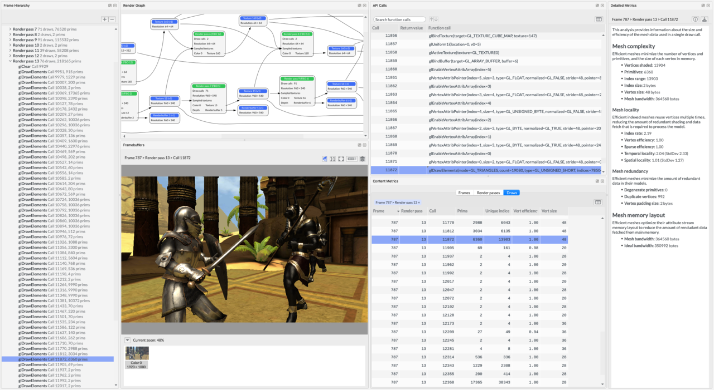
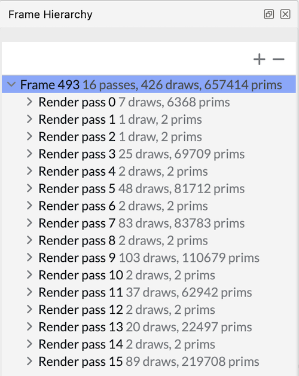
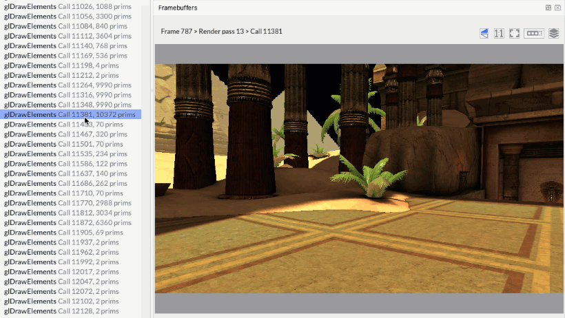
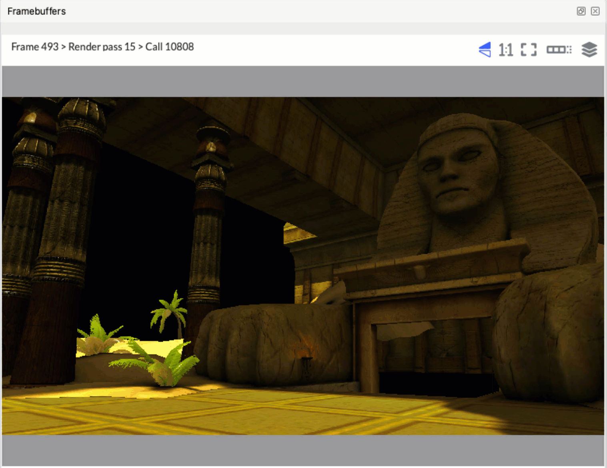

## Inspect draw calls

When the analysis completes, you will see Frame Advisor's **Analysis** screen.

1. Captured frames are listed in the **Frame hierarchy** view. This frame draws over 657,000 primitives using 426 draw calls within 16 render passes.

    

1. The **Frame hierarchy** shows all the render passes that make up the frame. Expand a render pass to inspect its draw calls. Step through the draw calls and observe how each one changes the framebuffer to see how the scene is built.

    

    Draw calls are expensive for the CPU to process, so reduce their number where possible. Look for draw calls that don't render visible changes to the framebuffer. A draw that makes no visible change could be outside the frustum or behind another object. Use software culling techniques to eliminate these draws.

    Some objects might be drawn with a large number of primitives. As an object is drawn, compare its level of detail with its size and position on screen. Using simpler meshes, particularly for objects far from the camera, could significantly increase performance.
    
1. Look for many identical objects being drawn individually, such as these pillars. To reduce the number of draw calls, consider batching multiple objects into a single combined mesh or using an instanced draw call.

    

## What you've accomplished

You've inspected draw calls and framebuffer changes for inefficient rendering behavior. Next, use the Render Graph to analyze frame construction.
