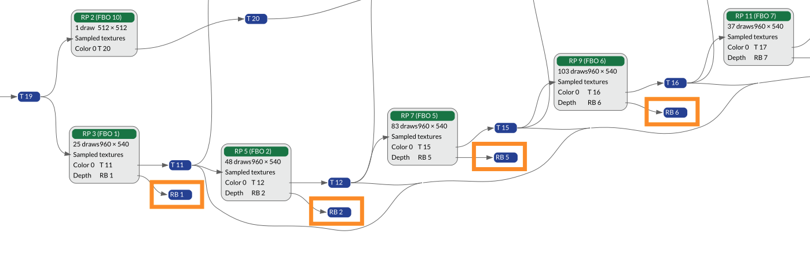
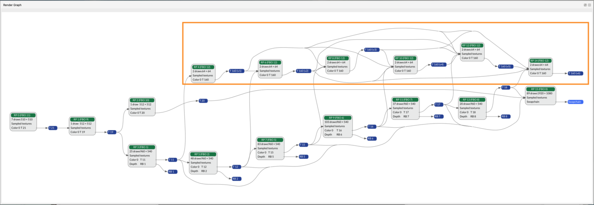

## Inspect the Render Graph

The **Render Graph** in Frame Advisor shows a visualization of the rendering operations that make up the frame. It shows how data flows between render passes as well as how resources such as textures are produced and consumed. Use the **Render Graph** to find render passes, input or output attachments that are not used in the final output, and which could be removed.

Render passes flow from left to right. The render pass that outputs to the swapchain is the final render pass that outputs to the screen.

In this example, some output attachments aren't used in a future render pass.

You should clear or invalidate input and output attachments that aren't used to avoid unnecessary memory accesses. If clear or invalidate calls are present within a render pass, they are shown in the **Frame Hierarchy** view.

In this example, some render passes have no consumers and don't contribute to the final rendered output.

These render passes can be removed without affecting the output, saving processing power and bandwidth.

## What you've accomplished and what's next

You've used the Render Graph to identify attachments and render passes that don't contribute to the final output. 

Next, you'll use Content Metrics to analyze mesh geometry.
