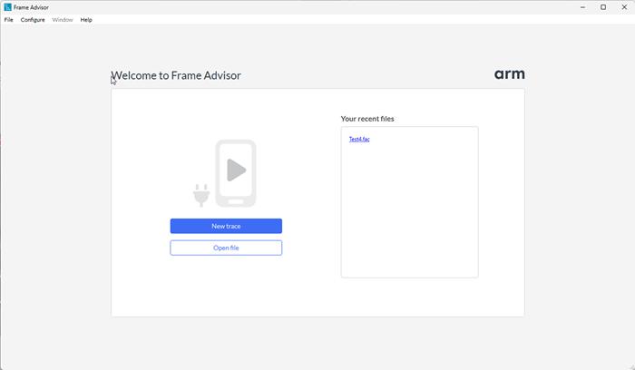
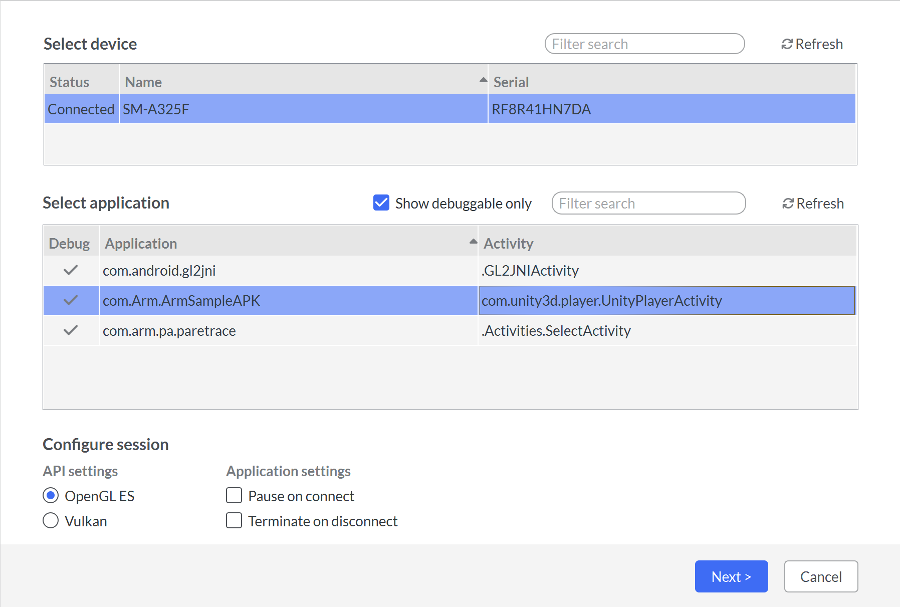
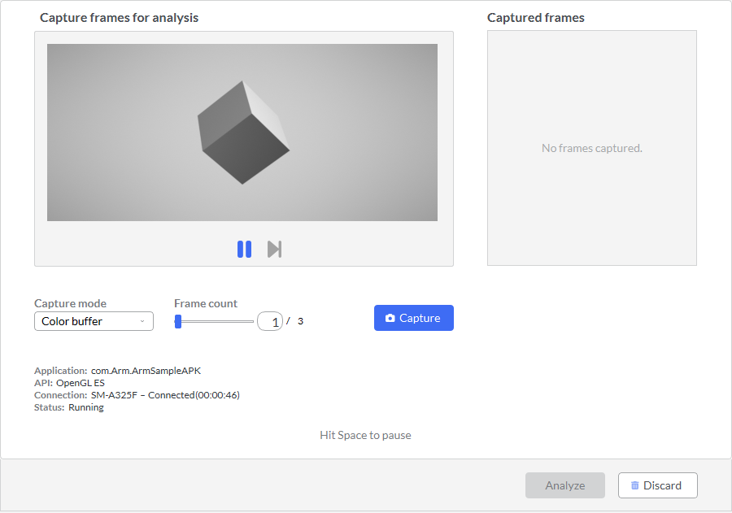

## Capture a frame for analysis

1. Open Frame Advisor and select **New Trace**.

    

1. Frame Advisor lists the connected devices and the applications installed. Select your device and the application containing the frames that you want to capture.

    

1. If your application is Vulkan, change the selection in **API settings**.

1. Select **Next** to start the capture session. The application will start automatically on the device.

    

1. Play the application until you find your problem area. Before you reach the part of the application where the frame rate drops or the device overheats, select **Pause** or press the **Space bar**. Use the **Step** button to move forward frame by frame.

1. You can currently capture a frame burst of up to three consecutive frames. For this example, capture one frame. Select **Capture**, and Frame Advisor captures the next frame.

    By default, Frame Advisor captures only the color attachment. Change **Capture mode** to **All attachments** to also include any depth and stencil attachments as well as any attachments from multiple render targets. You can instead capture the overdraw in the scene.

    When the capture completes, the frame is shown in the **Captured frames** list.

1. Select **Analyze** to see the results. This might take a few minutes, depending on your content and how many frames you captured.

## What you've accomplished and what's next

You've captured a representative frame and opened it for analysis.

Next, you'll inspect its draw calls and framebuffer changes.
