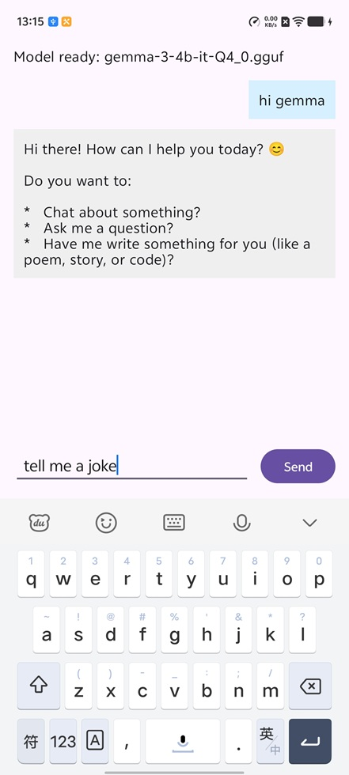

## Download a Mobile-compatible GGUF
Before you run you'll need to download a GGUF model file to run. To be mobile compatible, it'll need to run within your test Android phone's memory. A common Android memory size is 8GB, although some modern premium phones have more. Other things will also need to fit in memory, so the model size will need to be noticeably less than 8GB. 

A good example model is [google_gemma-3-4b-it-Q4_0.gguf](https://huggingface.co/bartowski/google_gemma-3-4b-it-GGUF/blob/main/google_gemma-3-4b-it-Q4_0.gguf). Gemma 3 is a powerful model, and this 4 billion parameter version has been int4 quantized with the Q4_0 schema that works particularly well with Arm's [KleidiAI library](https://developer.arm.com/ai/kleidi-libraries), enabling speed-ups on phones with [SME2](https://www.arm.com/technologies/sme2), [SVE2](https://developer.arm.com/documentation/102340/0100/Introducing-SVE2) and [Neon](https://www.arm.com/technologies/neon).

Download Gemma 3 or another suitable model onto your phone, ready to run the app.

## Run the App!
In Android Studio, if you connect your test Android phone with a USB cable to your computer, you should now be able to run your LLM chatbot app. Make sure when you connect the phone it is in Developer Mode and you allow USB debugging.

In the bottom right there is a button "Import model". Clicking this will take you to downloads to be able to select the model you've downloaded, so the app can download it. Once it has finished copying and loading the model it will say "Model ready" at the top of the screen. Now if you click the text entry area at the bottom, you can type your questions and chat with the LLM.

