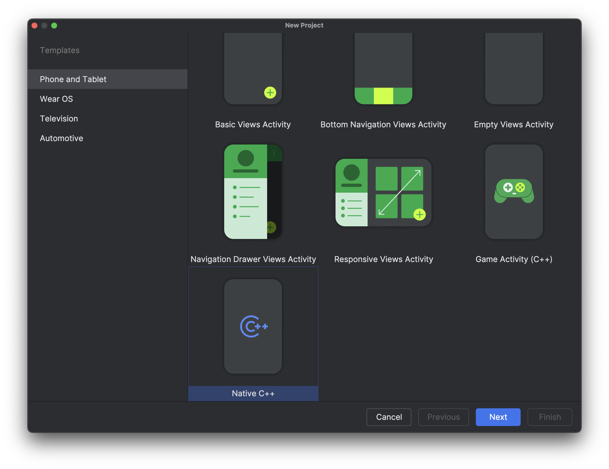
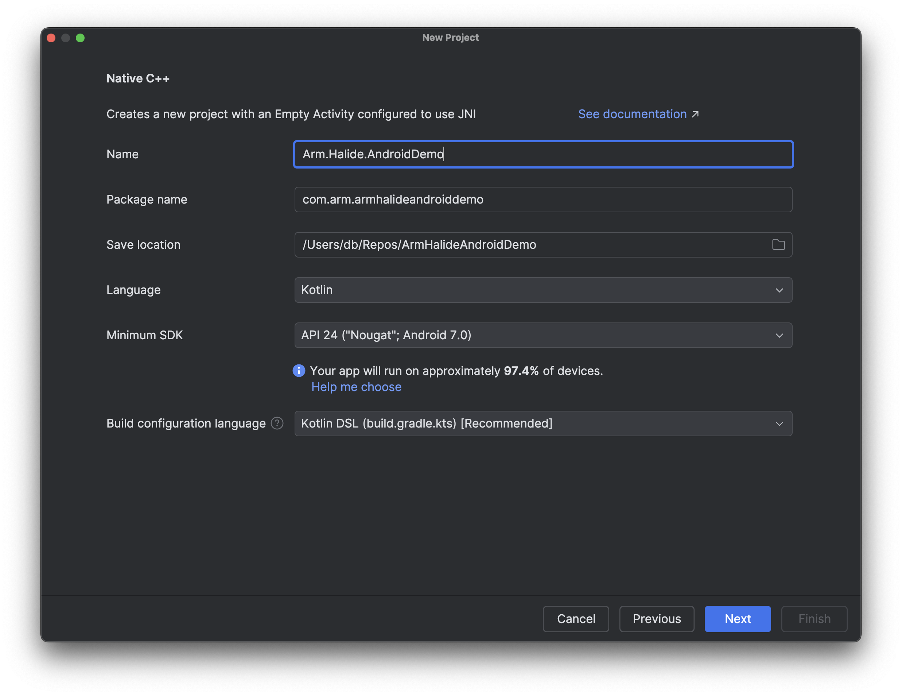

---
# User change
title: "Integrating Halide into an Android (Kotlin) Project"

weight: 6

layout: "learningpathall"
---

## Objective
In this lesson, we’ll learn how to integrate a high-performance Halide image-processing pipeline into an Android application using Kotlin. We’ll cover setting up your Android project with the NDK and JNI, cross-compiling your Halide pipeline for ARM-based Android devices, bridging between Kotlin and native C++ code, and managing images between Android’s Bitmap format and Halide buffers.

## Overview of Mobile Integration with Halide
Android is the world’s most widely-used mobile operating system, powering billions of devices across diverse markets. This vast user base makes Android an ideal target platform for developers aiming to reach a broad audience, particularly in applications requiring sophisticated image and signal processing, such as augmented reality, photography, video editing, and real-time analytics.

Kotlin, now the preferred programming language for Android development, combines concise syntax with robust language features, enabling developers to write maintainable, expressive, and safe code. It offers seamless interoperability with existing Java codebases and straightforward integration with native code via JNI, simplifying the development of performant mobile applications. Kotlin’s modern language features—such as null safety, coroutine-based concurrency, and extension functions—accelerate development and reduce common errors, improving both developer productivity and application reliability.

##  Benefits of Using Halide on Mobile
Integrating Halide into Android applications brings several key advantages:
1. Performance. Halide enables significant acceleration of complex image processing algorithms, often surpassing the speed of traditional Java or Kotlin implementations by leveraging optimized code generation. By directly generating highly optimized native code tailored for ARM CPUs or GPUs, Halide can dramatically increase frame rates and responsiveness, essential for real-time or interactive applications.
2. Efficiency. On mobile devices, resource efficiency translates directly to improved battery life and reduced thermal output. Halide’s scheduling strategies (such as operation fusion, tiling, parallelization, and vectorization) minimize unnecessary memory transfers, CPU usage, and GPU overhead. This optimization substantially reduces the overall power consumption, extending device battery life and enhancing the user experience by preventing overheating.
3. Portability. Halide abstracts hardware-specific details, allowing developers to write a single high-level pipeline that easily targets different processor architectures and hardware configurations. Pipelines can seamlessly run on various ARM-based CPUs and GPUs commonly found in Android smartphones and tablets, enabling developers to support a wide range of devices with minimal platform-specific modifications.

In short, Halide delivers high-performance image processing without sacrificing portability or efficiency, a balance particularly valuable on resource-constrained mobile devices.

### Android Development Ecosystem and Challenges
While Android presents abundant opportunities for developers, the mobile development ecosystem brings its own set of challenges, especially for performance-intensive applications:
1. Limited Hardware Resources. Unlike desktop or server environments, mobile devices have significant constraints on processing power, memory capacity, and battery life. Developers must optimize software meticulously to deliver smooth performance while carefully managing hardware resource consumption. Leveraging tools like Halide allows developers to overcome these constraints by optimizing computational workloads, making resource-intensive tasks feasible on constrained hardware.
2. Cross-Compilation Complexities. Developing native code for Android requires handling multiple hardware architectures (such as ARMv7, ARM64, and sometimes x86/x86_64). Cross-compilation introduces complexities due to different instruction sets, CPU features, and performance characteristics. Managing this complexity involves careful use of the Android NDK, understanding toolchains, and correctly configuring build systems (e.g., Gradle, CMake). Halide helps mitigate these issues by abstracting away many platform-specific optimizations, generating code optimized for target architectures automatically.
3. Image-Format Conversions (Bitmap <-> Halide Buffer). Android typically handles images through the Bitmap class or similar platform-specific constructs, whereas Halide expects image data to be in raw, contiguous buffer formats. Developers must therefore bridge the gap between Android-specific image representations (Bitmaps, YUV images from the camera APIs, etc.) and Halide’s native buffer format. Proper management of these conversions—including considerations for pixel formats, stride alignment, and memory copying overhead—can significantly impact performance and correctness, necessitating careful design and implementation of efficient buffer handling routines.

## Project Requirements
Before integrating Halide into your Android application, ensure you have the necessary tools and libraries.

### Tools and Prerequisites
1. Android Studio. Android Studio is Google’s official Integrated Development Environment (IDE) for Android application development. It provides robust support for building, testing, debugging, and deploying Android applications. Android Studio integrates seamlessly with Kotlin, Gradle, and the Android SDK, making it an essential tool for any Android developer. [Download link](https://developer.android.com/studio).
2. Android NDK (Native Development Kit). The Android NDK allows you to write and integrate native (C/C++) code into your Android applications. Because Halide compiles to highly optimized native code, you’ll need the NDK to build and integrate Halide pipelines into your application. The NDK provides essential tools and cross-compilation toolchains to target Android’s supported CPU architectures, such as ARM (arm64-v8a), x86, and others. Can be easily installed from Android Studio (Tools → SDK Manager → SDK Tools → Android NDK).

## Setting Up the Android Project
1. Creating the Project:
* Open Android Studio
* Select New Project > Native C++

2. Configure the Project:
* 
* Choose Kotlin as the language.

b. Adding the NDK
	•	Open File > Project Structure > SDK Location.
	•	Under Android NDK, ensure it’s installed or download if necessary.