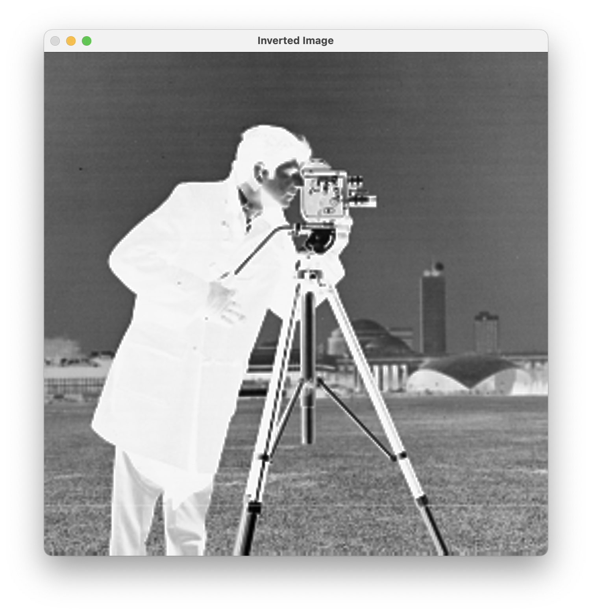

---
# User change
title: "Background and Installation"

weight: 2

layout: "learningpathall"
---

## Introduction
Halide is a powerful, open-source programming language specifically designed to simplify and optimize high-performance image and signal processing pipelines. Initially developed by researchers at MIT and Adobe in 2012, Halide addresses a critical challenge in computational imaging: efficiently mapping image-processing algorithms onto diverse hardware architectures without extensive manual tuning. It accomplishes this by clearly separating the description of an algorithm (specifying the mathematical or logical transformations applied to images or signals) from its schedule (detailing how and where those computations execute). This design enables rapid experimentation and effective optimization for various processing platforms, including CPUs, GPUs, and mobile hardware.

A key advantage of Halide lies in its innovative programming model. By clearly distinguishing between algorithmic logic and scheduling decisions—such as parallelism, vectorization, memory management, and hardware-specific optimizations, developers can first focus on ensuring the correctness of their algorithms. Performance tuning can then be handled independently, significantly accelerating development cycles. This approach often yields performance that matches or even surpasses manually optimized code. As a result, Halide has seen widespread adoption across industry and academia, powering image processing systems at organizations such as Google, Adobe, and Facebook, and enabling advanced computational photography features used by millions daily.

In this Learning Path, you'll explore Halide's foundational concepts, set up your development environment, and create your first functional Halide application. By the end, you'll understand what makes Halide uniquely suited to efficient image processing, particularly on mobile and Arm-based hardware, and be ready to build your own optimized pipelines.

For broader or more general use cases, please refer to the official Halide documentation and tutorials available at [halide-lang.org](https://halide-lang.org).

The example code for this Learning Path is available in two repositories [here](https://github.com/dawidborycki/Arm.Halide.Hello-World.git) and [here](https://github.com/dawidborycki/Arm.Halide.AndroidDemo.git)

## Key concepts in Halide
### Separation of algorithm and schedule
At the core of Halide's design philosophy is the principle of clearly separating algorithms from schedules. Traditional image-processing programming tightly couples algorithmic logic with execution strategy, complicating optimization and portability. In contrast, Halide explicitly distinguishes these two components:
  * Algorithm: Defines what computations are performed—for example, image filters, pixel transformations, or other mathematical operations on image data.
  * Schedule: Specifies how and where these computations are executed, addressing critical details such as parallel execution, memory usage, caching strategies, and hardware-specific optimizations.

This separation allows developers to rapidly experiment and optimize their code for different hardware architectures or performance requirements without altering the core algorithmic logic.

Halide provides three key building blocks, including Functions, Vars, and Pipelines, to simplify and structure image processing algorithms. Consider the following illustrative example:

```cpp
Halide::Var x("x"), y("y"), c("c");
Halide::Func brighter("brighter");

// Define a function to increase image brightness by 50
brighter(x, y, c) = Halide::cast<uint8_t>(Halide::min(input(x, y, c) + 50, 255));
```

Functions (Func) represent individual computational steps or image operations. Each Func encapsulates an expression applied to pixels, allowing concise definition of complex image processing tasks. Vars symbolically represent spatial coordinates or dimensions (for example, horizontal x, vertical y, color channel c). They specify where computations are applied in the image data. Pipelines are formed by interconnecting multiple Func objects, structuring a clear workflow where the output of one stage feeds into subsequent stages, enabling modular and structured image processing.

Halide is a domain-specific language (DSL) tailored explicitly for image and signal processing tasks. It provides a concise set of predefined operations and building blocks optimized for expressing complex image processing pipelines. By abstracting common computational patterns into powerful operators, Halide allows developers to succinctly define their processing logic, facilitating readability, maintainability, and easy optimization for various hardware targets.

### Scheduling strategies (parallelism, vectorization, tiling)
Halide offers several powerful scheduling strategies designed for maximum performance:
  * Parallelism: Executes computations concurrently across multiple CPU cores, significantly reducing execution time for large datasets.
  * Vectorization: Enables simultaneous processing of multiple data elements using SIMD (Single Instruction, Multiple Data) instructions available on CPUs and GPUs, greatly enhancing performance.
  * Tiling: Divides computations into smaller blocks (tiles) optimized for cache efficiency, thus improving memory locality and reducing overhead due to memory transfers.

By combining these scheduling techniques, developers can achieve optimal performance tailored specifically to their target hardware architecture.

Beyond manual scheduling strategies, Halide also provides an Autoscheduler, a powerful tool that automatically generates optimized schedules tailored to specific hardware architectures, further simplifying performance optimization.

## System requirements and environment setup
To start developing with Halide, your system must meet several requirements and dependencies.

### Installation options
Halide can be set up using one of two main approaches:
* Installing pre-built binaries - pre-built binaries are convenient, quick to install, and suitable for most beginners or standard platforms (Windows, Linux, macOS). This approach is recommended for typical use cases.
* Building Halide from source is required when pre-built binaries are unavailable for your specific environment, or if you wish to experiment with the latest Halide features or LLVM versions still under active development. This method typically requires greater familiarity with build systems and may be more suitable for advanced users.

Use pre-built binaries:
  1. Visit the official Halide releases [page](https://github.com/halide/Halide/releases). As of this writing, the latest Halide version is v19.0.0.
  2. Download and unzip the binaries to a convenient location (e.g., /usr/local/halide on Linux/macOS or C:\halide on Windows).
  3. Optionally set environment variables to simplify further usage:
```console
export HALIDE_DIR=/path/to/halide
export PATH=$HALIDE_DIR/bin:$PATH
```

To proceed further, install the following components:
1. LLVM (Halide requires LLVM to compile and execute pipelines)
2. OpenCV (for image handling in later sections)

Install with the commands for your OS:


  
sudo apt-get install llvm-19-dev libclang-19-dev clang-19
sudo apt-get install libopencv-dev pkg-config
  
  
brew install llvm
brew install opencv pkg-config
  

   
Halide examples were tested with OpenCV 4.11.0

## Your first Halide program
Now you’re ready to build your first Halide-based application. Save the following code in a file named `hello-world.cpp`:
```cpp
#include "Halide.h"
#include <opencv2/opencv.hpp>
#include <iostream>
#include <string>
#include <cstdint>

using namespace Halide;
using namespace cv;

int main() {
    // Static path for the input image.
    std::string imagePath = "img.png";

    // Load the input image using OpenCV (BGR format by default, which stands for Blue-Green-Red channel order).
    Mat input = imread(imagePath, IMREAD_COLOR);
    // Alternative: Halide has a built-in IO function to directly load images as Halide::Buffer.
    // Example: Halide::Buffer<uint8_t> inputBuffer = Halide::Tools::load_image(imagePath);
    if (input.empty()) {
        std::cerr << "Error: Unable to load image from " << imagePath << std::endl;
        return -1;
    }
            
    // Convert from BGR to RGB (Red-Green-Blue) format for correct color display in OpenCV.
    cvtColor(input, input, COLOR_BGR2RGB);

    // Wrap the OpenCV Mat data in a Halide::Buffer.
    Buffer<uint8_t> inputBuffer(input.data, input.cols, input.rows, input.channels());

    // Example Halide pipeline definition directly using inputBuffer
    // Define Halide pipeline variables:
    // x, y - spatial coordinates (width, height)
    // c    - channel coordinate (R, G, B)
    Var x("x"), y("y"), c("c");
    Func invert("inverted");
    invert(x, y, c) = 255 - inputBuffer(x, y, c);

    // Schedule the pipeline so that the channel dimension is the innermost loop,
    // ensuring that the output is interleaved.
    invert.reorder(c, x, y);

    // Realize the output buffer with the same dimensions as the input.
    Buffer<uint8_t> outputBuffer = invert.realize({input.cols, input.rows, input.channels()});

    // Wrap the Halide output buffer directly into an OpenCV Mat header.
    // CV_8UC3 indicates an 8-bit unsigned integer image (CV_8U) with 3 color channels (C3), typically representing RGB or BGR images.
    // This does not copy data; it creates a header that refers to the same memory.
    Mat output(input.rows, input.cols, CV_8UC3, outputBuffer.data());

    // Convert from BGR to RGB for consistency (optional, but recommended if your pipeline expects RGB).
    cvtColor(output, output, COLOR_RGB2BGR);

    // Display the input and processed image.
    imshow("Original Image", input);
    imshow("Inverted Image", output);

    // Wait indefinitely until a key is pressed.
    waitKey(0); // Wait for a key press before closing the window.

    return 0;
}
```

This program demonstrates how to combine Halide's image processing capabilities with OpenCV's image I/O and display functionality. It begins by loading an image from disk using OpenCV, specifically reading from a static file named `img.png` (here you use a Cameraman image). Since OpenCV loads images in BGR (Blue-Green-Red) format by default, the code immediately converts the image to RGB (Red-Green-Blue) format so that it's compatible with Halide's expectations.

Once the image is loaded and converted, the program wraps the raw image data into a Halide buffer, capturing the image's dimensions (width, height, and color channels). Next, the Halide pipeline is defined through a function named invert, which specifies the computations to perform on each pixel—in this case, subtracting the original pixel value from 255 to invert the colors. The pipeline definition alone doesn't perform any actual computation; it only describes what computations should occur and how to schedule them.

The actual computation occurs when the pipeline is executed with the call to invert.realize(...). This is the step that processes the input image according to the defined pipeline and produces an output Halide buffer. The scheduling directive (invert.reorder(c, x, y)) ensures that pixel data is computed in an interleaved manner (channel-by-channel per pixel), aligning the resulting data with OpenCV’s expected memory layout for images.

Finally, the processed Halide output buffer is efficiently wrapped in an OpenCV Mat header without copying pixel data. For proper display in OpenCV, which uses BGR (Blue-Green-Red) channel ordering by default, the code converts the processed image back from RGB (Red-Green-Blue) to BGR. The program then displays the original and inverted images in separate windows, waiting for a key press before exiting. This approach demonstrates a streamlined integration between Halide for high-performance image processing and OpenCV for convenient input and output operations.

By default, Halide orders loops based on the order of variable declaration. In this example, the original ordering (x, y, c) implies processing the image pixel-by-pixel across all horizontal positions (x), then vertical positions (y), and finally channels (c). This ordering naturally produces a planar memory layout (e.g., processing all red pixels first, then green, then blue).

However, the optimal loop order depends on your intended memory layout and compatibility with external libraries:
1. Interleaved Layout (RGBRGBRGB…):
* Commonly used by libraries such as OpenCV.
* To achieve this, the color channel (c) should be the innermost loop, followed by horizontal (x) and then vertical (y) loops

Specifically, call:
```cpp
invert.reorder(c, x, y);
```
This changes the loop nesting to process each pixel’s channels together (R, G, B for the first pixel, then R, G, B for the second pixel, and so on), resulting in:
* Better memory locality and cache performance when interfacing with interleaved libraries like OpenCV.
* Reduced overhead for subsequent image-handling operations (display, saving, or further processing).

By default, OpenCV stores images in interleaved memory layout, using the HWC (Height, Width, Channel) ordering. To correctly represent this data layout in a Halide buffer, you can also explicitly use the Buffer::make_interleaved() method, which ensures the data layout is properly specified. The code snippet would look like this:

```cpp
// Wrap the OpenCV Mat data in a Halide buffer with interleaved HWC layout.
Buffer<uint8_t> inputBuffer = Buffer<uint8_t>::make_interleaved(
    input.data, input.cols, input.rows, input.channels()
);
```

2. Planar Layout (RRR...GGG...BBB...):
* Preferred by certain image-processing routines or hardware accelerators (for example, some GPU kernels or certain ML frameworks).
* Achieved naturally by Halide's default loop ordering (x, y, c).

Select loop ordering based on your specific data format requirements and integration scenario. Halide provides full flexibility, allowing you to explicitly reorder loops to match the desired memory layout efficiently.

In Halide, distinguish two distinct concepts clearly:
1. Loop execution order (controlled by reorder). Defines the nesting order of loops during computation. For example, to make the channel dimension (c) innermost during computation:

```cpp
invert.reorder(c, x, y);
```
2. Memory storage layout (controlled by reorder_storage). Defines the actual order in which data is stored in memory, such as interleaved or planar:

```cpp
invert.reorder_storage(c, x, y);
```

Using only reorder(c, x, y) affects the computational loop order but not necessarily the memory layout. The computed data could still be stored in planar order by default. Using reorder_storage(c, x, y) explicitly defines the memory layout as interleaved.

## Compilation instructions
Compile the program as follows (replace /path/to/halide accordingly):
```console
export DYLD_LIBRARY_PATH=/path/to/halide/lib/libHalide.19.dylib
g++ -std=c++17 hello-world.cpp -o hello-world \
    -I/path/to/halide/include -L/path/to/halide/lib -lHalide \
    $(pkg-config --cflags --libs opencv4) -lpthread -ldl \
    -Wl,-rpath,/path/to/halide/lib
```

On Linux, set LD_LIBRARY_PATH instead:
```console
export LD_LIBRARY_PATH=/path/to/halide/lib/
```

Run the executable:
```console
./hello-world
```

You'll see two windows displaying the original and inverted images:



## Summary
In this section, you've learned Halide's foundational concepts, explored the benefits of separating algorithms and schedules, set up your development environment, and created your first functional Halide application integrated with OpenCV. 

While the example introduces the core concepts of Halide pipelines (such as defining computations symbolically and realizing them), it doesn't yet showcase the substantial benefits of explicitly separating algorithm definition from scheduling strategies.

In subsequent sections, explore advanced Halide scheduling techniques, including parallelism, vectorization, tiling, and loop fusion, which clearly demonstrate the practical advantages of separating algorithm logic from scheduling. These techniques enable fine-grained performance optimization tailored to specific hardware without modifying algorithmic correctness.

