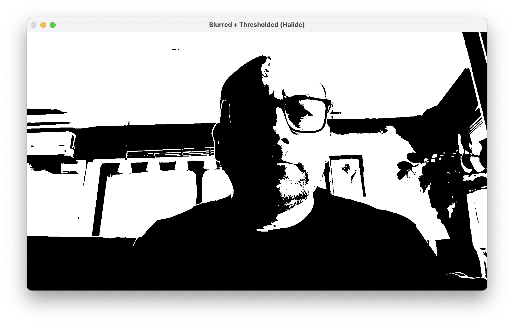

---
# User change
title: "Building a Simple Camera Image Processing Workflow"

weight: 3

layout: "learningpathall"
---

## Objective
In this section, you will build a real-time camera processing pipeline using Halide. First, you capture video frames from a webcam using OpenCV, then implement a Gaussian (binomial) blur to smooth the captured images, followed by thresholding to create a clear binary output highlighting prominent image features. After establishing this pipeline, you will measure performance and then explore Halide's  scheduling options—parallelization and tiling—to understand when they help and when they don’t.

## Gaussian blur and thresholding
Create a new `camera-capture.cpp` file and modify it as follows:
```cpp
#include "Halide.h"
#include "HalideRuntime.h"   // for Runtime::Buffer make_interleaved
#include <opencv2/opencv.hpp>
#include <iostream>
#include <string>
#include <cstdint>
#include <exception>

using namespace cv;
using namespace std;

// Clamp coordinate within [0, maxCoord - 1].
static inline Halide::Expr clampCoord(Halide::Expr coord, int maxCoord) {
    return Halide::clamp(coord, 0, maxCoord - 1);
}

int main() {
    // Open the default camera.
    VideoCapture cap(0);
    if (!cap.isOpened()) {
        cerr << "Error: Unable to open camera." << endl;
        return -1;
    }

    while (true) {
        // Capture frame (typically interleaved BGR).
        Mat frame;
        cap >> frame;
        if (frame.empty()) {
            cerr << "Error: Received empty frame." << endl;
            break;
        }
        if (!frame.isContinuous()) frame = frame.clone();

        const int width    = frame.cols;
        const int height   = frame.rows;
        const int channels = frame.channels(); // 3 (BGR) or 4 (BGRA)

        // Wrap the interleaved OpenCV frame for Halide.
        auto in_rt = Halide::Runtime::Buffer<uint8_t>::make_interleaved(
            frame.data, width, height, channels);
        Halide::Buffer<> inputBuffer(*in_rt.raw_buffer()); // front-end view

        // Define ImageParam (x, y, c) and declare interleaved layout.
        Halide::ImageParam input(Halide::UInt(8), 3, "input");
        input.set(inputBuffer);
        input.dim(0).set_stride(channels); // x-stride = C (interleaved)
        input.dim(2).set_stride(1);        // c-stride = 1 (adjacent bytes)
        input.dim(2).set_bounds(0, channels);

        // Spatial vars.
        Halide::Var x("x"), y("y");

        // Grayscale in Halide
        Halide::Func gray("gray");
        Halide::Expr r16 = Halide::cast<int16_t>(input(x, y, 2));
        Halide::Expr g16 = Halide::cast<int16_t>(input(x, y, 1));
        Halide::Expr b16 = Halide::cast<int16_t>(input(x, y, 0));

        // Integer approx: Y ≈ (77*R + 150*G + 29*B) >> 8
        gray(x, y) = Halide::cast<uint8_t>((77 * r16 + 150 * g16 + 29 * b16) >> 8);

        // 3×3 binomial kernel (sum = 16).
        int kernel_vals[3][3] = {
            {1, 2, 1},
            {2, 4, 2},
            {1, 2, 1}
        };
        Halide::Buffer<int> kernelBuf(&kernel_vals[0][0], 3, 3);

        // Blur via reduction over a 3×3 neighborhood.
        Halide::RDom r(0, 3, 0, 3);
        Halide::Func blur("blur");

        // Use int16_t for safe multiply-and-accumulate with 8-bit input.
        Halide::Expr val =
            Halide::cast<int16_t>(
                gray(clampCoord(x + r.x - 1, width),
                     clampCoord(y + r.y - 1, height))
            ) * Halide::cast<int16_t>(kernelBuf(r.x, r.y));

        blur(x, y) = Halide::cast<uint8_t>(Halide::sum(val) / 16);

        // Thresholding.
        Halide::Func thresholded("thresholded");
        thresholded(x, y) = Halide::cast<uint8_t>(
            Halide::select(blur(x, y) > 128, 255, 0)
        );

        // Realize and display.
        Halide::Buffer<uint8_t> outputBuffer;
        try {
            outputBuffer = thresholded.realize({ width, height });
        } catch (const std::exception &e) {
            cerr << "Halide pipeline error: " << e.what() << endl;
            break;
        }

        Mat blurredThresholded(height, width, CV_8UC1, outputBuffer.data());
        imshow("Processed Image", blurredThresholded);

        // ~33 FPS; exit on any key.
        if (waitKey(30) >= 0) break;
    }

    cap.release();
    destroyAllWindows();
    return 0;
}
```

This code demonstrates a real-time image processing pipeline using Halide and OpenCV. The default camera is accessed, continuously capturing color video frames in an interleaved BGR format. The images are then converted to the grayscale directly inside the Halide pipeline. A Halide function gray(x, y) computes the luminance from the red, green, and blue channels using an integer approximation of the Rec.601 formula:

```cpp
Halide::Expr r16 = Halide::cast<int16_t>(input(x, y, 2));
Halide::Expr g16 = Halide::cast<int16_t>(input(x, y, 1));
Halide::Expr b16 = Halide::cast<int16_t>(input(x, y, 0));
gray(x, y) = Halide::cast<uint8_t>((77 * r16 + 150 * g16 + 29 * b16) >> 8);
```

The pipeline then applies a Gaussian blur using a 3×3 kernel explicitly defined in a Halide buffer:
```
int kernel_vals[3][3] = {
    {1, 2, 1},
    {2, 4, 2},
    {1, 2, 1}
};
Halide::Buffer<int> kernelBuf(&kernel_vals[0][0], 3, 3);
```

Why this kernel?
* It provides effective smoothing while remaining computationally lightweight.
* The weights approximate a Gaussian distribution, which reduces noise but preserves edges better than a box filter.
* This is mathematically a binomial filter, a standard and efficient approximation of Gaussian blurring.

The Gaussian blur is computed using a Halide reduction domain (RDom), which iterates over the 3×3 neighborhood around each pixel. To handle boundaries, pixel coordinates are manually clamped to valid ranges. Intermediate products use 16-bit arithmetic to safely accumulate pixel values before normalization:
```cpp
Halide::Expr val =
    Halide::cast<int16_t>(
        gray(clampCoord(x + r.x - 1, width),
             clampCoord(y + r.y - 1, height))
    ) * Halide::cast<int16_t>(kernelBuf(r.x, r.y));

blur(x, y) = Halide::cast<uint8_t>(Halide::sum(val) / 16);
```

After the blur stage, the pipeline applies a thresholding operation to highlight prominent features. Thresholding converts the blurred grayscale image into a binary image: pixels with intensity greater than 128 become white (255), while all others become black (0). This is expressed in Halide as:
```cpp
Halide::Func thresholded("thresholded");
thresholded(x, y) = Halide::cast<uint8_t>(
    Halide::select(blur(x, y) > 128, 255, 0)
);
```

This simple but effective step emphasizes strong edges and regions of high contrast, often used as a building block in segmentation and feature extraction pipelines

Finally, the result is realized by Halide into a buffer and directly wrapped into an OpenCV matrix (cv::Mat) without extra copying:
```cpp
Halide::Buffer<uint8_t> outputBuffer = thresholded.realize({width, height});
Mat blurredThresholded(height, width, CV_8UC1, outputBuffer.data());
imshow("Processed Image", blurredThresholded);
```

The main loop continues capturing frames, running the Halide pipeline, and displaying the processed output in real-time until a key is pressed. This demonstrates how Halide integrates with OpenCV to build efficient, interactive image processing applications.

In the examples above, pixel coordinates are manually clamped with a helper function:

```cpp
gray(clampCoord(x + r.x - 1, width),
     clampCoord(y + r.y - 1, height))
```

This ensures that when the reduction domain r extends beyond the image borders (for example, at the left or top edge), the coordinates are clipped into the valid range [0, width-1] and [0, height-1]. Manual clamping is explicit and easy to understand, but it scatters boundary-handling logic across the pipeline.

Halide provides an alternative through boundary condition functions, which wrap an existing Func and define its behavior outside the valid region. For the Gaussian blur, you can clamp the grayscale function instead of the raw input, producing a new function that automatically handles out-of-bounds coordinates:
```cpp
// Clamp the grayscale function instead of raw input
Halide::Func grayClamped = Halide::BoundaryConditions::repeat_edge(gray);

// Use grayClamped inside the blur definition
Halide::Expr val =
    Halide::cast<int16_t>(grayClamped(x + (r.x - 1), y + (r.y - 1))) *
    Halide::cast<int16_t>(kernelBuf(r.x, r.y));
```

In practice, both manual clamping and BoundaryConditions produce the same visual results. But for maintainability and performance tuning, using BoundaryConditions::repeat_edge (or another suitable policy) can be the preferred approach in production Halide pipelines.

## Compilation instructions
Compile the program as follows (replace /path/to/halide accordingly):
```console
g++ -std=c++17 camera-capture.cpp -o camera-capture \
    -I/path/to/halide/include -L/path/to/halide/lib -lHalide \
    $(pkg-config --cflags --libs opencv4) -lpthread -ldl \
    -Wl,-rpath,/path/to/halide/lib
```

Run the executable:
```console
./camera-capture
```

The output should look as in the figure below:


## Parallelization and Tiling
In this section, you will explore two complementary scheduling optimizations provided by Halide: Parallelization and Tiling. Both techniques help enhance performance but achieve it through different mechanisms—parallelization leverages multiple CPU cores, whereas tiling improves cache efficiency by optimizing data locality.

Now you will learn how to use each technique separately for clarity and to emphasize their distinct benefits. 

Let’s first lock in a measurable baseline before we start changing the schedule. You will create a second file, `camera-capture-perf-measurement.cpp`, that runs the same grayscale → blur → threshold pipeline but prints per-frame timing, FPS, and MPix/s around the Halide realize() call. This lets you quantify each optimization you will add next (parallelization, tiling, caching).

Create `camera-capture-perf-measurement.cpp` with the following code:
```cpp
#include "Halide.h"
#include "HalideRuntime.h"          
#include <opencv2/opencv.hpp>
#include <iostream>
#include <string>
#include <cstdint>
#include <exception>
#include <chrono>                    
#include <iomanip>                   

using namespace cv;
using namespace std;

// Clamp coordinate within [0, maxCoord - 1].
static inline Halide::Expr clampCoord(Halide::Expr coord, int maxCoord) {
    return Halide::clamp(coord, 0, maxCoord - 1);
}

int main() {
    // Open the default camera.
    VideoCapture cap(0);
    if (!cap.isOpened()) {
        cerr << "Error: Unable to open camera." << endl;
        return -1;
    }

    bool warmed_up = false;  // skip/report first-frame JIT separately

    while (true) {
        // Capture frame.
        Mat frame;
        cap >> frame;
        if (frame.empty()) {
            cerr << "Error: Received empty frame." << endl;
            break;
        }
        if (!frame.isContinuous()) {
            frame = frame.clone();
        }

        int width    = frame.cols;
        int height   = frame.rows;
        int channels = frame.channels();   // typically 3 (BGR) or 4 (BGRA)

        // Wrap the interleaved BGR[BGR...] frame for Halide
        auto in_rt = Halide::Runtime::Buffer<uint8_t>::make_interleaved(
            frame.data, width, height, channels);
        Halide::Buffer<> inputBuffer(*in_rt.raw_buffer()); // front-end Buffer view

        // Define ImageParam for color input (x, y, c).
        Halide::ImageParam input(Halide::UInt(8), 3, "input");
        input.set(inputBuffer);

        const int C = frame.channels();          // 3 (BGR) or 4 (BGRA)
        input.dim(0).set_stride(C);              // x stride = channels (interleaved)
        input.dim(2).set_stride(1);              // c stride = 1 (adjacent bytes)
        input.dim(2).set_bounds(0, C);           // c in [0, C)

        // Define variables representing image coordinates.
        Halide::Var x("x"), y("y");

        // Grayscale in Halide (BGR order; ignore alpha if present)
        Halide::Func gray("gray");
        Halide::Expr r16 = Halide::cast<int16_t>(input(x, y, 2));
        Halide::Expr g16 = Halide::cast<int16_t>(input(x, y, 1));
        Halide::Expr b16 = Halide::cast<int16_t>(input(x, y, 0));

        // Integer approx: Y ≈ (77*R + 150*G + 29*B) >> 8
        gray(x, y) = Halide::cast<uint8_t>((77 * r16 + 150 * g16 + 29 * b16) >> 8);

        // Kernel layout: [1 2 1; 2 4 2; 1 2 1], sum = 16.
        int kernel_vals[3][3] = {
            {1, 2, 1},
            {2, 4, 2},
            {1, 2, 1}
        };
        Halide::Buffer<int> kernelBuf(&kernel_vals[0][0], 3, 3);

        Halide::RDom r(0, 3, 0, 3);
        Halide::Func blur("blur");

        Halide::Expr val =
            Halide::cast<int16_t>( gray(clampCoord(x + r.x - 1, width),
                                        clampCoord(y + r.y - 1, height)) ) *
            Halide::cast<int16_t>( kernelBuf(r.x, r.y) );

        blur(x, y) = Halide::cast<uint8_t>(Halide::sum(val) / 16);

        // Thresholding stage
        Halide::Func thresholded("thresholded");
        thresholded(x, y) = Halide::cast<uint8_t>(
            Halide::select(blur(x, y) > 128, 255, 0)
        );

        // Performance timing around realize() only
        Halide::Buffer<uint8_t> outputBuffer;
        auto t0 = std::chrono::high_resolution_clock::now();

        try {
            outputBuffer = thresholded.realize({ width, height });
        } catch (const std::exception &e) {
            cerr << "Halide pipeline error: " << e.what() << endl;
            break;
        }

        auto t1 = std::chrono::high_resolution_clock::now();
        double ms = std::chrono::duration<double, std::milli>(t1 - t0).count();

        // First frame includes JIT; mark it so you know why it's slower
        double fps = (ms > 0.0) ? 1000.0 / ms : 0.0;
        double mpixps = (ms > 0.0) ? (double(width) * double(height)) / (ms * 1000.0) : 0.0;

        std::cout << std::fixed << std::setprecision(2)
                  << (warmed_up ? "" : "[warm-up] ")
                  << "Halide realize: " << ms << " ms  |  "
                  << fps << " FPS  |  "
                  << mpixps << " MPix/s" << endl;

        warmed_up = true;

        // Wrap output in OpenCV Mat and display.
        Mat blurredThresholded(height, width, CV_8UC1, outputBuffer.data());
        imshow("Processed Image", blurredThresholded);

        // Wait for 30 ms (~33 FPS). Exit if any key is pressed.
        if (waitKey(30) >= 0) {
            break;
        }
    }

    std::cout << std::endl;
    cap.release();
    destroyAllWindows();
    return 0;
}
```
 
* The console prints ms, FPS, and MPix/s per frame, measured strictly around realize() (camera capture and UI are excluded).
* The very first line is labeled [warm-up] because it includes Halide's  JIT compilation. You can ignore it when comparing schedules.
* MPix/s = (width*height)/seconds is a good resolution-agnostic metric to compare schedule variants.

Build and run the application. Here is the sample output:

```console
% ./camera-capture-perf-measurement 
[warm-up] Halide realize: 327.13 ms  |  3.06 FPS  |  6.34 MPix/s
Halide realize: 77.32 ms  |  12.93 FPS  |  26.82 MPix/s
Halide realize: 82.86 ms  |  12.07 FPS  |  25.03 MPix/s
Halide realize: 83.59 ms  |  11.96 FPS  |  24.81 MPix/s
Halide realize: 79.20 ms  |  12.63 FPS  |  26.18 MPix/s
Halide realize: 78.97 ms  |  12.66 FPS  |  26.26 MPix/s
Halide realize: 80.37 ms  |  12.44 FPS  |  25.80 MPix/s
Halide realize: 79.60 ms  |  12.56 FPS  |  26.05 MPix/s
Halide realize: 80.52 ms  |  12.42 FPS  |  25.75 MPix/s
Halide realize: 80.22 ms  |  12.47 FPS  |  25.85 MPix/s
Halide realize: 80.91 ms  |  12.36 FPS  |  25.63 MPix/s
Halide realize: 79.90 ms  |  12.51 FPS  |  25.95 MPix/s
Halide realize: 79.49 ms  |  12.58 FPS  |  26.09 MPix/s
Halide realize: 79.78 ms  |  12.53 FPS  |  25.99 MPix/s
Halide realize: 80.74 ms  |  12.38 FPS  |  25.68 MPix/s
Halide realize: 80.88 ms  |  12.36 FPS  |  25.64 MPix/s
Halide realize: 81.07 ms  |  12.34 FPS  |  25.58 MPix/s
Halide realize: 79.98 ms  |  12.50 FPS  |  25.93 MPix/s
Halide realize: 79.73 ms  |  12.54 FPS  |  26.01 MPix/s
Halide realize: 80.24 ms  |  12.46 FPS  |  25.84 MPix/s
Halide realize: 80.99 ms  |  12.35 FPS  |  25.60 MPix/s
Halide realize: 80.70 ms  |  12.39 FPS  |  25.69 MPix/s
Halide realize: 81.24 ms  |  12.31 FPS  |  25.52 MPix/s
Halide realize: 79.77 ms  |  12.54 FPS  |  26.00 MPix/s
Halide realize: 79.81 ms  |  12.53 FPS  |  25.98 MPix/s
Halide realize: 80.13 ms  |  12.48 FPS  |  25.88 MPix/s
Halide realize: 80.12 ms  |  12.48 FPS  |  25.88 MPix/s
Halide realize: 80.45 ms  |  12.43 FPS  |  25.78 MPix/s
Halide realize: 77.72 ms  |  12.87 FPS  |  26.68 MPix/s
Halide realize: 80.54 ms  |  12.42 FPS  |  25.74 MPix/s
Halide realize: 80.44 ms  |  12.43 FPS  |  25.78 MPix/s
Halide realize: 79.47 ms  |  12.58 FPS  |  26.09 MPix/s
Halide realize: 79.68 ms  |  12.55 FPS  |  26.02 MPix/s
Halide realize: 79.79 ms  |  12.53 FPS  |  25.99 MPix/s
Halide realize: 79.86 ms  |  12.52 FPS  |  25.97 MPix/s
Halide realize: 80.52 ms  |  12.42 FPS  |  25.75 MPix/s
Halide realize: 79.47 ms  |  12.58 FPS  |  26.09 MPix/s
Halide realize: 82.55 ms  |  12.11 FPS  |  25.12 MPix/s
Halide realize: 78.59 ms  |  12.72 FPS  |  26.38 MPix/s
Halide realize: 79.98 ms  |  12.50 FPS  |  25.93 MPix/s
Halide realize: 79.06 ms  |  12.65 FPS  |  26.23 MPix/s
Halide realize: 80.54 ms  |  12.42 FPS  |  25.75 MPix/s
Halide realize: 79.19 ms  |  12.63 FPS  |  26.19 MPix/s
Halide realize: 80.70 ms  |  12.39 FPS  |  25.70 MPix/s
```

This gives an average FPS of 12.48, and average throughput of 25.88 MPix/s. Now you can start measuring potential improvements from scheduling.

### Parallelization
Parallelization lets Halide run independent pieces of work at the same time on multiple CPU cores. For image pipelines, rows (or tiles of rows) are naturally parallel: each can be processed independently once producer data is available. By distributing work across cores, we reduce wall-clock time—crucial for real-time video.

With the baseline measured, you will apply a minimal schedule that parallelizes the blur reduction across rows while keeping the threshold stage at root. This avoids tricky interactions between a parallel consumer and an unscheduled reduction (a common source of internal errors).

Add these lines right after the threshold definition (and before any realize()):
```cpp
blur.compute_root().parallel(y);   // parallelize reduction across scanlines
thresholded.compute_root();        // cheap pixel-wise stage at root
```

This does two important things:
* compute_root() on blur moves the reduction to the top level, so it isn’t nested under a parallel loop that might complicate reduction ordering.
* parallel(y) parallelizes over the pure loop variable y (rows), not the reduction domain r, which is the safe/idiomatic way to parallelize reductions in Halide.

Now rebuild and run the application again. The results should look like:
```output
% ./camera-capture-perf-measurement
[warm-up] Halide realize: 312.66 ms  |  3.20 FPS  |  6.63 MPix/s
Halide realize: 84.86 ms  |  11.78 FPS  |  24.44 MPix/s
Halide realize: 88.53 ms  |  11.30 FPS  |  23.42 MPix/s
Halide realize: 85.46 ms  |  11.70 FPS  |  24.26 MPix/s
Halide realize: 83.12 ms  |  12.03 FPS  |  24.95 MPix/s
Halide realize: 88.70 ms  |  11.27 FPS  |  23.38 MPix/s
Halide realize: 87.58 ms  |  11.42 FPS  |  23.68 MPix/s
Halide realize: 83.38 ms  |  11.99 FPS  |  24.87 MPix/s
Halide realize: 81.65 ms  |  12.25 FPS  |  25.39 MPix/s
Halide realize: 84.88 ms  |  11.78 FPS  |  24.43 MPix/s
Halide realize: 84.40 ms  |  11.85 FPS  |  24.57 MPix/s
Halide realize: 85.30 ms  |  11.72 FPS  |  24.31 MPix/s
Halide realize: 83.15 ms  |  12.03 FPS  |  24.94 MPix/s
Halide realize: 85.69 ms  |  11.67 FPS  |  24.20 MPix/s
Halide realize: 83.39 ms  |  11.99 FPS  |  24.87 MPix/s

% g++ -std=c++17 camera-capture-perf-measurement.cpp -o camera-capture-perf-measurement \
    -I/Users/db/Repos/Halide-19.0.0-arm-64-osx/include -L/Users/db/Repos/Halide-19.0.0-arm-64-osx/lib -lHalide \
    $(pkg-config --cflags --libs opencv4) -lpthread -ldl \
    -Wl,-rpath,/Users/db/Repos/Halide-19.0.0-arm-64-osx
% ./camera-capture-perf-measurement 
[warm-up] Halide realize: 300.76 ms  |  3.32 FPS  |  6.89 MPix/s
Halide realize: 64.23 ms  |  15.57 FPS  |  32.29 MPix/s
Halide realize: 64.68 ms  |  15.46 FPS  |  32.06 MPix/s
Halide realize: 71.92 ms  |  13.90 FPS  |  28.83 MPix/s
Halide realize: 63.78 ms  |  15.68 FPS  |  32.51 MPix/s
Halide realize: 67.95 ms  |  14.72 FPS  |  30.52 MPix/s
Halide realize: 67.31 ms  |  14.86 FPS  |  30.81 MPix/s
Halide realize: 67.90 ms  |  14.73 FPS  |  30.54 MPix/s
Halide realize: 68.81 ms  |  14.53 FPS  |  30.14 MPix/s
Halide realize: 68.57 ms  |  14.58 FPS  |  30.24 MPix/s
Halide realize: 66.83 ms  |  14.96 FPS  |  31.03 MPix/s
Halide realize: 68.04 ms  |  14.70 FPS  |  30.47 MPix/s
Halide realize: 67.72 ms  |  14.77 FPS  |  30.62 MPix/s
Halide realize: 68.79 ms  |  14.54 FPS  |  30.14 MPix/s
Halide realize: 67.56 ms  |  14.80 FPS  |  30.69 MPix/s
Halide realize: 67.65 ms  |  14.78 FPS  |  30.65 MPix/s
Halide realize: 67.81 ms  |  14.75 FPS  |  30.58 MPix/s
Halide realize: 67.81 ms  |  14.75 FPS  |  30.58 MPix/s
Halide realize: 68.03 ms  |  14.70 FPS  |  30.48 MPix/s
Halide realize: 67.44 ms  |  14.83 FPS  |  30.75 MPix/s
Halide realize: 70.11 ms  |  14.26 FPS  |  29.58 MPix/s
Halide realize: 66.23 ms  |  15.10 FPS  |  31.31 MPix/s
Halide realize: 67.96 ms  |  14.72 FPS  |  30.51 MPix/s
Halide realize: 68.00 ms  |  14.71 FPS  |  30.49 MPix/s
Halide realize: 67.98 ms  |  14.71 FPS  |  30.50 MPix/s
Halide realize: 67.56 ms  |  14.80 FPS  |  30.69 MPix/s
Halide realize: 68.53 ms  |  14.59 FPS  |  30.26 MPix/s
Halide realize: 67.06 ms  |  14.91 FPS  |  30.92 MPix/s
```

This gives, on average FPS: 14.79, and throughput of 30.67 MPix/s, leading to ~+18.5% improvement vs baseline.

### Tiling
Tiling is a scheduling technique that divides computations into smaller, cache-friendly blocks or tiles. This approach significantly enhances data locality, reduces memory bandwidth usage, and leverages CPU caches more efficiently. While tiling can also use parallel execution, its primary advantage comes from optimizing intermediate data storage.

Tiling splits the image into cache-friendly blocks (tiles). Two wins:
* Partitioning: tiles are easy to parallelize across cores.
* Locality: when you cache intermediates per tile, you avoid refetching/recomputing data and hit L1/L2 more often.

Now lets look at both flavors.

### Tiling with explicit intermediate storage (best for cache efficiency)
Here you will cache gray once per tile so the 3×3 blur can reuse it instead of recomputing RGB -> gray up to 9× per output pixel.

Before using this, remove any earlier compute_root().parallel(y) schedule for blur.

```cpp
// After defining: input, gray, blur, thresholded
Halide::Var xo("xo"), yo("yo"), xi("xi"), yi("yi");

// Tile & parallelize the consumer; vectorize inner x on planar output.
thresholded
    .tile(x, y, xo, yo, xi, yi, 128, 64)
    .vectorize(xi, 16)
    .parallel(yo);

// Compute blur inside each tile and vectorize its inner x.
blur
    .compute_at(thresholded, xo)
    .vectorize(x, 16);

// Cache RGB→gray per tile (reads interleaved input → keep unvectorized).
gray
    .compute_at(thresholded, xo)
    .store_at(thresholded, xo);
```

In this scheduling:
* tile(...) splits the image into cache-friendly blocks and makes it easy to parallelize across tiles.
* blur.compute_at(thresholded, xo) localizes the blur computation to each tile (it doesn’t force storing blur; it just computes it where it’s needed, keeping the working set small).
* gray.compute_at(...).store_at(...) materializes a tile-local planar buffer for the grayscale intermediate so blur can reuse it within the tile.
* Vectorization is applied only to planar stages (blur, thresholded), gray stays unvectorized because it reads interleaved input (x-stride = channels).

Recompile your application as before, then run. On our machine, this version ran at ~7.6 FPS (~15.76 MPix/s, ~139 ms/frame), slower than baseline (~12.48 FPS) and the parallelization-only schedule (~14.79 FPS). The 3×3 blur is very small (low arithmetic intensity), the extra writes/reads of a tile-local buffer add overhead, and the interleaved source still limits how efficiently the gray producer can be read/vectorized.

This pattern shines when the cached intermediate is expensive and reused a lot (bigger kernels, multi-use intermediates, or separable/multi-stage pipelines). For a tiny 3×3 on CPU, the benefit often doesn’t amortize.

### Tiling for parallelization (without explicit intermediate storage)
Tiling can also be used just to partition work across cores, without caching intermediates. This keeps the schedule simple: you split the output into tiles, parallelize across tiles, and vectorize along unit-stride x. Producers are computed inside each tile to keep the working set small, but don’t materialize extra tile-local buffers:
```cpp
// Tiling (partitioning only)
Halide::Var xo("xo"), yo("yo"), xi("xi"), yi("yi");

thresholded
    .tile(x, y, xo, yo, xi, yi, 128, 64)  // try 128x64; tune per CPU
    .vectorize(xi, 16)                    // safe: planar, unit-stride along x
    .parallel(yo);                        // run tiles across cores

blur
    .compute_at(thresholded, xo)          // keep work tile-local
    .vectorize(x, 16);                    // vectorize planar blur
```

What this does
* tile(...) splits the image into cache-friendly blocks and makes parallelization straightforward.
* parallel(yo) distributes tiles across CPU cores.
* compute_at(thresholded, xo) evaluates blur per tile (better locality) without forcing extra storage.
* Vectorization is applied to planar stages (blur, thresholded).

Recompile your application as before, then run. On our test machine, we got 9.35 FPS (19.40 MPix/s, ~106.93 ms/frame). This is slower than both the baseline and the parallelization-only schedule. The main reasons:
* Recomputation of gray: with a 3×3 blur, each output reuses up to 9 neighbors; leaving gray inlined means RGB→gray is recomputed for each tap.
* Interleaved input: gray reads BGR interleaved data (x-stride = channels), limiting unit-stride vectorization efficiency upstream.
* Overhead vs. work: a 3×3 blur has low arithmetic intensity; extra tile/task overhead isn’t amortized.

Tiling without caching intermediates mainly helps partition work, but for tiny kernels on CPU (and interleaved sources) it often underperforms. The earlier “quick win” (blur.compute_root().parallel(y)) remains the better choice here.

### Tiling vs. parallelization
* Parallelization spreads independent work across CPU cores. For this pipeline, the safest/most effective quick win was:
```cpp
blur.compute_root().parallel(y);
thresholded.compute_root();
```
* Tiling for cache efficiency helps when an expensive intermediate is reused many times per output (e.g., larger kernels, separable/multi-stage pipelines, multiple consumers) and when producers read planar data. Caching gray per tile with a tiny 3×3 kernel over an interleaved source added overhead and ran slower (~8.2 FPS / 17.0 MPix/s).
* Tiling for parallelization (partitioning only) simplifies work distribution and enables vectorization of planar stages, but with low arithmetic intensity (3×3) and an interleaved source it underperformed here (~9.35 FPS / 19.40 MPix/s).

When to choose what:
* Start with parallelizing the main reduction at root.
* Add tiling + caching only if: kernel ≥ 5×5, separable/multi-pass blur, or the intermediate is reused by multiple consumers—and preferably after converting sources to planar (or precomputing a planar gray).
* Keep stages that read interleaved inputs unvectorized; vectorize only planar consumers.

## Summary
In this section, you built a real-time Halide+OpenCV pipeline—grayscale, a 3×3 binomial blur, then thresholding—and instrumented it to measure throughput. The baseline settled around 12.48 FPS (25.88 MPix/s). A small, safe schedule tweak that parallelizes the blur reduction across rows lifted performance to about 14.79 FPS (30.67 MPix/s). In contrast, tiling used only for partitioning landed near 9.35 FPS (19.40 MPix/s), and tiling with a cached per-tile grayscale buffer was slower still at roughly 8.2 FPS (17.0 MPix/s).

The pattern is clear. On CPU, with a small kernel and an interleaved camera source, parallelizing the reduction is the most effective first step. Tiling starts to pay off only when an expensive intermediate is reused enough to amortize the overhead, e.g., after making the blur separable (horizontal+vertical), producing a planar grayscale once per frame with gray.compute_root(), and applying boundary conditions to unlock interior fast paths. From there, tune tile sizes and thread count to squeeze out the remaining headroom.

