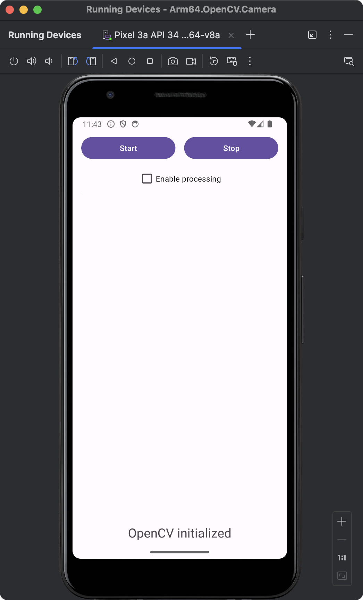
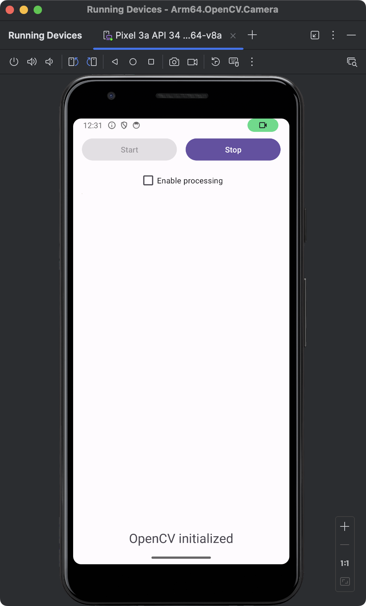
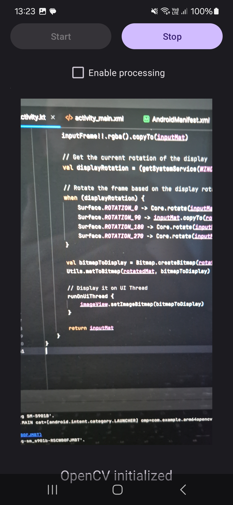

---
# User change
title: "Get camera images using OpenCV"

weight: 4

layout: "learningpathall"
---
You will now extend the application by adding camera support using OpenCV. Start by adding additional controls that will be used to start and stop the camera preview, and to display images from the camera. 

Additionally, you will add a checkbox control that will enable or disable real-time processing. For the real-time processing, you will use [adaptive thresholding](https://docs.opencv.org/4.x/d7/d4d/tutorial_py_thresholding.html) from OpenCV.

## Modify the application view
To modify the application view, open `activity_main.xml` and replace the file contents with the following code:

```XML
<?xml version="1.0" encoding="utf-8"?>
<LinearLayout xmlns:android="http://schemas.android.com/apk/res/android"
    android:layout_width="match_parent"
    android:layout_height="match_parent"
    android:orientation="vertical"
    android:padding="16dp">

    <LinearLayout
        android:layout_width="match_parent"
        android:layout_height="wrap_content"
        android:orientation="horizontal"
        android:gravity="center"
        android:layout_marginTop="16dp">

        <!-- Start Preview Button -->
        <Button
            android:id="@+id/buttonStartPreview"
            android:layout_width="0dp"
            android:layout_height="wrap_content"
            android:layout_weight="1"
            android:text="Start"
            android:layout_marginEnd="8dp" />

        <!-- Stop Preview Button -->
        <Button
            android:id="@+id/buttonStopPreview"
            android:layout_width="0dp"
            android:layout_height="wrap_content"
            android:layout_weight="1"
            android:text="Stop"
            android:layout_marginStart="8dp"/>
    </LinearLayout>

    <!-- Checkbox to enable processing -->
    <CheckBox
        android:id="@+id/checkboxEnableProcessing"
        android:layout_width="wrap_content"
        android:layout_height="wrap_content"
        android:text="Enable processing"
        android:layout_gravity="center_horizontal"
        android:layout_marginTop="8dp"/>

    <org.opencv.android.JavaCameraView
        android:id="@+id/cameraView"
        android:layout_width="1px"
        android:layout_height="1px"
        android:layout_weight="0"
        android:visibility="visible" />

    <!-- ImageView for displaying images -->
    <ImageView
        android:id="@+id/imageView"
        android:layout_width="match_parent"
        android:layout_height="match_parent"
        android:layout_weight="1"
        android:contentDescription="Image View"
        android:scaleType="centerCrop"
        android:layout_margin="16dp" />

    <!-- TextViewStatus -->
    <TextView
        android:id="@+id/textViewStatus"
        android:layout_width="wrap_content"
        android:layout_height="wrap_content"
        android:text=""
        android:layout_gravity="center_horizontal"
        android:layout_margin="16dp"
        android:textSize="64px"/>

</LinearLayout>
```

After adding this code, re-run the application. The above declarations render the following:



The view now contains two buttons: Start and Stop. They will be used to start and stop the camera preview. Below the buttons, there is a checkbox that will enable or disable real-time image processing. Though not visible, below the checkbox there is a `JavaCameraView`.

`JavaCameraView` is a class provided by the OpenCV library for Android, which serves as a bridge between the Android camera and the OpenCV library. It allows developers to capture frames from the camera and process them using OpenCV functions. JavaCameraView integrates the Android camera seamlessly with the OpenCV library, providing a way to capture video frames directly. `JavaCameraView` implements the `CameraBridgeViewBase.CvCameraViewListener2` interface, which includes methods for handling camera events and frame processing. `JavaCameraView` handles the lifecycle of the camera, including starting and stopping the camera preview, and releasing the camera when not in use.

Finally, in the view above, we have an ImageView which will be used to display images from the camera.

## Request access to the camera
To be able to record images with the device’s camera, you will first need to request the user’s permission to access the device’s camera. Follow these steps:
1. Open AndroidManifest.xml (app/manifests), and add the following statements before the **application** node:

```XML
<uses-permission android:name="android.permission.CAMERA"/>
<uses-feature android:name="android.hardware.camera"/>
```

2. Open `MainActivity.kt` and add these additional imports:

```java
import android.Manifest
import android.content.pm.PackageManager
import androidx.core.app.ActivityCompat
import androidx.core.content.ContextCompat
```

3. In the same file, modify the `onCreate` method as follows:

```java
private val cameraPermissionRequestCode = 100
    
override fun onCreate(savedInstanceState: Bundle?) {
    super.onCreate(savedInstanceState)
    enableEdgeToEdge()
    setContentView(R.layout.activity_main)

    textViewStatus = findViewById(R.id.textViewStatus)

    isOpenCvInitialized = OpenCVLoader.initLocal()

    // Request access to camera
    if (ContextCompat.checkSelfPermission(this, Manifest.permission.CAMERA)
        != PackageManager.PERMISSION_GRANTED) {
        // Permission is not granted, request it
        ActivityCompat.requestPermissions(
            this,
            arrayOf(Manifest.permission.CAMERA),
            cameraPermissionRequestCode
        )
    }
    
    updateControls()
}
```

The above code checks if the app has the CAMERA permission. If the permission is not granted, it requests the permission using `ActivityCompat.requestPermissions`, passing the `Manifest.permission.CAMERA` and the cameraPermissionRequestCode (100). When you re-run the application, you should see the following screen:


Click the **While using the app** button to enable camera access. You are now ready to capture images from the camera. 

## Control the camera
You will now extend the MainActivity.kt by an additional logic that enables to start and stop the camera preview, when user clicks corresponding buttons. Also, you will extend the MainActivity class by implementing the CameraBridgeViewBase.CvCameraViewListener2 interface to access the JavaCameraView events associated with the camera lifecycle: 
1. onCameraViewStarted - This method is called when the camera preview starts. You typically use this method to initialize resources needed for processing frames, such as creating OpenCV's Mat objects that will hold the image data.

2. onCameraViewStopped - This method is called when the camera preview stops. You use this method to release or clean up resources that were allocated in onCameraViewStarted, such as releasing Mat objects or stopping background processing tasks

3. onCameraFrame - This method is called for each frame captured by the camera. You use this method to process each frame. In this learning path you will use this method to process camera image using adaptive thresholding.

Proceed as follows (all changes are to be made in the MainActivity.kt file):

1. Add the following import statements:

```java
import org.opencv.android.CameraBridgeViewBase
import android.widget.Button
import android.widget.CheckBox
import android.widget.ImageView
import org.opencv.core.CvType
import org.opencv.core.Mat
```
2. Modify the class declaration to add CameraBridgeViewBase.CvCameraViewListener2:
```java
class MainActivity : AppCompatActivity(), CameraBridgeViewBase.CvCameraViewListener2 {
```
3. In the MainActivity class declare the following additional variables (right below class MainActivity : AppCompatActivity(), CameraBridgeViewBase.CvCameraViewListener2 {):

```
private lateinit var buttonStartPreview: Button
private lateinit var buttonStopPreview: Button
private lateinit var checkBoxProcessing: CheckBox
private lateinit var imageView: ImageView
private lateinit var openCvCameraView: CameraBridgeViewBase

private var isPreviewActive = false

```
4. Modify the onCreate method as follows:

```java
override fun onCreate(savedInstanceState: Bundle?) {
    super.onCreate(savedInstanceState)
    enableEdgeToEdge()
    setContentView(R.layout.activity_main)

    textViewStatus = findViewById(R.id.textViewStatus)
    buttonStartPreview = findViewById(R.id.buttonStartPreview)
    buttonStopPreview = findViewById(R.id.buttonStopPreview)
    checkBoxProcessing = findViewById(R.id.checkboxEnableProcessing)
    imageView = findViewById(R.id.imageView)
    openCvCameraView = findViewById(R.id.cameraView)

    isOpenCvInitialized = OpenCVLoader.initLocal()

    // Request access to camera
    if (ContextCompat.checkSelfPermission(this, Manifest.permission.CAMERA)
        != PackageManager.PERMISSION_GRANTED) {
        // Permission is not granted, request it
        ActivityCompat.requestPermissions(
            this,
            arrayOf(Manifest.permission.CAMERA),
            cameraPermissionRequestCode
        )
    }

    openCvCameraView.setCameraIndex(0)
    openCvCameraView.setCvCameraViewListener(this)

    buttonStartPreview.setOnClickListener {
        openCvCameraView.setCameraPermissionGranted()
        openCvCameraView.enableView()

        updateControls()
    }

    buttonStopPreview.setOnClickListener {
        openCvCameraView.disableView()

        updateControls()
    }

    updateControls()
}
```

5. Update the updateControls method:

```java
private fun updateControls() {
    if(!isOpenCvInitialized) {
        textViewStatus.text = "OpenCV initialization error"

        buttonStartPreview.isEnabled = false;
        buttonStopPreview.isEnabled = false;
    } else {
        textViewStatus.text = "OpenCV initialized"

        buttonStartPreview.isEnabled = !isPreviewActive;
        buttonStopPreview.isEnabled = isPreviewActive;
    }
}
```

6. Add onCameraViewStarted, onCameraViewStopped and onCameraFrame:

```java
override fun onCameraViewStarted(width: Int, height: Int) {
    isPreviewActive = true

    updateControls()
}

override fun onCameraViewStopped() {
    isPreviewActive = false

    updateControls()
}

override fun onCameraFrame(inputFrame: CameraBridgeViewBase.CvCameraViewFrame?): Mat {
    return inputFrame!!.rgba()
}
```

You began by declaring TextView, Button, CheckBox, and ImageView elements, along with the OpenCV camera view. You also added an additional variable, isPreviewActive, which tracks the camera preview status. Then, you modified the onCreate method to bind UI elements to the variables. After checking if the camera permission is granted, you set the camera index to 0 to access the rear camera. If you want to record images from the front camera, you will need to change the camera index to 1. Afterwards, you set the activity as the listener for camera events.

Next, you implemented click event handlers for the buttons. Specifically, when the user clicks the Start button, you set the camera permission as granted (openCvCameraView.setCameraPermissionGranted()) and enable the camera view (openCvCameraView.enableView()). Then, you modified the updateControls method to change the UI elements based on the current state. You disable the Start button when the camera preview is active. Conversely, when the camera preview is inactive, the Stop button is disabled.

Finally, you implemented onCameraViewStarted, onCameraViewStopped, and onCameraFrame as follows:
- onCameraViewStarted - sets isPreviewActive to true and updates the controls.
- onCameraViewStopped - sets isPreviewActive to false and updates the controls.
- onCameraFrame - returns the frame in RGBA format for processing.

Here is final form of the MainActivity.kt file:

```java
package com.example.arm64opencvcamera

import android.Manifest
import android.content.pm.PackageManager
import android.os.Bundle
import android.widget.Button
import android.widget.CheckBox
import android.widget.ImageView
import android.widget.TextView
import androidx.activity.enableEdgeToEdge
import androidx.appcompat.app.AppCompatActivity
import androidx.core.app.ActivityCompat
import androidx.core.content.ContextCompat
import org.opencv.android.CameraBridgeViewBase
import org.opencv.android.OpenCVLoader
import org.opencv.core.CvType
import org.opencv.core.Mat

class MainActivity : AppCompatActivity(), CameraBridgeViewBase.CvCameraViewListener2 {
    private lateinit var textViewStatus: TextView
    private lateinit var buttonStartPreview: Button
    private lateinit var buttonStopPreview: Button
    private lateinit var checkBoxProcessing: CheckBox
    private lateinit var imageView: ImageView
    private lateinit var openCvCameraView: CameraBridgeViewBase

    private var isOpenCvInitialized = false
    private var isPreviewActive = false

    private val cameraPermissionRequestCode = 100

    override fun onCreate(savedInstanceState: Bundle?) {
        super.onCreate(savedInstanceState)
        enableEdgeToEdge()
        setContentView(R.layout.activity_main)

        textViewStatus = findViewById(R.id.textViewStatus)
        buttonStartPreview = findViewById(R.id.buttonStartPreview)
        buttonStopPreview = findViewById(R.id.buttonStopPreview)
        checkBoxProcessing = findViewById(R.id.checkboxEnableProcessing)
        imageView = findViewById(R.id.imageView)
        openCvCameraView = findViewById(R.id.cameraView)

        isOpenCvInitialized = OpenCVLoader.initLocal()

        // Request access to camera
        if (ContextCompat.checkSelfPermission(this, Manifest.permission.CAMERA)
            != PackageManager.PERMISSION_GRANTED) {
            // Permission is not granted, request it
            ActivityCompat.requestPermissions(
                this,
                arrayOf(Manifest.permission.CAMERA),
                cameraPermissionRequestCode
            )
        }

        openCvCameraView.setCameraIndex(0)
        openCvCameraView.setCvCameraViewListener(this)

        buttonStartPreview.setOnClickListener {
            openCvCameraView.setCameraPermissionGranted()
            openCvCameraView.enableView()

            updateControls()
        }

        buttonStopPreview.setOnClickListener {
            openCvCameraView.disableView()

            updateControls()
        }

        updateControls()
    }

    private fun updateControls() {
        if(!isOpenCvInitialized) {
            textViewStatus.text = "OpenCV initialization error"

            buttonStartPreview.isEnabled = false;
            buttonStopPreview.isEnabled = false;
        } else {
            textViewStatus.text = "OpenCV initialized"

            buttonStartPreview.isEnabled = !isPreviewActive;
            buttonStopPreview.isEnabled = isPreviewActive;
        }
    }

    override fun onCameraViewStarted(width: Int, height: Int) {
        isPreviewActive = true

        updateControls()
    }

    override fun onCameraViewStopped() {
        isPreviewActive = false

        updateControls()
    }

    override fun onCameraFrame(inputFrame: CameraBridgeViewBase.CvCameraViewFrame?): Mat {
        return inputFrame!!.rgba()
    }
}
```

After re-launching the application and pressing the Start button you will see the application is accessing the camera. However, the images are not yet displayed.



## Display images
To display images, you need to modify the onCameraFrame method so that the image from the camera is displayed in the ImageView. You will also declare Mat objects to store the image from the camera. 

Follow these steps (all changes to be made in `MainActivity.kt`):

1. Import `Bitmap` and `Utils` packages for use in `OnCameraFrame`:

```java
import android.graphics.Bitmap
import org.opencv.android.Utils
```

2. Declare the Mat object:

```java
private lateinit var inputMat: Mat
```

3. Initialize the above member within the `onCameraViewStarted` method:

```java
override fun onCameraViewStarted(width: Int, height: Int) {
    isPreviewActive = true

    inputMat = Mat(height, width, CvType.CV_8UC4)    

    updateControls()
}
```

4. Modify the `onCameraViewStopped` method:

```java
override fun onCameraViewStopped() {
    isPreviewActive = false

    inputMat.release()    

    updateControls()
}
```

5. Update the `onCameraFrame` method:

```java
override fun onCameraFrame(inputFrame: CameraBridgeViewBase.CvCameraViewFrame?): Mat {
    inputFrame!!.rgba().copyTo(inputMat)

    val bitmapToDisplay = Bitmap.createBitmap(inputMat.cols(), inputMat.rows(), Bitmap.Config.ARGB_8888)
    Utils.matToBitmap(inputMat, bitmapToDisplay)

    // Display it on UI Thread
    runOnUiThread {
        imageView.setImageBitmap(bitmapToDisplay)
    }

    return inputMat
}
```

To test the code, you will need to run the application on an actual device. Follow the steps in [Run apps on a hardware device](https://developer.android.com/studio/run/device) to test the app.

After running the app, remember to grant permissions to the camera. Then, click the Start button, and the application will display images from the camera:


