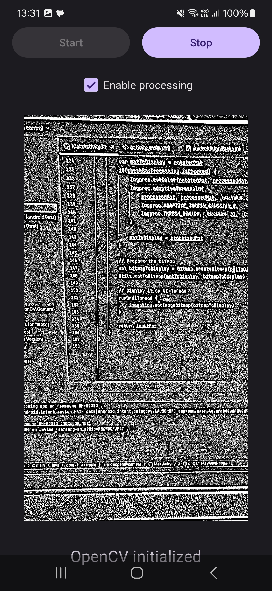

---
# User change
title: "Process Images"

weight: 5

layout: "learningpathall"
---
## Process images
In this final step, you will process the camera image with OpenCV. 

To do so, you will declare another Mat for storing the processed image. Then, depending on whether the checkbox is checked, you will apply the adaptive thresholding algorithm to the input image.

Proceed as follows (all changes to be made in MainActivity.kt):

1. Import the `Imgproc` package from OpenCV in order to add adaptive thresholding:

```java
import org.opencv.imgproc.Imgproc
```

2. Declare another Mat object:
```java
private lateinit var processedMat: Mat
```

3. Add Mat initialization and release:
```java
override fun onCameraViewStarted(width: Int, height: Int) {
    isPreviewActive = true

    inputMat = Mat(height, width, CvType.CV_8UC4)    
    processedMat = Mat(height, width, CvType.CV_8UC1)

    updateControls()
}

override fun onCameraViewStopped() {
    isPreviewActive = false

    inputMat.release()    
    processedMat.release()

    updateControls()
}
```

4. Process the image within the onCameraFrame:

```java
override fun onCameraFrame(inputFrame: CameraBridgeViewBase.CvCameraViewFrame?): Mat {
    inputFrame!!.rgba().copyTo(inputMat)

    var matToDisplay = inputMat
    if(checkBoxProcessing.isChecked) {
        Imgproc.cvtColor(inputMat, processedMat, Imgproc.COLOR_RGBA2GRAY)
        Imgproc.adaptiveThreshold(
            processedMat, processedMat, 255.0,
            Imgproc.ADAPTIVE_THRESH_GAUSSIAN_C,
            Imgproc.THRESH_BINARY, 21, 0.0
        )

        matToDisplay = processedMat
    }

    // Prepare the bitmap
    val bitmapToDisplay = Bitmap.createBitmap(matToDisplay.cols(), matToDisplay.rows(), Bitmap.Config.ARGB_8888)
    Utils.matToBitmap(matToDisplay, bitmapToDisplay)

    // Display it on UI Thread
    runOnUiThread {
        imageView.setImageBitmap(bitmapToDisplay)
    }

    return inputMat
}
```

The major modification you made is following: 

If the checkbox checkBoxProcessing is checked, the frame is converted to grayscale and an adaptive thresholding operation is applied. `matToDisplay` is set to the processed frame if processing is enabled; otherwise, the input frame is used.

To process the image, you will use the `Imgproc.adaptiveThreshold` openCV function which applies adaptive thresholding to a grayscale image. Before you can apply thresholding, you will convert the color image to grayscale using the `Imgproc.cvtColor` OpenCV function.

The adaptive thresholding implemented in OpenCV has two versions. They differ in how the threshold value is calculated within the block. Here, you use `Imgproc.ADAPTIVE_THRESH_GAUSSIAN_C`, which uses the mean of a Gaussian window to calculate the threshold for each pixel. Then, you specify the thresholding type as `Imgproc.THRESH_BINARY`. It converts pixels above the threshold to the maximum value (255) and below the threshold to 0.

You use 21 as the size of the block to use for calculating the threshold for each pixel and 0 as a constant subtracted from the mean or weighted mean calculated.

After re-running the application, starting the preview, and enabling the processing, you should see the following result:



