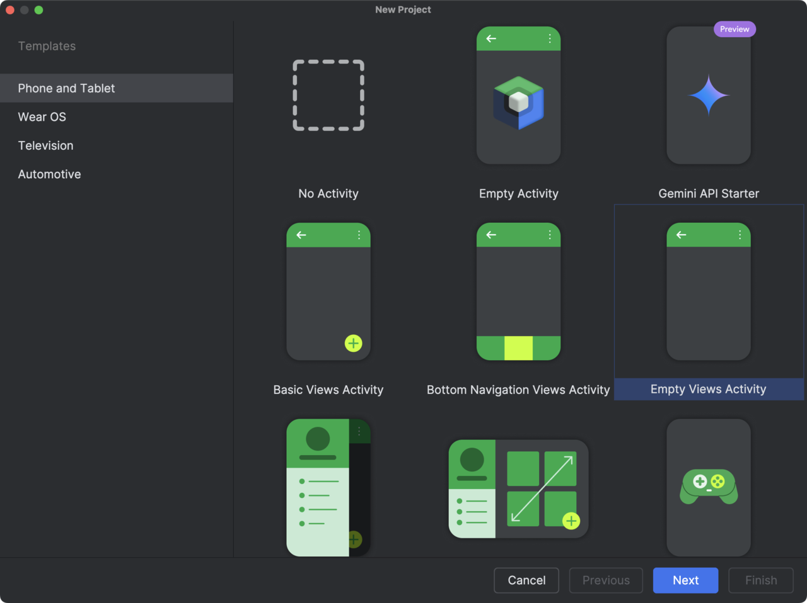
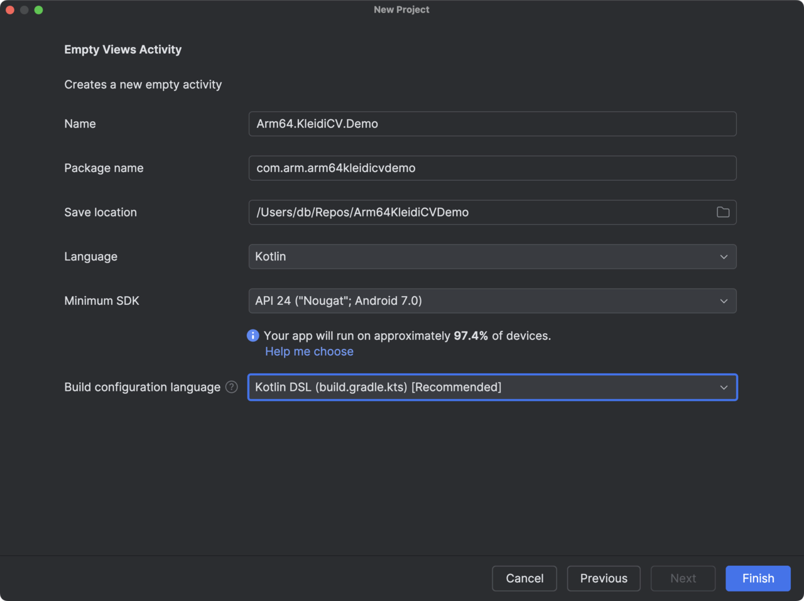

---
# User change
title: "Create a project and add OpenCV"

weight: 3

layout: "learningpathall"
---
## Create a project
You will need a development computer with [Android Studio](https://developer.android.com/studio) installed. This example uses Android Studio Ladybug 2024.2.1, Patch 3.

You can create a project and add OpenCV with KleidiCV support by following the steps outlined in this section.

Start by creating a new project, and configuring it: 

1. Open Android Studio on your development machine, and click the **+ New Project** icon.
2. In the **New Project** window, select **Empty Views Activity**:



3. Figure 2 shows you how to configure the project:
- Name: **Arm64.KleidiCV.Demo**.
- Package name: **com.arm.arm64kleidicvdemo**.
- Save location: *Select relevant file location for your setup*.
- Language: **Kotlin**.
- Minimum SDK: **API 24**.
- Build configuration language: **Kotlin DSL**.



4. Click the **Finish** button. 

Now wait a few moments until your project is ready. You will be able to configure the project further later on.

## Add OpenCV support
To add OpenCV support for Arm64 (AArch64), open the *build.gradle.ts (Module: app)*, and add the following line under the dependencies:

```JSON
implementation("org.opencv:opencv:4.11.0")
```

Make sure that compileSdk is set to 35. The contents of the file should look like this:

```JSON
plugins {
    alias(libs.plugins.android.application)
    alias(libs.plugins.kotlin.android)
}

android {
    namespace = "com.arm.arm64kleidicvdemo"
    compileSdk = 35

    defaultConfig {
        applicationId = "com.arm.arm64kleidicvdemo"
        minSdk = 24
        targetSdk = 34
        versionCode = 1
        versionName = "1.0"

        testInstrumentationRunner = "androidx.test.runner.AndroidJUnitRunner"
    }

    buildTypes {
        release {
            isMinifyEnabled = false
            proguardFiles(
                getDefaultProguardFile("proguard-android-optimize.txt"),
                "proguard-rules.pro"
            )
        }
    }
    compileOptions {
        sourceCompatibility = JavaVersion.VERSION_11
        targetCompatibility = JavaVersion.VERSION_11
    }
    kotlinOptions {
        jvmTarget = "11"
    }
}

dependencies {
    implementation(libs.androidx.core.ktx)
    implementation(libs.androidx.appcompat)
    implementation(libs.material)
    implementation(libs.androidx.activity)
    implementation(libs.androidx.constraintlayout)
    testImplementation(libs.junit)
    androidTestImplementation(libs.androidx.junit)
    androidTestImplementation(libs.androidx.espresso.core)
    implementation("org.opencv:opencv:4.11.0")
}
```

Now click the **Sync Now** link in the top pane that appears. 

You can now use OpenCV with KleidiCV support in your application. 

Save the file. In the next step, you will define the application UI.